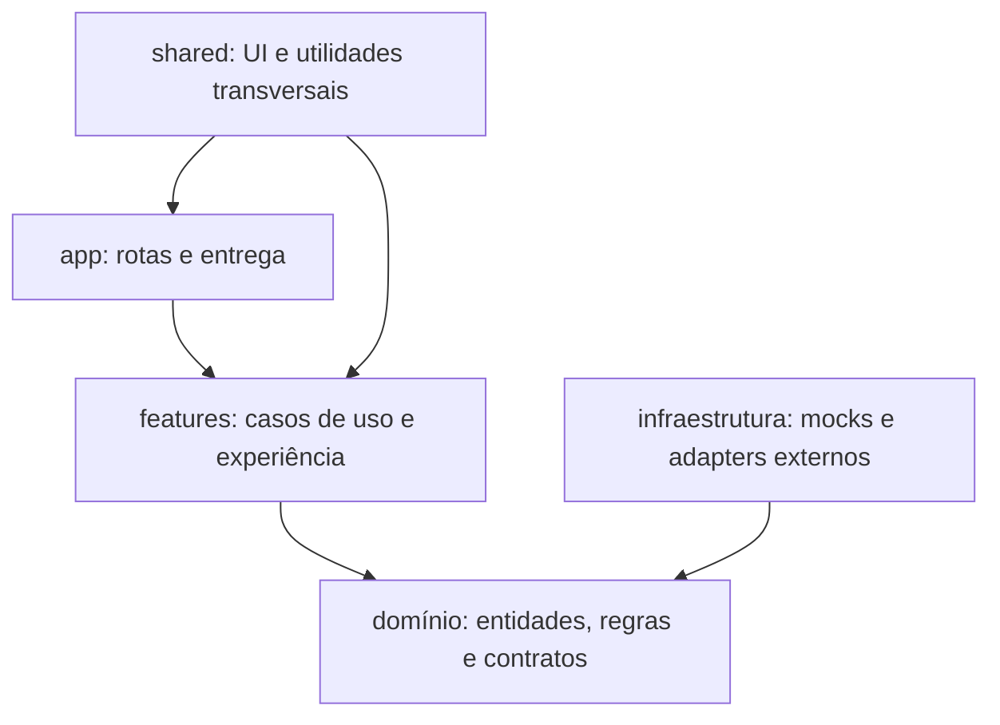
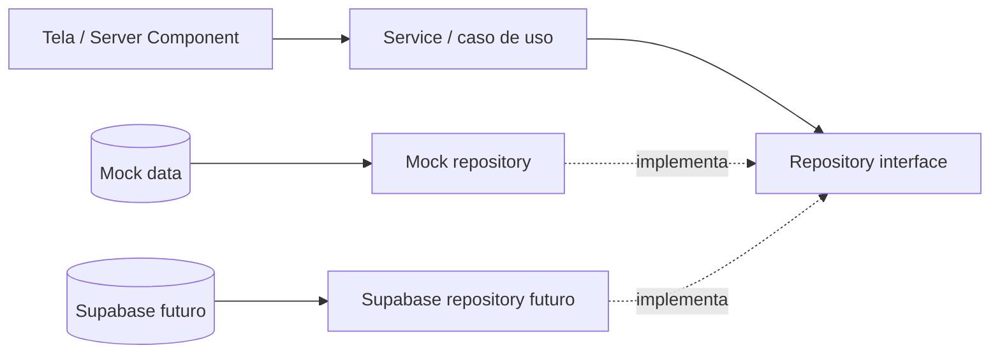
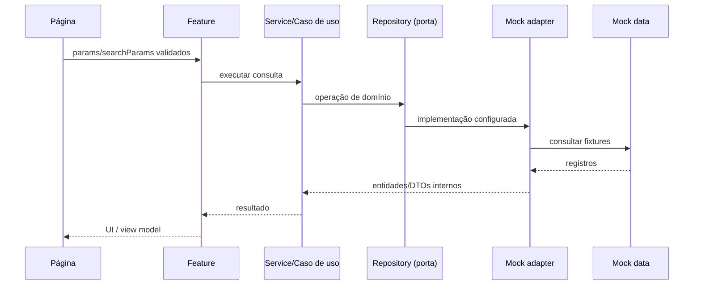
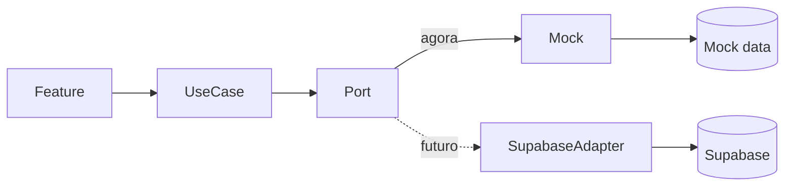
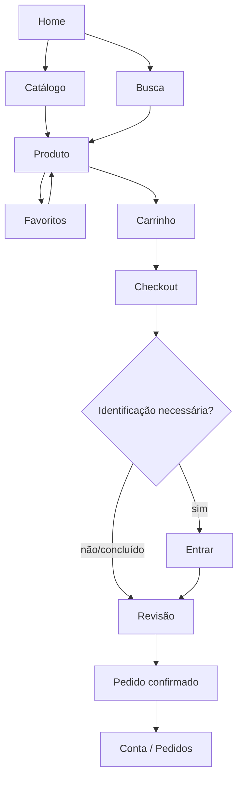
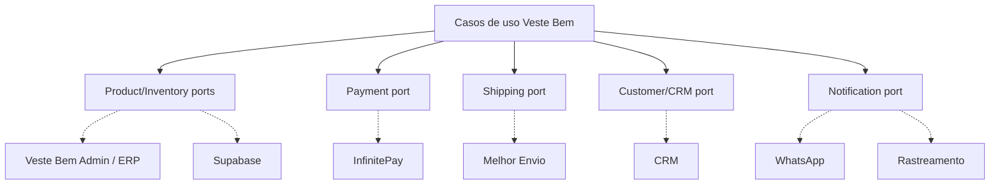

# Arquitetura de Software — Veste Bem E-commerce

> **Status:** referência arquitetural inicial  
> **Escopo:** storefront independente, sem integrações externas na primeira versão  
> **Stack de referência:** Next.js (App Router), React, TypeScript e Zod  
> **Público:** engenharia, produto, QA e pessoas responsáveis por integrações futuras

## 1. Visão geral da arquitetura

O Veste Bem E-commerce será um **monólito modular orientado a features**, executado sobre Next.js. “Monólito” significa uma unidade de implantação; “modular” significa que catálogo, carrinho, checkout e demais domínios possuem limites explícitos e não compartilham detalhes internos. Essa escolha reduz o custo operacional da primeira versão sem criar um monólito acoplado.

A arquitetura combina:

- **App Router** como camada de entrega web, roteamento, renderização e composição de layouts;
- **features** como módulos verticais de negócio;
- **componentes compartilhados** apenas para conceitos realmente transversais;
- **services e repositories definidos por contratos**, com implementações mock na primeira versão;
- **adapters externos** para que Supabase, pagamentos, frete, ERP, CRM e mensageria sejam acrescentados nas bordas;
- **validação nas fronteiras**, com Zod para dados que entram ou saem do sistema.

### 1.1 Objetivos

1. Entregar rapidamente um storefront consistente, testável e acessível.
2. Impedir que detalhes de infraestrutura contaminem regras de negócio e interface.
3. Permitir a troca de mocks por integrações reais por composição, sem reescrever páginas.
4. Manter cada mudança localizada no domínio ao qual pertence.
5. Favorecer Server Components e envio mínimo de JavaScript ao navegador.
6. Tornar decisões importantes explícitas e verificáveis em revisão de código.

### 1.2 Princípios de direção



As setas representam dependência de código. O domínio não conhece React, Next.js, Supabase ou dados mock. A infraestrutura depende dos contratos do domínio, e não o contrário.

### 1.3 Escalabilidade e reutilização

A primeira forma de escala será **organizacional e modular**: novas funcionalidades entram em módulos previsíveis, com baixo risco de efeitos colaterais. A escala de tráfego será tratada com renderização híbrida, cache explícito, CDN, otimização de imagens e acesso eficiente a dados. Apenas evidência operacional justificará separar serviços implantáveis; os limites de feature e contratos já fornecem pontos naturais de extração.

Reutilização não significa centralizar antecipadamente. Um componente permanece local à feature até existir uso estável em mais de um domínio. A duplicação pequena e temporária é preferível a uma abstração compartilhada errada.

## 2. Princípios arquiteturais

| Princípio | Aplicação no projeto | Sinal de violação |
|---|---|---|
| Clean Architecture | Regras e contratos não dependem de frameworks ou fornecedores. Adapters implementam portas internas. | Uma entidade importa `next/*`, React ou SDK externo. |
| SOLID | Classes, funções e componentes têm uma razão para mudar; contratos pequenos; implementações substituíveis. | Um service mistura catálogo, carrinho, analytics e chamadas HTTP. |
| DRY | Conhecimento estável é centralizado, como política de moeda ou schema de endereço. | A mesma regra de desconto é implementada em telas distintas. |
| KISS | Preferência por funções, composição e fluxo explícito antes de factories ou hierarquias complexas. | Uma abstração exige mais contexto que o problema resolvido. |
| Separation of Concerns | Rota entrega; feature orquestra; domínio decide; adapter comunica. | Página acessa mock ou SDK diretamente. |
| Componentização | Componentes possuem contrato visual claro, responsabilidade única e API pequena. | Componente recebe dezenas de flags para experiências não relacionadas. |
| Composition over Inheritance | UI é formada por slots, children, hooks e funções; services são compostos por contratos. | Herança cria variantes implícitas e difíceis de testar. |
| Single Responsibility | Cada unidade possui um motivo principal para mudar. | Alterar frete exige editar um componente de produto. |

### 2.1 Clean Architecture na prática

Os círculos clássicos serão aplicados dentro de cada feature, sem criar dezenas de pastas cerimoniais:

- **domain:** entidades, value objects, invariantes e portas;
- **application:** casos de uso que coordenam regras e portas;
- **infrastructure:** repositories, mappers e clients concretos;
- **presentation:** componentes, hooks e schemas de formulário.

Nem toda feature precisa começar com as quatro pastas. A separação física surge quando houver conteúdo; a regra de dependência existe desde o início. Um caso de uso pode importar domínio e portas, mas nunca um adapter concreto.

### 2.2 SOLID sem orientação a objetos obrigatória

- **S:** `addItemToCart` adiciona item; cálculo de frete pertence a outro caso de uso.
- **O:** um novo `ProductRepository` pode ser adicionado sem alterar consumidores.
- **L:** mock e Supabase devem cumprir a mesma semântica do contrato, inclusive erros e paginação.
- **I:** preferir contratos focados (`ProductReader`) a uma interface CRUD universal.
- **D:** casos de uso recebem contratos; o composition root escolhe implementações.

### 2.3 DRY e KISS

DRY se aplica a **conhecimento**, não à aparência incidental do código. Só extrair uma abstração quando os usos compartilham a mesma razão para mudar. KISS proíbe complexidade especulativa: event bus, microservices, generic repositories e estado global não entram sem problema concreto e decisão registrada.

## 3. Organização geral

Estrutura de referência de `src/`:

```text
src/
├── app/                    # rotas, layouts, metadata e handlers Next.js
├── assets/                 # fontes e mídia importada pelo build
├── components/
│   ├── ui/                 # primitives visuais
│   ├── layout/             # estrutura visual de páginas
│   ├── commerce/           # composição comercial reutilizável
│   ├── feedback/           # estados e mensagens
│   ├── navigation/         # navegação transversal
│   └── shared/             # componentes transversais restantes
├── config/                 # configuração tipada e ambiente
├── constants/              # constantes globais estáveis
├── features/               # módulos verticais de domínio
├── hooks/                  # hooks genuinamente globais
├── lib/                    # wrappers técnicos e composition root
├── mocks/                  # infraestrutura e dados mock compartilhados
├── providers/              # context providers da aplicação
├── schemas/                # schemas transversais de fronteira
├── services/               # contratos/orquestrações transversais
├── styles/                 # tokens, globals e utilitários de estilo
├── types/                  # tipos globais e utilitários
├── utils/                  # funções puras transversais
└── validators/             # validações transversais compostas
```

| Pasta | Pode conter | Não pode conter | Exemplo |
|---|---|---|---|
| `app` | páginas, layouts, route handlers, metadata, loading/error/not-found | regra de negócio, query direta, componentes grandes | `app/(store)/catalogo/page.tsx` |
| `assets` | fontes locais, SVG/imagens importados | arquivos públicos por URL, dados de produto | `assets/fonts/` |
| `components` | UI reutilizada entre features | chamadas a repository, regra específica escondida | `components/ui/button.tsx` |
| `config` | leitura/parse de env, flags e configuração tipada | segredo exposto ao client, regra de domínio | `config/env.server.ts` |
| `constants` | chaves e valores estáveis globais | conteúdo mutável ou vindo de backend | `constants/routes.ts` |
| `features` | domínio, casos de uso, UI e adapters exclusivos da feature | importação dos internos de outra feature | `features/cart/` |
| `hooks` | comportamento React transversal | hooks usados por uma única feature | `hooks/use-media-query.ts` |
| `lib` | instâncias técnicas, wrappers e montagem de dependências | regras comerciais | `lib/query-client.ts` |
| `mocks` | fixtures e repositories mock compartilhados | lógica exclusiva da UI, dados de produção | `mocks/data/products.ts` |
| `providers` | providers raiz e sua composição | estado de domínio que cabe numa feature | `providers/app-providers.tsx` |
| `schemas` | Zod schemas globais | schemas específicos de checkout | `schemas/pagination.schema.ts` |
| `services` | portas e serviços entre domínios/externos | acesso direto a UI ou estado React | `services/shipping-service.ts` |
| `styles` | tokens e CSS global mínimo | estilos privados de componente | `styles/globals.css` |
| `types` | tipos compartilhados sem dono de domínio | “depósito” de todas as interfaces | `types/result.ts` |
| `utils` | formatadores e funções puras globais | I/O, estado ou regra comercial | `utils/format-currency.ts` |
| `validators` | composição de validação transversal | transformação silenciosa de dados | `validators/validate-env.ts` |

Arquivos estáticos referenciados por URL ficam em `public/`, fora de `src`. Testes unitários devem ficar próximos à unidade (`*.test.ts[x]`); testes ponta a ponta ficam em `e2e/` na raiz.

## 4. Organização por domínio

```text
features/
├── home/
├── catalog/
├── product/
├── cart/
├── checkout/
├── orders/
├── customer/
├── favorites/
├── search/
└── authentication/
```

Cada feature pode adotar esta estrutura completa quando necessária:

```text
features/catalog/
├── application/
│   ├── list-products.ts
│   └── get-filters.ts
├── domain/
│   ├── entities/
│   ├── errors/
│   ├── repositories/
│   └── value-objects/
├── infrastructure/
│   ├── mappers/
│   └── repositories/
├── presentation/
│   ├── components/
│   ├── hooks/
│   └── schemas/
├── types/
├── index.ts
└── README.md              # opcional: decisões locais
```

| Feature | Responsabilidade | Fora de seu limite |
|---|---|---|
| `home` | vitrines, banners e composição da entrada | definir produto ou preço |
| `catalog` | listagem, categorias, filtros, ordenação e paginação | detalhe completo e estoque transacional |
| `product` | detalhe, variantes, disponibilidade exibida | persistir carrinho |
| `cart` | itens, quantidades, subtotal e persistência local/remota | autorizar pagamento |
| `checkout` | endereço, entrega, resumo e orquestração do pedido | SDK de pagamento na UI |
| `orders` | criação lógica, consulta e estado de pedidos | perfil do cliente |
| `customer` | perfil, endereços e preferências | credenciais/autenticação |
| `favorites` | adicionar, remover e listar favoritos | redefinir entidade Product |
| `search` | consulta, sugestões e resultados | duplicar catálogo |
| `authentication` | sessão, login, logout e recuperação futura | dados do perfil além da identidade |

Features se comunicam por APIs públicas (`index.ts`), tipos compartilhados mínimos ou casos de uso de aplicação. É proibido importar caminhos internos, por exemplo `features/cart/domain/...`, a partir de outra feature. Quando dois domínios precisam coordenar uma operação, a orquestração pertence à camada de aplicação do domínio condutor (por exemplo, checkout) ou a um serviço transversal explícito.

## 5. Organização do App Router

```text
app/
├── layout.tsx
├── globals.css
├── providers.tsx
├── error.tsx
├── not-found.tsx
├── robots.ts
├── sitemap.ts
├── (store)/
│   ├── layout.tsx
│   ├── page.tsx                    # /
│   ├── catalogo/
│   │   └── page.tsx                # /catalogo
│   ├── produto/[slug]/
│   │   └── page.tsx                # /produto/:slug
│   ├── busca/
│   │   └── page.tsx                # /busca?q=
│   ├── favoritos/
│   │   └── page.tsx                # /favoritos
│   └── carrinho/
│       └── page.tsx                # /carrinho
├── (auth)/
│   ├── layout.tsx
│   ├── entrar/page.tsx
│   └── recuperar-senha/page.tsx
├── (checkout)/
│   ├── layout.tsx
│   ├── checkout/page.tsx
│   └── pedido/[id]/sucesso/page.tsx
└── (account)/
    ├── conta/layout.tsx
    ├── conta/page.tsx
    ├── conta/pedidos/page.tsx
    ├── conta/pedidos/[id]/page.tsx
    └── conta/enderecos/page.tsx
```

Route Groups organizam layouts sem alterar URLs. `(store)` usa navegação e rodapé completos; `(checkout)` reduz distrações; `(auth)` centraliza o fluxo de identidade; `(account)` prepara rotas protegidas. Segmentos dinâmicos usam identificadores públicos (`slug`) e nunca revelam detalhes de persistência.

Páginas devem ser finas: interpretar `params/searchParams`, definir metadata e compor a entrada pública de uma feature. Server Components são o padrão; adicionar `'use client'` apenas no menor componente que precisa de estado, evento ou API do navegador. `loading.tsx`, `error.tsx` e Suspense devem ser posicionados por segmento conforme a experiência desejada.

## 6. Estrutura dos componentes

| Grupo | Uso | Exemplos | Restrições |
|---|---|---|---|
| `ui` | primitives agnósticos de negócio | Button, Input, Dialog, Badge | sem repository, rota ou conceito comercial |
| `layout` | estrutura visual recorrente | Container, Stack, Grid, Section | sem buscar dados |
| `commerce` | padrões comerciais transversais | Price, ProductCard, Money | regra complexa fica no domínio |
| `feedback` | estado e comunicação | EmptyState, Skeleton, Alert | não decidir política de erro |
| `navigation` | navegação global | Header, Footer, Breadcrumbs | URLs vêm de constantes/configuração |
| `shared` | componentes transversais não enquadrados acima | Logo, VisuallyHidden | não virar pasta genérica de sobras |

Componentes específicos permanecem em `features/<feature>/presentation/components`. Primitives devem aceitar composição por `children`/slots e encaminhar atributos HTML pertinentes. Acessibilidade, estados de foco, teclado e semântica fazem parte do contrato, não são acabamento posterior.

## 7. Estrutura de services e repositories

**Service** representa uma capacidade ou caso de uso; **repository** abstrai persistência/consulta de agregados. Contratos pertencem ao domínio ou à aplicação que os consome. Implementações pertencem à infraestrutura.

Exemplo conceitual:

```ts
export interface ProductRepository {
  findBySlug(slug: string): Promise<Product | null>;
  list(query: ProductQuery): Promise<Page<Product>>;
}

export class MockProductRepository implements ProductRepository {
  // Consulta fixtures locais preservando a semântica do contrato.
}

export class SupabaseProductRepository implements ProductRepository {
  // Futuro: consulta Supabase e converte registros pelo mapper.
}
```

A UI não instancia implementações. O composition root, em `lib/composition/`, seleciona o adapter e injeta a porta no caso de uso. Na primeira versão, a seleção é fixa e server-side para mocks. Futuramente, a configuração escolhe Supabase sem mudar o consumidor.



### 7.1 Regras dos contratos

- Representar intenção de domínio, não endpoints do fornecedor.
- Receber e retornar entidades/DTOs internos, nunca tipos de SDK.
- Definir paginação, ordenação, nulabilidade e erros de forma inequívoca.
- Ser pequenos e segregados; evitar `BaseRepository<T>` CRUD genérico.
- Fazer o mock respeitar filtros, limites e falhas relevantes; mock irreal gera integração enganosa.
- Converter formato externo em mapper na infraestrutura.

### 7.2 Erros e resultados

Falhas esperadas do domínio usam erros tipados ou um `Result`; falhas inesperadas são registradas e tratadas por boundaries. Não devolver `null` para significados múltiplos. Mensagem técnica não deve ser exibida diretamente ao usuário.

## 8. Organização dos hooks

Hooks globais em `src/hooks` encapsulam comportamento React realmente transversal, como media query ou hidratação. Hooks de catálogo, carrinho e checkout ficam na apresentação da feature correspondente.

Criar hook quando houver composição reutilizável de estado/efeitos React ou uma fronteira clara para API do navegador. Não criar hook para renomear uma função, esconder regra de negócio, realizar fetch que poderia ocorrer no servidor ou compartilhar estado sem necessidade. Hooks não substituem casos de uso.

## 9. Organização dos types

- **Entidades:** possuem identidade e invariantes; ficam no domínio da feature.
- **Value objects:** representam conceitos validados, como Money ou SKU.
- **DTOs:** formato de entrada/saída de uma fronteira; ficam junto do caso de uso ou adapter.
- **View models:** formato pronto para renderização; ficam na apresentação.
- **Tipos globais:** apenas primitives transversais, como `Result` e `Page`.

Não criar um `types.ts` global com tipos sem proprietário. Tipos do Supabase/SDK permanecem na infraestrutura e são mapeados. `type` é preferido para uniões/composições; `interface` é apropriada para contratos extensíveis. Não usar `any`; `unknown` exige narrowing explícito.

## 10. Validators

Zod valida dados em todas as fronteiras não confiáveis: variáveis de ambiente, `searchParams`, formulários, armazenamento local e respostas externas. O schema produz um DTO válido; o domínio ainda protege invariantes.

```text
entrada desconhecida -> schema Zod -> DTO válido -> caso de uso -> entidade
```

Validação estrutural (“CEP tem oito dígitos”) pode estar no schema. Regra de negócio (“cupom é aplicável a esta cesta”) pertence ao domínio/caso de uso. Schemas específicos ficam na feature; schemas compartilhados só são extraídos quando a semântica também é compartilhada. Erros devem ser convertidos em mensagens localizadas e acessíveis na camada de apresentação.

## 11. Utils

Utils são funções puras, determinísticas e sem dependência de React, rede, relógio implícito ou estado global. Exemplos: `formatCurrency(value, locale)`, `clamp` e normalização de slug. Dependências variáveis, como data atual, devem ser parâmetros.

Uma regra que fala a linguagem do negócio não é utilitário: `calculateCartTotal` pertence a `cart/domain`; um cliente HTTP pertence a `lib` ou infraestrutura. Evitar arquivos genéricos gigantes; nomear arquivos pela capacidade.

## 12. Providers

```text
providers/
├── app-providers.tsx
├── theme-provider.tsx
├── toast-provider.tsx
├── modal-provider.tsx
├── query-provider.tsx
└── session-provider.tsx
```

| Provider | Responsabilidade inicial/futura |
|---|---|
| Theme | tokens e preferência visual, evitando flash de tema |
| Toast | fila de notificações transitórias e acessíveis |
| Modal | coordenação de overlays globais; conteúdo segue local |
| Query | cache client-side apenas para dados interativos que o exijam |
| Session | identidade e estado de sessão futuro, sem dados de perfil completos |

`AppProviders` compõe providers client-side em ordem explícita. Um provider placeholder não deve adicionar JavaScript até possuir uso real. Estado server-first não deve ser duplicado automaticamente em Context. Context não é store universal e não deve conter catálogo, carrinho inteiro ou regras de negócio por conveniência.

## 13. Fluxo de dados

### 13.1 Leitura

1. A página interpreta e valida rota/query.
2. A entrada da feature chama um caso de uso.
3. O caso de uso aplica política e usa uma porta.
4. O repository mock consulta fixtures e retorna entidades/DTOs internos.
5. A feature cria o view model e renderiza.



No futuro, somente o ramo de infraestrutura muda:



### 13.2 Escrita

Formulários usam validação client-side para resposta rápida e validação server-side como autoridade. Server Actions ou Route Handlers chamam os mesmos casos de uso; não contêm regra comercial. Após sucesso, invalidar cache/tag de maneira intencional e retornar um resultado serializável. Operações devem prever idempotência em pedido e pagamento futuros.

### 13.3 Estado

- Estado de URL: busca, filtro, ordenação e paginação compartilháveis.
- Estado do servidor: produto, estoque, pedido e perfil; não copiar sem motivo para Context.
- Estado local: abertura de menu, seleção efêmera e formulário.
- Estado persistido no navegador: apenas preferências/carrinho visitante, versionado e validado.
- Estado global client-side: último recurso, escolhido por necessidade comprovada.

## 14. Fluxo de navegação



O histórico deve funcionar: filtros vivem na URL; retorno do produto preserva a posição/listagem quando viável; carrinho e checkout possuem rotas recuperáveis. Guardas futuras protegem conta e pedidos no servidor. Navegação nunca depende apenas de um modal; deve existir URL canônica para etapas relevantes.

## 15. Regras para criação de novas features

1. Definir objetivo, linguagem, proprietário e limite do domínio.
2. Identificar entidades, regras, entradas, saídas e falhas.
3. Definir portas pelo ponto de vista do consumidor.
4. Implementar caso de uso sem framework/SDK.
5. Criar adapter mock fiel e fixtures mínimas.
6. Construir apresentação server-first e schemas de fronteira.
7. Exportar somente API pública pelo `index.ts`.
8. Cobrir regras com testes unitários e fluxo crítico com integração/E2E.
9. Verificar acessibilidade, performance, SEO, segurança e observabilidade.
10. Registrar decisões não óbvias em README local ou ADR.

Uma feature não pode depender dos internos de outra, adicionar provider global por conveniência, expor tipos externos ou criar abstrações genéricas sem consumidores reais.

## 16. Regras para componentes

- Um componente deve expressar uma responsabilidade visual/comportamental.
- Preferir APIs pequenas e sem combinações inválidas; variantes tipadas em vez de muitas flags.
- Até cerca de **150 linhas** é um alerta de revisão, não uma métrica automática. Complexidade, quantidade de responsabilidades e testabilidade importam mais.
- Extrair partes quando possuírem nome, contrato, teste ou reutilização próprios.
- Não quebrar markup coeso em componentes triviais apenas para cumprir tamanho.
- Usar composição, slots e children; evitar herança.
- Estado deve morar no ancestral comum mais próximo, não globalmente por padrão.
- Componentes client devem formar “ilhas” pequenas; não transformar layout inteiro em client.
- Props não devem carregar entidades completas quando o componente precisa de poucos campos, salvo quando o conceito completo for seu contrato.
- Interação deve funcionar por teclado e tecnologias assistivas; respeitar contraste, foco e reduced motion.

## 17. Convenções

### 17.1 Nomes

| Item | Convenção | Exemplo |
|---|---|---|
| pastas e arquivos | `kebab-case` | `product-card.tsx` |
| componentes/tipos | `PascalCase` | `ProductCard`, `Product` |
| funções/variáveis | `camelCase` | `listProducts` |
| constantes globais | `SCREAMING_SNAKE_CASE` | `DEFAULT_PAGE_SIZE` |
| hooks | prefixo `use` | `useCartDrawer` |
| schemas | sufixo `Schema` | `addressSchema` |
| repositories | intenção + `Repository` | `ProductRepository` |
| adapters | fornecedor + contrato | `MockProductRepository` |
| testes | `*.test.ts[x]` | `cart-total.test.ts` |

Código usa inglês para identificadores; URLs e textos de interface usam português do Brasil. Termos de domínio devem constar em um glossário quando a tradução puder gerar ambiguidade.

### 17.2 Aliases e imports

Usar `@/*` apontando para `src/*`. Ordem: bibliotecas externas, aliases internos, relativos e estilos. Caminhos relativos são aceitáveis dentro do mesmo módulo; atravessar features exige API pública.

```ts
import { Suspense } from 'react';

import { ProductCard } from '@/components/commerce/product-card';
import { listProducts } from '@/features/catalog';

import { CatalogSkeleton } from './catalog-skeleton';
```

Barrel exports são permitidos na raiz pública de uma feature e em conjuntos pequenos/estáveis. Evitar barrels profundos ou globais: escondem dependências, favorecem ciclos e podem prejudicar tree-shaking. Imports internos devem ser diretos.

## 18. Performance

- Server Components por padrão reduzem JavaScript e waterfalls no cliente.
- `next/image` define dimensões, formatos e tamanhos responsivos; imagens acima da dobra recebem prioridade apenas quando realmente LCP.
- Fontes usam `next/font` e subconjuntos necessários.
- `dynamic import`/lazy loading atende widgets pesados e não críticos, não conteúdo essencial de SEO.
- App Router fornece code splitting por rota; features evitam importar SDKs em módulos públicos.
- Suspense entrega streaming em limites úteis, sem cascata de skeletons.
- Cache e revalidação são definidos por natureza do dado; preço/estoque não herdam política de conteúdo estático por acidente.
- Paginação e filtros acontecem na fonte; não carregar catálogo inteiro no cliente.
- Orçamentos iniciais: monitorar LCP, INP e CLS no percentil 75; regressões devem bloquear release conforme metas definidas pelo produto.

Otimização deve ser medida. Bundle analyzer, Web Vitals e tracing futuro orientam mudanças; memoização indiscriminada aumenta complexidade e pode piorar desempenho.

## 19. SEO

- Metadata API estática para páginas fixas e `generateMetadata` para produto/categoria.
- Título, descrição, canonical e alternates derivam de dados validados.
- `sitemap.ts` lista URLs indexáveis; será particionado quando o volume exigir.
- `robots.ts` permite assets e páginas públicas, bloqueando checkout, conta, busca interna e ambientes não produtivos.
- Open Graph/Twitter cards usam imagem estável, dimensões e fallback.
- Schema.org em JSON-LD descreve `Organization`, `WebSite`, `BreadcrumbList` e `Product`, incluindo ofertas somente quando dados forem confiáveis.
- Filtros combinatórios evitam indexação/canonical incorreta para não gerar páginas duplicadas.

Dados estruturados são serializados com segurança e validados nos testes de rich results. SEO não deve expor preço/estoque divergente do conteúdo visível.

## 20. Segurança

- Validar toda entrada no servidor mesmo quando validada no cliente.
- Escapar saída por padrão; HTML arbitrário exige sanitizador confiável e política explícita.
- Segredos permanecem em módulos `.server` e variáveis sem prefixo público.
- Não registrar senha, token, endereço completo ou dados de pagamento.
- Cookies de sessão futuros: `HttpOnly`, `Secure`, `SameSite` apropriado, rotação e expiração.
- Autenticação responde “quem é”; autorização verifica, no servidor e por recurso, “o que pode fazer”. Ocultar botão não autoriza operação.
- Proteções futuras incluem CSRF quando aplicável, rate limiting, headers de segurança/CSP e idempotency keys.
- Pagamento futuro será tokenizado pelo provedor; a aplicação não armazenará dados brutos de cartão.
- Webhooks devem verificar assinatura, timestamp, replay e idempotência antes de alterar pedido.
- Dependências e imagens passam por atualização e auditoria contínuas.

Dados pessoais seguem minimização, finalidade e retenção compatíveis com LGPD. Logs e analytics devem evitar PII por padrão.

## 21. Escalabilidade e integrações futuras



| Integração | Ponto de extensão | Cuidados arquiteturais |
|---|---|---|
| Veste Bem Admin/ERP | catálogo, estoque e pedido via portas | fonte de verdade, sincronização, conflito e idempotência |
| Supabase | repositories e session adapter | RLS, migrations, pooling, tipos externos isolados |
| InfinitePay | `PaymentGateway` | estado assíncrono, webhook assinado, reconciliação |
| Melhor Envio | `ShippingGateway` | cotação com validade, etiqueta e tracking assíncronos |
| CRM | publicação/consumo de eventos de cliente | consentimento, deduplicação e LGPD |
| WhatsApp | `NotificationGateway` | opt-in, templates aprovados, retry e auditoria |
| Rastreamento | provider de eventos de entrega | normalização de status e ordenação temporal |

Adapters implementam portas internas e mappers formam a camada anticorrupção. Resiliência futura inclui timeout, retry apenas em operações seguras, backoff, circuit breaker quando justificado e filas/outbox para efeitos assíncronos importantes. Observabilidade deve carregar correlation ID sem dados sensíveis.

Novos módulos entram como features no monólito. Extração para serviço separado só ocorre diante de escala, isolamento, ciclo de implantação ou propriedade de equipe comprovados. Contratos e eventos versionados reduzem o custo dessa transição.

### 21.1 Decisões explicitamente adiadas

Não fazem parte da primeira versão: SDKs externos, autenticação real, pagamentos, cálculo/compra de frete, sincronização ERP/CRM, WhatsApp e rastreamento. Também não será criada infraestrutura especulativa para simular essas integrações além dos contratos exigidos pelo fluxo local.

## 22. Checklist arquitetural

### Limite e domínio

- [ ] A feature possui objetivo e limite claros.
- [ ] Entidades, value objects e regras usam linguagem do negócio.
- [ ] Não há regra comercial em página, componente, hook ou adapter.
- [ ] A feature não importa internos de outra feature.
- [ ] A API pública exporta apenas o necessário.
- [ ] Abstrações possuem consumidores reais e razão estável.

### Dependências e dados

- [ ] Casos de uso dependem de portas, não de implementações.
- [ ] Tipos de SDK/fornecedor não vazam da infraestrutura.
- [ ] O mock cumpre a mesma semântica esperada do adapter futuro.
- [ ] Inputs externos são validados com Zod na fronteira.
- [ ] Erros esperados são tipados e mensagens técnicas não chegam à UI.
- [ ] Estado está na URL, servidor, componente ou provider correto.
- [ ] Cache, revalidação e invalidação foram definidos conscientemente.

### Next.js e UI

- [ ] A página é fina e compõe uma feature.
- [ ] Server Component é o padrão; `'use client'` está no menor limite possível.
- [ ] Loading, empty, error e success states foram tratados.
- [ ] Componentes têm responsabilidade e API pequenas.
- [ ] Reutilização compartilhada é comprovada, não presumida.
- [ ] Navegação, teclado, foco, semântica e leitores de tela funcionam.
- [ ] Layout é responsivo e não introduz CLS evitável.

### Qualidade

- [ ] Regras de negócio possuem testes unitários.
- [ ] Adapter/caso de uso possui teste de integração quando aplicável.
- [ ] Fluxo crítico possui cenário E2E.
- [ ] TypeScript não contém `any` injustificado.
- [ ] Nomes, aliases, imports e exports seguem as convenções.
- [ ] Decisão não óbvia foi documentada em README/ADR.

### Performance e SEO

- [ ] Imagens têm dimensões, `sizes`, texto alternativo e prioridade correta.
- [ ] Dependências client-side e imports dinâmicos foram avaliados.
- [ ] Não há fetch sequencial evitável nem catálogo inteiro no cliente.
- [ ] Metadata, canonical, Open Graph e JSON-LD estão corretos.
- [ ] Sitemap/robots refletem a indexabilidade da rota.
- [ ] Web Vitals e impacto no bundle foram verificados proporcionalmente ao risco.

### Segurança e privacidade

- [ ] Toda mutação revalida entrada e autorização no servidor.
- [ ] Segredos e módulos server-only não entram no bundle cliente.
- [ ] Logs, erros e analytics não expõem PII ou credenciais.
- [ ] HTML externo é rejeitado ou sanitizado.
- [ ] Operações críticas consideram idempotência e replay.
- [ ] Coleta e retenção de dados respeitam minimização e finalidade.

### Pronto para integração futura

- [ ] A capacidade externa está representada por contrato interno focado.
- [ ] Mapper anticorrupção foi previsto no adapter, não no domínio.
- [ ] Timeout, falha parcial, retry e observabilidade foram considerados.
- [ ] A fonte de verdade e a estratégia de sincronização estão explícitas.
- [ ] A troca de mock por adapter real não exige alterar páginas ou regras.

---

Este documento é normativo. Exceções são permitidas quando melhoram objetivamente o sistema, mas devem registrar contexto, alternativas, consequências e prazo de revisão em uma Architecture Decision Record (ADR). A arquitetura deve evoluir por evidência; seus limites e direção de dependência permanecem protegidos por revisão, testes e regras automatizadas.
