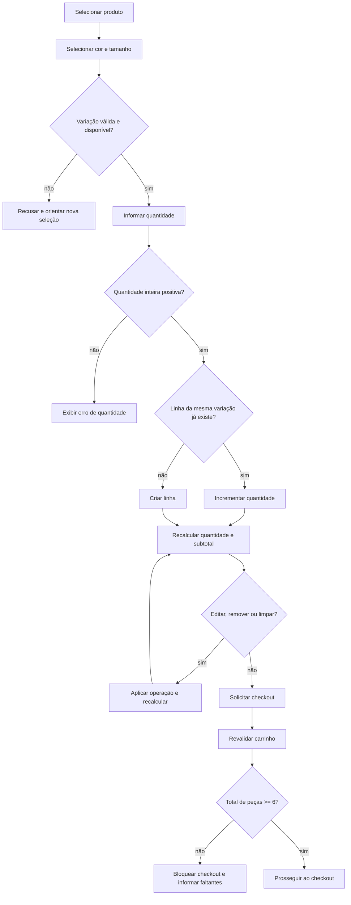
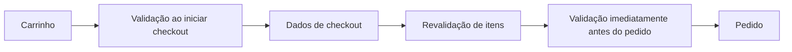
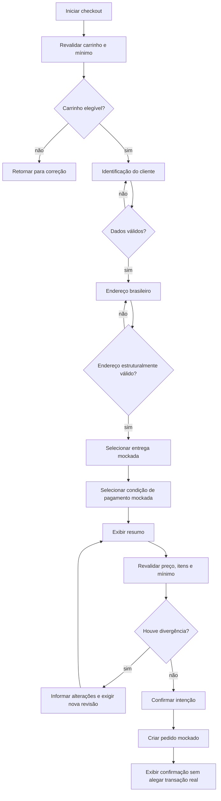
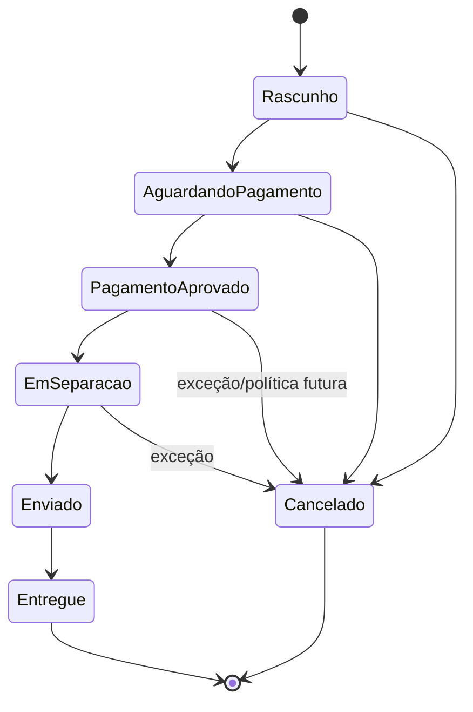
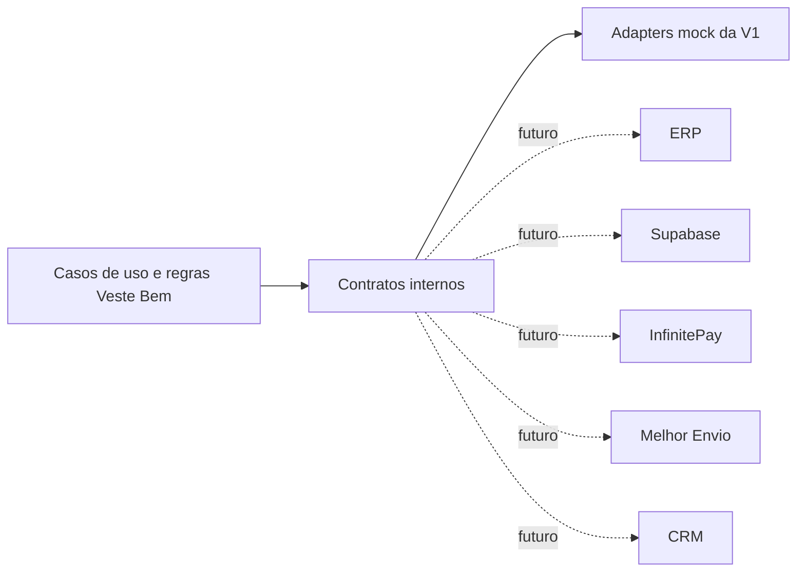

# Regras de Negócio — Veste Bem E-commerce

> **Status:** referência normativa inicial  
> **Escopo:** primeira versão do storefront com dados mockados  
> **Negócio:** moda feminina, especializada em coletes de alfaiataria no modelo atacarejo  
> **Documento relacionado:** [`01-arquitetura.md`](./01-arquitetura.md)

## Propósito, alcance e linguagem normativa

Este documento define as regras que deverão orientar entidades, casos de uso, services, validações e futuras integrações do Veste Bem E-commerce. Ele descreve comportamento de negócio, não telas, APIs, componentes, banco de dados ou implementação.

As palavras **DEVE**, **NÃO DEVE**, **PODE** e **DEVERÁ** têm sentido normativo. Valores comerciais não fornecidos pela Veste Bem — como catálogo exato de cores, tamanhos, meios de pagamento e política de frete — **NÃO DEVEM** ser presumidos. Na primeira versão, esses valores deverão vir de configuração ou dados mockados aprovados.

### Escopo da primeira versão

| Capacidade | V1 | Evolução prevista |
|---|---|---|
| Catálogo | 2 produtos e suas variações mockadas | ERP/Supabase como fonte de verdade |
| Preço | R$ 50,00 por peça para ambos os produtos | precificação fornecida pelo backoffice |
| Estoque | disponibilidade mockada | estoque por variação e reserva |
| Carrinho | seleção e cálculo local/mockado | persistência associada à sessão/cliente |
| Pedido mínimo | 6 peças no total | permanece regra comercial configurável |
| Entrega | endereços em todo o Brasil | cotação e contratação via Melhor Envio |
| Pagamento | simulação/placeholder, sem transação financeira | InfinitePay |
| Cliente | dados informados no checkout; identidade mockada quando necessária | autenticação e perfil persistente |
| Integrações | nenhuma | ERP, Supabase, InfinitePay, Melhor Envio e CRM |

### Identificação das regras

Regras recebem identificadores estáveis, como `MIN-001` ou `CART-003`. Implementações e testes deverão referenciar esses identificadores quando isso melhorar a rastreabilidade. Uma alteração em regra crítica deverá atualizar este documento e os respectivos cenários de teste.

---

## 1. Visão geral do negócio

A loja digital Veste Bem tem como objetivo comercializar coletes femininos de alfaiataria para todo o Brasil, combinando compra em volume com liberdade de composição. O público inclui revendedores, lojistas, pequenos negócios e consumidores que aceitem a quantidade mínima; nenhuma regra fornecida restringe a compra a pessoa jurídica.

O diferencial do modelo **atacarejo** é aplicar uma condição simples de acesso à compra: o pedido precisa conter no mínimo seis peças, mas a composição é livre entre modelos, cores e tamanhos disponíveis. Não existe, na V1, lote mínimo por SKU, modelo, cor ou tamanho.

### 1.1 Princípios comerciais

| ID | Regra | Justificativa |
|---|---|---|
| `COM-001` | O pedido DEVE conter pelo menos 6 peças no total para ser concluído. | Define a condição atacarejo. |
| `COM-002` | Modelos, cores e tamanhos disponíveis PODEM ser misturados livremente. | Preserva o principal diferencial comercial. |
| `COM-003` | Cada peça dos produtos iniciais custa R$ 50,00. | Preço informado para a V1. |
| `COM-004` | A entrega DEVE aceitar destinos válidos em todo o território brasileiro. | Abrangência nacional declarada. |
| `COM-005` | A V1 NÃO DEVE depender de integração externa para concluir o fluxo mockado. | Mantém o escopo independente e testável. |

O mínimo de seis peças é calculado pela soma das quantidades das linhas válidas do carrinho. A quantidade de linhas, referências distintas ou variações distintas não interfere no cálculo.

## 2. Catálogo

O catálogo é a coleção consultável de produtos comercializáveis e suas opções. Ele deverá fornecer informações suficientes para descobrir um produto e iniciar uma seleção, sem assumir responsabilidades de carrinho, pedido ou pagamento.

### 2.1 Catálogo inicial

| Referência | Nome | Preço unitário | Situação inicial |
|---|---|---:|---|
| `REF.001` | Colete Gola U | R$ 50,00 | definido nos mocks |
| `REF.002` | Colete Gola V | R$ 50,00 | definido nos mocks |

### 2.2 Regras do catálogo

| ID | Regra |
|---|---|
| `CAT-001` | Cada produto DEVE possuir referência única e estável no catálogo. |
| `CAT-002` | A referência DEVE ser exibível e pesquisável, pois identifica comercialmente o produto. |
| `CAT-003` | Nome, descrição, preço, imagens, variações, disponibilidade e status DEVEM vir da fonte de catálogo configurada. |
| `CAT-004` | Somente produtos com status publicável DEVEM aparecer na navegação normal. |
| `CAT-005` | Produto indisponível PODE permanecer visível, mas NÃO DEVE ser adicionado ao carrinho. |
| `CAT-006` | Imagem ausente NÃO DEVE tornar os demais dados do produto inválidos; deverá existir tratamento de ausência. |
| `CAT-007` | O catálogo NÃO DEVE inferir cores ou tamanhos que não estejam associados ao produto. |

### 2.3 Conceitos e responsabilidades

- **Produto:** modelo comercial, como Colete Gola U.
- **Referência:** código comercial único, como `REF.001`.
- **Variação:** combinação selecionável de atributos, nesta fase cor e tamanho.
- **Imagem:** representação do produto; poderá ser geral ou associada a uma cor.
- **Disponibilidade:** possibilidade corrente de selecionar/comprar o produto ou a variação.
- **Status:** condição editorial/comercial do produto, distinta de estoque futuro.

Catálogo responde quais produtos podem ser descobertos. Produto responde os detalhes e combinações válidas. Estoque futuro responderá quantas unidades podem ser prometidas. Essas responsabilidades não deverão ser fundidas.

## 3. Produto

Produto representa um modelo comercial oferecido pela Veste Bem. A entidade deverá manter identidade estável mesmo que nome, descrição, imagens ou preço sejam atualizados.

### 3.1 Estrutura conceitual

| Campo | Obrigatoriedade | Regra |
|---|---|---|
| Identificador interno | obrigatório | Único e estável; não precisa ser exibido. |
| Referência | obrigatória | Única, não vazia e preservada como código comercial. |
| Nome | obrigatório | Nome comercial não vazio. |
| Descrição | obrigatória para publicação | Conteúdo comercial do modelo; não deve prometer atributo inexistente. |
| Preço unitário | obrigatório | Valor monetário em BRL, maior ou igual a zero; na V1, R$ 50,00. |
| Imagens | necessárias para publicação comercial | Lista ordenada; uma imagem principal poderá ser definida. |
| Cores | obrigatórias para venda | Conjunto de opções autorizadas no mock do produto. |
| Tamanhos | obrigatórios para venda | Conjunto de opções autorizadas no mock do produto. |
| Variações | obrigatórias para venda | Combinações válidas entre cor e tamanho. |
| Status | obrigatório | Controla publicação e possibilidade de compra. |
| Disponibilidade | obrigatória | Derivada do status e, futuramente, do estoque da variação. |

### 3.2 Status de produto

| Status | Visível no catálogo | Comprável | Uso |
|---|---:|---:|---|
| Rascunho | não | não | Cadastro ainda incompleto. |
| Ativo | sim | sim, se houver variação disponível | Produto publicado. |
| Indisponível | opcionalmente | não | Produto conhecido, temporariamente sem compra. |
| Inativo | não na navegação normal | não | Produto retirado sem apagar histórico. |

Na V1, os mocks deverão definir explicitamente o status. Um produto somente poderá originar item de carrinho se estiver `Ativo` e se a combinação selecionada estiver disponível.

### 3.3 Preço

| ID | Regra |
|---|---|
| `PRD-001` | `REF.001` e `REF.002` DEVEM possuir preço unitário de R$ 50,00 na V1. |
| `PRD-002` | Cor e tamanho NÃO DEVEM alterar o preço na V1. |
| `PRD-003` | O preço usado no resumo e no pedido DEVE ser validado novamente pela fonte autoritativa no momento da conclusão. |
| `PRD-004` | Valores monetários DEVEM ser calculados em unidade inteira de centavos, sem ponto flutuante binário. |
| `PRD-005` | O pedido DEVE registrar um snapshot do preço unitário aplicado a cada item. |

## 4. Variações

Uma variação é a combinação de um produto, uma cor e um tamanho. Cada combinação deverá possuir identidade própria, ainda que compartilhe preço e imagens com o produto.

```text
Variação = Produto + Cor + Tamanho
```

### 4.1 Cores e tamanhos

As listas de cores e tamanhos não foram definidas no escopo recebido. Portanto:

- os mocks DEVEM declarar explicitamente as opções autorizadas por produto;
- a aplicação NÃO DEVE gerar opções por suposição;
- rótulos e códigos DEVEM permanecer estáveis;
- uma opção pertencente a um produto NÃO implica que exista para o outro;
- a seleção do usuário DEVE corresponder a uma combinação cadastrada.

### 4.2 Combinações

| ID | Regra |
|---|---|
| `VAR-001` | Cada linha do carrinho DEVE identificar uma única variação. |
| `VAR-002` | A mesma referência com cor ou tamanho diferente constitui linha distinta. |
| `VAR-003` | Adicionar novamente a mesma variação DEVE incrementar/consolidar sua quantidade, não criar linha duplicada. |
| `VAR-004` | Combinação inexistente ou indisponível NÃO DEVE ser adicionada. |
| `VAR-005` | A escolha de cor e tamanho DEVE ocorrer antes da adição ao carrinho. |
| `VAR-006` | Alterar cor ou tamanho de uma linha equivale a trocar a variação; se o destino já existir, as quantidades DEVEM ser consolidadas. |

### 4.3 Estoque atual e futuro

Na V1, disponibilidade é mockada. Não se deverá simular precisão de estoque real. Quando houver integração, estoque será controlado por variação, e não somente por produto.

O estoque futuro deverá distinguir, no mínimo, quantidade disponível, quantidade reservada e possibilidade de venda. Adicionar ao carrinho não deverá garantir reserva, salvo decisão futura explícita. A disponibilidade deverá ser revalidada no checkout e antes da confirmação do pedido.

## 5. Carrinho

Carrinho é a seleção mutável de variações que o cliente pretende comprar. Ele não representa pedido confirmado, não reserva estoque na V1 e não congela preço.

### 5.1 Estrutura de uma linha

Uma linha válida deverá conter identificadores de produto e variação, referência, nome, cor, tamanho, quantidade inteira positiva e preço unitário exibido. Dados descritivos no carrinho são snapshot de apresentação; a validação autoritativa deverá consultar o catálogo configurado.

### 5.2 Operações

| ID | Operação | Regra normativa |
|---|---|---|
| `CART-001` | Adicionar | Exige produto ativo, variação válida/disponível e quantidade inteira positiva. |
| `CART-002` | Consolidar | Mesma variação adicionada novamente incrementa a linha existente. |
| `CART-003` | Alterar quantidade | Novo valor deve ser inteiro positivo; zero deve ser tratado como remoção confirmada ou ação explícita de remover. |
| `CART-004` | Remover | Remove somente a linha selecionada e recalcula os totais. |
| `CART-005` | Limpar | Remove todas as linhas; a ação deverá ser intencional e resultar em carrinho vazio. |
| `CART-006` | Revalidar | Produto, variação, preço e disponibilidade deverão ser revistos antes do checkout. |
| `CART-007` | Persistir | Persistência futura deverá ser versionada, validada e conciliada com a fonte atual. |

### 5.3 Cálculos

Para cada linha `i`:

```text
totalDaLinha(i) = preçoUnitário(i) × quantidade(i)
quantidadeTotal = soma de quantidade(i)
subtotal = soma de totalDaLinha(i)
total = subtotal + entrega - descontos
```

Na V1 não há regra fornecida de desconto. Portanto, `descontos = R$ 0,00`. Se o mock não definir cobrança de entrega, o sistema não deverá inventar valor: deverá apresentar entrega como pendente/simulada conforme o fluxo aprovado. O total financeiro só é final quando todos os componentes aplicáveis estiverem determinados.

Com os dois produtos a R$ 50,00, seis peças resultam em subtotal de R$ 300,00, independentemente da combinação.

### 5.4 Fluxo completo



### 5.5 Persistência

Na V1, eventual armazenamento no navegador deverá ser considerado cache não confiável: precisa de versão e validação ao ser carregado. Futuramente, carrinho anônimo poderá ser associado a uma sessão e conciliado após login. A conciliação deverá consolidar variações idênticas e revalidar preço/disponibilidade; não deverá somar silenciosamente além do estoque disponível.

## 6. Pedido mínimo

O pedido mínimo é uma **invariante comercial crítica**.

| ID | Regra |
|---|---|
| `MIN-001` | A conclusão do checkout exige `quantidadeTotal >= 6`. |
| `MIN-002` | `quantidadeTotal` é a soma das unidades válidas, não a quantidade de linhas. |
| `MIN-003` | Referência, modelo, cor e tamanho não criam mínimos separados. |
| `MIN-004` | Itens inválidos, removidos ou indisponíveis não contam para o mínimo. |
| `MIN-005` | A regra deve ser verificada ao entrar no checkout e novamente antes de criar o pedido. |
| `MIN-006` | A interface deve informar quantas peças faltam: `max(0, 6 - quantidadeTotal)`. |
| `MIN-007` | Alterações que reduzam o carrinho para menos de 6 peças devem manter o carrinho editável, mas bloquear a conclusão. |

### 6.1 Exemplos normativos

| Composição | Total | Resultado | Motivo |
|---|---:|---|---|
| 6 × REF.001, mesma cor e tamanho | 6 | válido | Atinge o mínimo. |
| 3 × Gola U + 3 × Gola V | 6 | válido | Modelos podem ser misturados. |
| 4 × Gola U + 2 × Gola V | 6 | válido | Distribuição entre referências é livre. |
| 2 × Gola U + 2 × Gola V | 4 | inválido | Faltam 2 peças. |
| 1 unidade de 6 variações diferentes | 6 | válido | Cor e tamanho não criam mínimo próprio. |
| 5 × REF.001 + 1 item indisponível | 5 válidas | inválido | Item indisponível não conta. |
| 8 unidades válidas | 8 | válido | Não há múltiplo obrigatório de 6. |
| 12 unidades de uma única referência | 12 | válido | Não há diversidade obrigatória. |
| carrinho vazio | 0 | inválido | Faltam 6 peças. |

### 6.2 Pontos de validação



Validar somente no botão ou somente no cliente é insuficiente. A regra deverá existir no caso de uso autoritativo de criação do pedido; validações anteriores apenas antecipam feedback.

## 7. Checkout

Checkout transforma um carrinho elegível em intenção de pedido. Na V1, o fluxo deverá operar com mocks e NÃO deverá comunicar pagamento, frete ou persistência reais.

### 7.1 Pré-condições

- carrinho não vazio;
- pelo menos seis peças válidas;
- produtos ativos e variações disponíveis no mock;
- preços revalidados;
- dados pessoais e endereço de entrega válidos;
- opção de entrega mockada selecionada quando houver mais de uma;
- condição de pagamento mockada selecionada quando o fluxo a exigir.

### 7.2 Etapas

1. **Identificação:** coletar dados pessoais necessários à compra.
2. **Endereço:** coletar e validar destino brasileiro.
3. **Entrega:** apresentar opção/condição mockada, sem cotação real.
4. **Pagamento:** apresentar simulação ou placeholder claramente não transacional.
5. **Resumo:** exibir itens, variações, quantidades, subtotal, entrega e total determinável.
6. **Revisão:** revalidar dados, mínimo, disponibilidade e preço.
7. **Confirmação:** criar representação mockada do pedido e número único no conjunto local.

### 7.3 Dados pessoais mínimos

O conjunto definitivo deverá ser aprovado conforme necessidade fiscal e operacional. Para a documentação atual, nome, e-mail e telefone são dados de contato esperados; CPF/CNPJ não deverá ser tornado obrigatório sem decisão fiscal/documentada. Consentimentos de marketing deverão ser separados da execução do pedido e nunca pré-condicionados à compra.

### 7.4 Endereço

Um endereço de entrega deverá conter, no mínimo, destinatário, CEP, logradouro, número (ou indicação válida de “sem número”), bairro, cidade e UF. Complemento é opcional. O CEP deve ter oito dígitos após normalização, mas não prova sozinho que o endereço existe. A V1 deverá aceitar endereços de todas as UFs brasileiras e Distrito Federal.

### 7.5 Fluxo



### 7.6 Regra de confirmação na V1

Como não existe InfinitePay, a V1 NÃO DEVE afirmar que um pagamento real foi aprovado. O estado resultante deverá ser explicitamente mockado. Se o protótipo usar “pedido confirmado”, a mensagem deverá significar apenas que o pedido mockado foi criado, não que houve cobrança, reserva real de estoque ou contratação de frete.

## 8. Pedido

Pedido é o registro imutável da intenção comercial aceita após as validações finais. Diferentemente do carrinho, ele preserva snapshots para auditoria e não deve mudar retroativamente quando o catálogo for alterado.

### 8.1 Estrutura conceitual

| Campo | Regra |
|---|---|
| Identificador | Único e estável. |
| Número | Único, exibível e não reutilizável no escopo da fonte. |
| Status | Um dos estados permitidos, com transições controladas. |
| Datas | Criação obrigatória; atualizações e eventos em ordem rastreável. |
| Itens | Pelo menos 6 unidades totais válidas na criação. |
| Item | Snapshot de referência, nome, cor, tamanho, quantidade e preço unitário. |
| Cliente | Snapshot dos dados necessários ao pedido. |
| Endereço | Snapshot completo do endereço de entrega. |
| Entrega | Método, valor e prazo quando determinados; mock identificado na V1. |
| Pagamento | Condição e estado, sem dados sensíveis; mock identificado na V1. |
| Valores | Subtotal, descontos, entrega e total em BRL. |
| Histórico | Eventos de status com data e origem. |

### 8.2 Regras

| ID | Regra |
|---|---|
| `ORD-001` | Um pedido só pode ser criado a partir de carrinho elegível e revalidado. |
| `ORD-002` | O número do pedido deve ser único e não deve expor segredo ou dado pessoal. |
| `ORD-003` | Itens e preços devem ser snapshots; mudanças no catálogo não os alteram. |
| `ORD-004` | Toda mudança de status deve gerar histórico, sem apagar o evento anterior. |
| `ORD-005` | O total deve ser reproduzível pela soma dos componentes registrados. |
| `ORD-006` | Operação repetida de confirmação não deve criar pedidos duplicados; integrações futuras exigirão idempotência. |
| `ORD-007` | Pedido não deve armazenar dados brutos de cartão. |

## 9. Status do pedido

Os estados abaixo formam o vocabulário futuro completo. Na V1, somente os estados necessários ao fluxo mockado deverão ser utilizados, sem representar eventos externos inexistentes.

| Status | Significado | Transições típicas | Terminal |
|---|---|---|---:|
| Rascunho | Intenção ainda não submetida ou pedido mock em construção. | Aguardando pagamento, Cancelado | não |
| Aguardando pagamento | Pedido criado e cobrança pendente. | Pagamento aprovado, Cancelado | não |
| Pagamento aprovado | Provedor confirmou pagamento de forma autoritativa. | Em separação, Cancelado/estorno conforme política futura | não |
| Em separação | Itens estão sendo preparados. | Enviado, Cancelado excepcionalmente | não |
| Enviado | Pedido entregue à transportadora e possui expedição registrada. | Entregue | não |
| Entregue | Entrega confirmada. | —, salvo fluxo futuro de devolução | sim |
| Cancelado | Pedido encerrado sem prosseguir. | — | sim |

### 9.1 Regras de transição

- Status não deverá avançar apenas por passagem de tempo.
- `Pagamento aprovado` futuro exigirá confirmação autoritativa do provedor, não retorno visual do navegador.
- `Enviado` exigirá evidência de expedição; `Entregue`, evento de entrega.
- Cancelamento deverá registrar motivo, origem e data quando a capacidade existir.
- Transição inválida deverá ser rejeitada e registrada para diagnóstico.
- Estados futuros de reembolso, devolução ou falha poderão ser adicionados por decisão de negócio, sem reinterpretar histórico antigo.



## 10. Cliente

Cliente é a pessoa que fornece dados para o pedido. Identidade/autenticação e perfil comercial são conceitos relacionados, porém distintos.

### 10.1 V1

- A compra não deverá exigir login real, pois autenticação não está integrada.
- Dados de checkout deverão ser validados e usados somente no fluxo mockado conforme o escopo.
- A aplicação não deverá prometer conta persistente ou histórico real sem fonte persistente.
- Dados pessoais não deverão ser usados para marketing sem consentimento específico.

### 10.2 Evolução

| Capacidade | Regra futura |
|---|---|
| Cadastro | Identidade única por mecanismo definido, com verificação quando necessária. |
| Login | Autenticação segura; não mistura senha com perfil de cliente. |
| Perfil | Alterações afetam dados futuros, não snapshots de pedidos anteriores. |
| Endereços | Cliente pode manter múltiplos endereços e escolher um no checkout. |
| Pedidos | Somente o titular autorizado acessa seus pedidos. |
| Favoritos | Podem ser conciliados entre visitante e conta autenticada. |

E-mail e telefone deverão ser normalizados para comparação, mas preservados adequadamente para comunicação. CPF/CNPJ, se futuramente exigidos, deverão ter base legal, validação e proteção compatíveis com sua sensibilidade.

## 11. Favoritos

Favoritos representam interesse e não intenção de compra. Favoritar não reserva estoque, não congela preço e não garante disponibilidade.

| ID | Regra |
|---|---|
| `FAV-001` | Um produto deve aparecer no máximo uma vez na lista de favoritos. |
| `FAV-002` | Favoritar novamente o mesmo produto deve ser idempotente. |
| `FAV-003` | Desfavoritar item ausente não deve causar corrupção ou duplicidade. |
| `FAV-004` | Produto inativo pode ser ocultado ou marcado indisponível, sem ser silenciosamente convertido em outro produto. |
| `FAV-005` | Adicionar favorito ao carrinho exige seleção de uma variação válida. |
| `FAV-006` | Favoritos de visitante são locais/mockados; persistência em conta é futura. |

Fluxo: cliente favorita produto → sistema registra identidade do produto → lista consulta dados atuais do catálogo → cliente abre produto e escolhe cor/tamanho → regras normais de carrinho são aplicadas.

## 12. Busca

Busca deverá localizar produtos publicáveis por texto comercial e atributos estruturados disponíveis. Ela não deve criar produtos nem variações diferentes do catálogo.

### 12.1 Critérios

| Critério | Comportamento esperado |
|---|---|
| Referência | Correspondência exata normalizada deve ter prioridade, por exemplo `REF.001`. |
| Modelo/nome | Correspondência textual tolerante a caixa e acentos. |
| Descrição | Pode complementar relevância, abaixo de referência e nome. |
| Cor | Filtra produtos com ao menos uma variação daquela cor. |
| Tamanho | Filtra produtos com ao menos uma variação daquele tamanho. |
| Disponibilidade | Permite restringir a itens compráveis. |

### 12.2 Ordenação

Ordenações permitidas deverão ser explícitas e estáveis, como relevância, nome e preço. “Menor preço” e “maior preço” terão empate na V1; um critério secundário estável deverá evitar ordem aleatória. Nenhuma ordenação por popularidade deverá ser simulada sem dados.

Consulta vazia poderá apresentar catálogo completo ou orientação definida pela experiência, mas não deverá ser tratada como erro. Resultado vazio deverá informar ausência sem alterar filtros silenciosamente. Filtros combinados usam interseção: um produto precisa satisfazer todas as categorias de filtro selecionadas.

## 13. Regras comerciais consolidadas

| ID | Regra | Exemplo |
|---|---|---|
| `COM-001` | Mínimo de 6 peças totais. | 5 peças bloqueiam; 6 liberam. |
| `COM-002` | Mistura livre de modelos. | 3 Gola U + 3 Gola V. |
| `COM-006` | Mistura livre de cores disponíveis. | 6 peças podem ter cores diferentes. |
| `COM-007` | Mistura livre de tamanhos disponíveis. | 6 peças podem ter tamanhos diferentes. |
| `COM-003` | Preço unitário único de R$ 50,00 na V1. | 8 peças = subtotal de R$ 400,00. |
| `COM-004` | Entrega para destinos válidos de todo o Brasil. | Não bloquear uma UF válida por região. |
| `COM-008` | Não há mínimo por variação nem múltiplos obrigatórios. | 7 peças também formam pedido válido. |
| `COM-009` | Não há descontos ou faixas de preço documentados na V1. | 12 peças continuam a R$ 50,00 cada. |

### 13.1 Exemplos financeiros

| Carrinho | Quantidade | Subtotal | Elegibilidade |
|---|---:|---:|---|
| 3 REF.001 + 3 REF.002 | 6 | R$ 300,00 | elegível |
| 6 REF.001 | 6 | R$ 300,00 | elegível |
| 4 REF.001 + 2 REF.002 | 6 | R$ 300,00 | elegível |
| 2 REF.001 + 2 REF.002 | 4 | R$ 200,00 | não elegível |
| 5 REF.001 + 3 REF.002 | 8 | R$ 400,00 | elegível |
| 12 REF.002 | 12 | R$ 600,00 | elegível |

Entrega não foi incluída nesses subtotais. O total somente poderá ser declarado após determinar o valor da entrega; descontos permanecem zero enquanto não houver nova regra aprovada.

## 14. Regras de validação

Validação estrutural deverá ocorrer nas fronteiras; invariantes comerciais deverão ser protegidas pelos casos de uso/domínio, conforme `01-arquitetura.md`. Validação no navegador melhora feedback, mas nunca substitui a validação autoritativa.

### 14.1 Matriz de validação

| Contexto | Validação | Falha esperada |
|---|---|---|
| Produto | referência única e não vazia | produto rejeitado/não publicado |
| Produto | nome e preço válidos | produto rejeitado/não publicado |
| Produto | status conhecido | produto rejeitado |
| Variação | produto + cor + tamanho existentes | seleção rejeitada |
| Variação | combinação disponível | adição bloqueada |
| Carrinho | quantidade inteira positiva | operação recusada |
| Carrinho | linha identificada por variação | linha recusada/consolidada corretamente |
| Carrinho | totais derivados das linhas | recalcular, nunca aceitar total informado pelo cliente |
| Checkout | total de peças >= 6 | conclusão bloqueada |
| Checkout | dados pessoais estruturados | solicitar correção |
| Checkout | endereço brasileiro completo | solicitar correção |
| Checkout | preço e disponibilidade atuais | informar divergência e exigir revisão |
| Pedido | número único | impedir duplicidade |
| Pedido | pelo menos 6 unidades válidas | não criar pedido |
| Pedido | soma monetária consistente | não confirmar e registrar falha |
| Cliente | e-mail/telefone em formato aceito | solicitar correção |
| Favoritos | identidade de produto válida | não adicionar |
| Busca | filtros pertencem ao vocabulário aceito | ignorar de forma explícita ou retornar erro controlado |

### 14.2 Normalização

- Referência deverá ser comparada de forma consistente sem alterar seu valor canônico.
- CEP deverá remover caracteres de apresentação e resultar em oito dígitos.
- UF deverá pertencer ao conjunto das 27 unidades federativas.
- Quantidade deverá ser número inteiro; strings, decimais, negativos, infinito e `NaN` são inválidos.
- Dinheiro deverá usar BRL e centavos inteiros.
- Texto deverá ser aparado e limitado conforme seu contexto, sem remover significado legítimo.

### 14.3 Autoridade dos dados

O cliente nunca é autoridade para preço, subtotal, total, disponibilidade, elegibilidade ou status de pedido. Esses valores deverão ser recalculados a partir da fonte configurada e das regras oficiais.

## 15. Casos de exceção

| Caso | Comportamento obrigatório |
|---|---|
| Produto indisponível antes da adição | Bloquear adição e preservar seleção possível para correção. |
| Produto fica indisponível no carrinho | Marcar linha inválida, excluí-la dos cálculos elegíveis e solicitar remoção/substituição. |
| Quantidade inválida | Recusar alteração; não normalizar negativo ou decimal silenciosamente. |
| Pedido abaixo do mínimo | Bloquear conclusão e informar quantidade atual e faltante. |
| Produto removido do catálogo | Preservar histórico de pedido; no carrinho, marcar como indisponível. |
| Variação removida | Não converter automaticamente para outra cor/tamanho. |
| Preço divergente | Atualizar apenas após informar a mudança e exigir nova revisão do resumo. |
| Dados mock corrompidos | Falhar de forma controlada; não criar pedido com regra parcialmente aplicada. |
| Carrinho persistido incompatível | Descartar/recuperar apenas partes válidas e comunicar alterações relevantes. |
| Duplo envio da confirmação | Produzir no máximo um pedido para a mesma tentativa lógica. |
| Falha futura no pagamento | Não marcar como aprovado; manter estado recuperável e permitir nova tentativa segura. |
| Callback visual sem webhook | Não considerar pagamento confirmado. |
| Falha futura na cotação de frete | Não inventar preço/prazo; permitir nova tentativa ou informar indisponibilidade. |
| CEP sem serviço futuro | Impedir seleção de método inexistente, sem declarar que a Veste Bem não atende o Brasil inteiro. |
| Falha futura de estoque | Não prometer item; orientar correção e revalidar o mínimo. |

### 15.1 Concorrência futura

Preço e estoque poderão mudar entre catálogo, carrinho e confirmação. O checkout deverá trabalhar com revisão otimista: revalida, apresenta divergências e exige aceite do resumo atualizado. Pagamento não deverá ser iniciado com valores desatualizados. Se a indisponibilidade reduzir a cesta abaixo de seis peças, o pedido deverá ser bloqueado até recomposição.

## 16. Preparação para futuras integrações

Integrações deverão implementar as portas internas descritas na arquitetura. Elas não poderão redefinir silenciosamente as regras deste documento; divergências exigem decisão de negócio e atualização normativa.



### 16.1 Matriz de evolução

| Integração | Responsabilidade futura | Regras que permanecem internas | Decisões pendentes |
|---|---|---|---|
| Supabase | persistência, consultas e possivelmente sessão | mínimo, composição livre, validação de pedido | modelo de dados, RLS, retenção |
| ERP | catálogo, preço, estoque e pedidos como definido pela operação | interpretação do mínimo e experiência de checkout | fonte de verdade, frequência e conflitos |
| InfinitePay | criação/consulta de cobrança e confirmação por webhook | valor autoritativo do pedido e transições permitidas | métodos, expiração, estorno, idempotência |
| Melhor Envio | cotação, contratação, etiqueta e rastreio | endereço válido e composição do pedido | embalagem, origem, prazo, margem e frete grátis |
| CRM | relacionamento e eventos consentidos | finalidade e consentimento | eventos, opt-in, retenção e deduplicação |

### 16.2 Supabase

Repositories reais deverão substituir mocks sem alterar casos de uso. Tipos de banco não deverão vazar para domínio. Operações de pedido deverão ser atômicas quando necessário, e políticas de acesso deverão impedir leitura cruzada entre clientes.

### 16.3 ERP

Antes da integração, deverá ser definido se o ERP é fonte de verdade para produto, variação, preço, estoque e número de pedido. Sincronizações deverão preservar referências, detectar conflitos e ser idempotentes. Exclusão no ERP não deverá apagar snapshots históricos.

### 16.4 InfinitePay

O valor enviado deverá ser recalculado no servidor a partir do pedido. Confirmação exigirá evento autoritativo verificado. Repetição de requisição/webhook não poderá duplicar cobrança ou transição. Dados brutos de cartão não serão armazenados pela Veste Bem.

### 16.5 Melhor Envio

Cotação dependerá de endereço, dimensões/peso e composição do pacote, ainda não definidos. Prazo e valor deverão ter validade. Falha de cotação não autoriza usar valor inventado. Rastreamento será normalizado para os estados internos sem substituir o histórico bruto necessário à auditoria.

### 16.6 CRM

Eventos deverão carregar o mínimo de dados pessoais necessário e respeitar consentimento. Falha no CRM não deverá bloquear pedido válido. A entrega deverá ser assíncrona/repetível quando a confiabilidade exigir.

### 16.7 Necessidades arquiteturais documentadas

Sem alterar a arquitetura atual, as integrações futuras exigirão: idempotência, snapshots de pedido, histórico de status, mappers anticorrupção, observabilidade com correlation ID, tratamento de eventos assíncronos e definição explícita de fontes de verdade. Esses requisitos já são compatíveis com as portas/adapters estabelecidos em `01-arquitetura.md`.

## 17. Checklist de conformidade

### Catálogo e produto

- [ ] Existem somente produtos publicáveis na navegação normal.
- [ ] `REF.001` corresponde a Colete Gola U e `REF.002` a Colete Gola V.
- [ ] Ambos custam R$ 50,00 por peça na V1.
- [ ] Referências são únicas, estáveis e pesquisáveis.
- [ ] Cores e tamanhos vêm dos mocks aprovados, sem opções inventadas.
- [ ] A variação corresponde a produto + cor + tamanho válidos.
- [ ] Produto/variação indisponível não pode ser adicionado.

### Carrinho e mínimo

- [ ] Mesma variação é consolidada em uma única linha.
- [ ] Quantidade aceita apenas inteiro positivo.
- [ ] Alterar, remover e limpar recalculam todos os totais.
- [ ] Quantidade total soma unidades, não linhas.
- [ ] Modelos, cores e tamanhos podem ser misturados.
- [ ] Não existe mínimo por referência ou variação.
- [ ] Checkout é bloqueado abaixo de 6 peças válidas.
- [ ] O sistema informa quantas peças faltam.
- [ ] O mínimo é revalidado antes de criar o pedido.

### Valores

- [ ] Cálculos usam centavos inteiros e moeda BRL.
- [ ] Subtotal é soma de preço unitário × quantidade.
- [ ] Cor e tamanho não alteram preço na V1.
- [ ] Não foram criados descontos/faixas comerciais não documentados.
- [ ] Entrega não recebe preço ou prazo inventado.
- [ ] O total é recalculado pela autoridade, nunca aceito do cliente.
- [ ] Divergência de preço exige nova revisão.

### Checkout e pedido

- [ ] Dados pessoais e endereço são validados na fronteira e no servidor autoritativo.
- [ ] Endereços válidos de todas as UFs e DF são aceitos.
- [ ] Marketing não é condição para compra.
- [ ] A V1 identifica pagamento, entrega e pedido como mockados quando necessário.
- [ ] Nenhuma mensagem afirma pagamento real sem integração.
- [ ] Pedido registra snapshots de itens, cliente, endereço e valores.
- [ ] Número do pedido é único no escopo da fonte.
- [ ] Confirmação repetida não cria duplicidade.
- [ ] Mudanças de status preservam histórico.

### Cliente, favoritos e busca

- [ ] Compra na V1 não depende de login real.
- [ ] Favorito não reserva estoque nem preço.
- [ ] Favoritos não contêm duplicatas.
- [ ] Adicionar favorito ao carrinho exige seleção de variação.
- [ ] Busca prioriza referência exata e aceita nome/modelo.
- [ ] Filtros de cor/tamanho usam variações existentes.
- [ ] Ordenação é explícita e estável.
- [ ] Popularidade não é simulada sem dados.

### Exceções e integrações

- [ ] Itens inválidos deixam de contar para mínimo e valores elegíveis.
- [ ] Variação removida não é substituída silenciosamente.
- [ ] Falhas são recuperáveis quando possível e não corrompem o pedido.
- [ ] Mocks respeitam a mesma semântica dos contratos futuros.
- [ ] Tipos e estados de fornecedores não vazam para o domínio.
- [ ] Fonte de verdade é definida antes de cada integração.
- [ ] Pagamento futuro depende de confirmação autoritativa e idempotente.
- [ ] Falha de CRM não bloqueia pedido.
- [ ] Dados pessoais são mínimos, protegidos e usados para finalidade declarada.

---

## Registro de ambiguidades e decisões pendentes

Os itens abaixo não autorizam suposições de implementação. Devem ser decididos pela Veste Bem antes de sua capacidade correspondente tornar-se definitiva:

1. catálogo exato de cores e tamanhos por produto;
2. imagens e descrições oficiais;
3. política de disponibilidade nos mocks;
4. dados pessoais/fiscais obrigatórios no checkout;
5. modalidades, preço e prazo de entrega na V1;
6. condições/meios exibidos na simulação de pagamento;
7. formato do número de pedido;
8. política de cancelamento, troca, devolução e reembolso;
9. dimensões, peso e regras de embalagem para frete;
10. fonte de verdade entre ERP, Supabase e o e-commerce;
11. política futura de descontos, atacado por faixa ou frete grátis, caso exista.

Até que uma decisão seja aprovada, a aplicação deverá manter configuração mock explícita, comportamento conservador e comunicação que não prometa operação real. Qualquer mudança em preço, mínimo ou liberdade de composição exige revisão deste documento, dos testes de domínio e dos contratos afetados.
