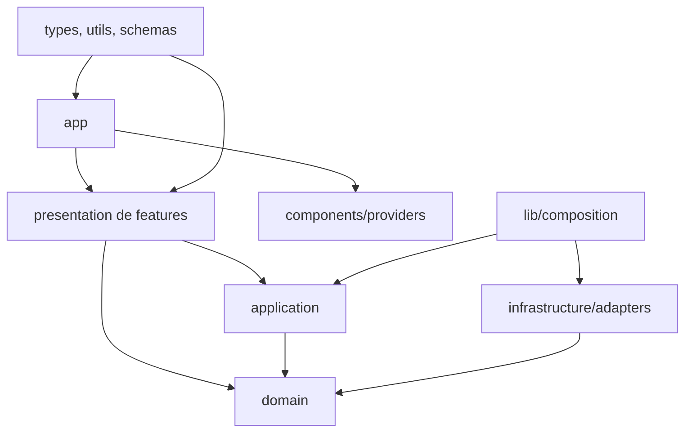
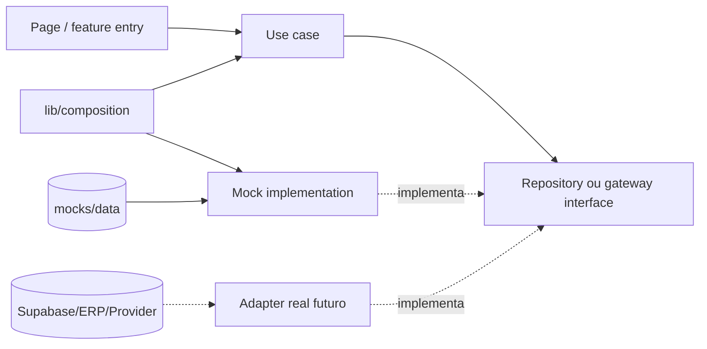

# Estrutura do Projeto — Veste Bem E-commerce

> **Status:** padrão estrutural normativo inicial  
> **Escopo:** organização de arquivos e diretórios do storefront Next.js  
> **Documentos normativos relacionados:** [`01-arquitetura.md`](./01-arquitetura.md) e [`02-regras-negocio.md`](./02-regras-negocio.md)  
> **Regra de precedência:** regras de negócio definem o comportamento; arquitetura define dependências; este documento define a localização física

## Linguagem normativa e critérios de criação

As palavras **DEVE**, **NÃO DEVE**, **PODE** e **DEVERÁ** são normativas. As árvores deste documento representam a estrutura permitida e sua evolução prevista; diretórios vazios **NÃO DEVEM** ser criados somente para reproduzir a árvore. Uma pasta deverá existir quando contiver ao menos um arquivo real ou um placeholder explicitamente exigido.

Este documento não autoriza a criação de código, páginas ou configurações. Ele determina onde esses artefatos deverão ficar quando a implementação for iniciada. Tecnologia não aprovada — por exemplo, Tailwind CSS ou uma biblioteca específica de testes — não deverá ganhar arquivo de configuração apenas por conveniência.

---

## 1. Objetivo da estrutura

A estrutura transforma os limites lógicos de `01-arquitetura.md` em regras físicas verificáveis. Seu objetivo é permitir que uma pessoa ou IA descubra onde criar, localizar e revisar qualquer artefato sem inventar uma nova organização a cada tarefa.

### 1.1 Resultados esperados

- **Manutenção:** mudanças permanecem próximas do domínio responsável e reduzem efeitos colaterais.
- **Escalabilidade do código:** novas features repetem um padrão conhecido sem ampliar pastas genéricas.
- **Escalabilidade de equipe:** APIs públicas e limites físicos permitem trabalho paralelo com menos conflito.
- **Testabilidade:** domínio e casos de uso permanecem isolados de Next.js, React e fornecedores.
- **Integrações futuras:** mocks e adapters reais implementam as mesmas portas sem mover regras ou páginas.
- **Navegabilidade:** nomes previsíveis diminuem tempo de busca e revisões inconsistentes.

### 1.2 Regra central de localização

Um arquivo deverá ficar no **menor escopo que seja dono de sua mudança**:

```mermaid
flowchart TD
    A[Novo artefato] --> B{Pertence a uma única feature?}
    B -->|sim| C[features/nome-da-feature]
    B -->|não| D{É apresentação reutilizável?}
    D -->|sim| E[components, hooks ou styles]
    D -->|não| F{É capacidade técnica/transversal?}
    F -->|sim| G[lib, config, providers, schemas, services, types, utils ou validators]
    F -->|não| H[Reavaliar proprietário; não usar shared como descarte]
```



Mover um artefato para o escopo global exige reutilização real, semântica compartilhada e a mesma razão para mudar. Sem esses três critérios, o artefato deverá permanecer local à feature.

## 2. Estrutura geral

Estrutura normativa da raiz quando o projeto estiver inicializado:

```text
veste-bem-ecom/
├── docs/
│   ├── 01-arquitetura.md
│   ├── 02-regras-negocio.md
│   └── 03-estrutura-do-projeto.md
├── e2e/                              # testes ponta a ponta, quando adotados
├── public/                           # arquivos públicos servidos por URL
├── src/                              # código-fonte da aplicação
├── .env.example                     # nomes de variáveis, sem segredos
├── .gitignore
├── eslint.config.mjs
├── next-env.d.ts                    # gerado pelo Next.js
├── next.config.ts
├── package.json
├── package-lock.json                # lockfile único do npm
├── prettier.config.mjs
├── README.md
└── tsconfig.json
```

### 2.1 Responsabilidade dos itens da raiz

| Item | Deve conter | Não deve conter |
|---|---|---|
| `docs/` | arquitetura, regras e padrões técnicos oficiais | código executável ou anotações temporárias |
| `e2e/` | cenários que atravessam rotas e fluxos críticos | testes unitários de domínio |
| `public/` | favicons, manifest e mídia acessada por URL pública | segredos, módulos TypeScript ou imagens importadas pelo build |
| `src/` | todo código-fonte e assets processados | documentação normativa ou arquivos de CI |
| `.env.example` | chaves esperadas e valores seguros de exemplo | credencial real ou dado pessoal |
| `.gitignore` | artefatos gerados, segredos locais e caches ignorados | arquivos-fonte necessários ao build |
| `eslint.config.mjs` | regras de qualidade, imports e limites arquiteturais | formatação que pertence ao Prettier |
| `next-env.d.ts` | referências de tipos geradas pelo Next.js | edição manual |
| `next.config.ts` | configuração do framework, imagens e headers técnicos | regra comercial ou segredo |
| `package.json` | scripts, dependências e metadados do pacote | configuração de domínio |
| `package-lock.json` | resolução reproduzível das dependências npm | edição manual |
| `prettier.config.mjs` | formatação determinística | regras semânticas de lint |
| `README.md` | onboarding, comandos e links para `docs/` | duplicação integral dos documentos oficiais |
| `tsconfig.json` | TypeScript, strict mode e alias `@/*` | aliases paralelos desnecessários |

O padrão inicial usa um único pacote e um único lockfile. Monorepo não deverá ser criado enquanto existir apenas uma unidade de implantação. Arquivos como `tailwind.config.ts`, `postcss.config.mjs`, configurações de Vitest ou Playwright somente deverão existir após a respectiva tecnologia ser escolhida e registrada; eles ficam na raiz por serem configuração de ferramenta.

### 2.2 Testes e documentação auxiliar

Testes unitários e de componente ficam junto do arquivo testado (`*.test.ts` ou `*.test.tsx`). Fixtures exclusivas de um teste ficam em `__fixtures__/` adjacente somente quando houver mais de uma. Testes E2E ficam em `e2e/` por exercitarem o sistema como unidade. ADRs futuros ficam em `docs/adr/` e usam numeração sequencial; a pasta não deverá ser criada antes do primeiro ADR.

## 3. Estrutura da pasta `src`

```text
src/
├── app/
├── assets/
│   ├── fonts/
│   ├── icons/
│   ├── illustrations/
│   ├── images/
│   └── logos/
├── components/
│   ├── ui/
│   ├── commerce/
│   ├── layout/
│   ├── navigation/
│   ├── forms/
│   ├── feedback/
│   └── shared/
├── config/
├── constants/
├── features/
├── hooks/
├── lib/
│   └── composition/
├── mocks/
│   ├── data/
│   └── factories/
├── providers/
├── schemas/
├── services/
├── styles/
├── types/
├── utils/
└── validators/
```

### 3.1 Matriz de responsabilidades

| Pasta | Quando usar | Pode conter | Nunca deve conter |
|---|---|---|---|
| `app` | para entrega HTTP/web e rotas | pages, layouts, route handlers, metadata, boundaries | regra de negócio, fixture ou acesso direto a SDK |
| `assets` | para recurso processado/importado pelo build | fontes, imagens, logos, ícones e ilustrações | dados de catálogo ou arquivo que precisa de URL pública fixa |
| `components` | para apresentação reutilizada entre features | primitives, composições visuais e acessibilidade | caso de uso, repository ou regra comercial |
| `config` | para configuração tipada por ambiente | parse de env, flags e configuração da aplicação | constantes de domínio ou segredos enviados ao client |
| `constants` | para valores globais, estáveis e sem comportamento | rotas, locales e chaves estáveis | preço, mínimo ou conteúdo vindo de backend |
| `features` | para capacidade vertical com proprietário de domínio | domain, application, infrastructure e presentation | import interno de outra feature |
| `hooks` | para comportamento React transversal comprovado | hooks de navegador/UI globais | fetch server-first ou regra de negócio |
| `lib` | para wrappers técnicos e montagem de dependências | clients técnicos, composição e integração com bibliotecas | política comercial |
| `mocks` | para dados/factories mock compartilhados | catálogo mock, builders e cenários reutilizáveis | lógica de UI ou segredo real |
| `providers` | para Context providers raiz | Theme, Toast, Modal e placeholders aprovados | estado de domínio por conveniência |
| `schemas` | para schemas de fronteira transversais | paginação, identificadores e env compartilhados | schema exclusivo de uma feature |
| `services` | para portas/capacidades transversais | contratos de frete, pagamento e notificação | services exclusivos de feature ou adapters concretos |
| `styles` | para tokens e CSS global mínimo | reset, tokens, globals e utilitários de tema | estilos privados de um único componente |
| `types` | para tipos utilitários sem dono de domínio | `Result`, `Page`, tipos nominais transversais | todas as entidades e DTOs do sistema |
| `utils` | para funções puras transversais | formatação monetária e operações genéricas | I/O, React ou regra de pedido mínimo |
| `validators` | para composição de validações globais | validação de env/configuração | regra comercial específica escondida |

### 3.2 Dependências permitidas



O diagrama não autoriza dependência inversa: domínio não importa `app`, `presentation`, `infrastructure`, React ou Next.js. `lib/composition` é o lugar excepcional que conhece contratos e implementações para conectá-los.

## 4. Organização do App Router

Estrutura de rotas aprovada:

```text
src/app/
├── layout.tsx
├── providers.tsx
├── globals.css
├── loading.tsx
├── error.tsx
├── not-found.tsx
├── robots.ts
├── sitemap.ts
├── (store)/
│   ├── layout.tsx
│   ├── page.tsx
│   ├── catalogo/
│   │   └── page.tsx
│   ├── produto/
│   │   └── [slug]/
│   │       ├── page.tsx
│   │       └── not-found.tsx
│   ├── busca/
│   │   └── page.tsx
│   ├── favoritos/
│   │   └── page.tsx
│   └── carrinho/
│       └── page.tsx
├── (auth)/
│   ├── layout.tsx
│   ├── entrar/
│   │   └── page.tsx
│   └── recuperar-senha/
│       └── page.tsx
├── (checkout)/
│   ├── layout.tsx
│   ├── checkout/
│   │   └── page.tsx
│   └── pedido/
│       └── [id]/
│           └── sucesso/
│               └── page.tsx
└── (account)/
    └── conta/
        ├── layout.tsx
        ├── page.tsx
        ├── pedidos/
        │   ├── page.tsx
        │   └── [id]/
        │       └── page.tsx
        └── enderecos/
            └── page.tsx
```

### 4.1 Arquivos especiais

| Arquivo | Responsabilidade | Proibição |
|---|---|---|
| `layout.tsx` | estrutura persistente, metadata comum e composição visual | buscar dados sem relação com todos os filhos ou conter regra comercial |
| `page.tsx` | interpretar parâmetros, chamar entrada pública de feature e compor a página | implementar caso de uso ou importar mock diretamente |
| `providers.tsx` | limite client para compor `AppProviders` | transformar todo o layout em Client Component |
| `globals.css` | carregar estilos globais/tokens aprovados | estilo específico de uma feature |
| `loading.tsx` | fallback imediato do segmento | skeleton sem dimensões que cause layout shift |
| `error.tsx` | capturar falha inesperada do segmento e permitir recuperação | exibir stack trace ou dado sensível |
| `not-found.tsx` | resposta semântica para recurso inexistente | tratar indisponibilidade temporária como 404 |
| `robots.ts` | política de rastreamento por ambiente | expor rota privada como indexável |
| `sitemap.ts` | URLs públicas e canônicas | checkout, conta, busca interna ou combinações infinitas de filtros |

### 4.2 Route Groups

Pastas entre parênteses organizam layouts sem alterar a URL:

- `(store)` aplica header, navegação e footer completos.
- `(auth)` prepara identidade futura e uma apresentação focada.
- `(checkout)` reduz distrações no fluxo de conclusão.
- `(account)` agrupa conta e futuras proteções server-side.

Route Group não é feature e não deve conter domínio. O nome do grupo descreve experiência/layout, enquanto `features/` descreve capacidade de negócio.

### 4.3 Layouts, metadata e boundaries

O layout raiz deverá definir idioma, estrutura HTML e metadata padrão. Metadata específica de produto deverá usar dados validados da feature por `generateMetadata`; não deverá duplicar consulta pesada se o mecanismo de cache puder compartilhá-la. `loading.tsx` e `error.tsx` deverão existir no menor segmento com experiência distinta. `notFound()` será usado quando o recurso não existir; falha de infraestrutura deverá chegar ao error boundary, não ser mascarada como ausência.

Páginas e layouts são Server Components por padrão. `'use client'` só poderá aparecer no menor arquivo que necessite eventos, estado React, Context ou API do navegador.

## 5. Organização por features

### 5.1 Features previstas

```text
src/features/
├── home/
├── catalog/
├── product/
├── cart/
├── checkout/
├── orders/
├── customer/
├── favorites/
├── search/
└── authentication/
```

Os nomes seguem `01-arquitetura.md`; portanto, usar `authentication`, não criar simultaneamente `auth`. URLs podem usar português, mas nomes de código usam inglês.

### 5.2 Estrutura completa de uma feature

```text
features/catalog/
├── application/
│   ├── dto/
│   ├── services/                    # somente domain/application services reais
│   └── use-cases/
│       ├── get-catalog-filters.ts
│       └── list-products.ts
├── domain/
│   ├── entities/
│   ├── errors/
│   ├── repositories/
│   ├── services/                    # somente regra que não pertence a uma entidade
│   └── value-objects/
├── infrastructure/
│   ├── mappers/
│   └── repositories/
│       └── mock-product-repository.ts
├── presentation/
│   ├── components/
│   ├── hooks/
│   ├── schemas/
│   ├── types/
│   ├── utils/
│   └── view-models/
├── index.ts
└── README.md                        # opcional, só para decisões locais relevantes
```

Pastas internas são criadas sob demanda. Uma feature simples poderá começar apenas com `domain/`, `application/`, `presentation/` e `index.ts`, desde que a direção de dependência seja preservada.

### 5.3 Responsabilidades internas

| Diretório | Responsabilidade | Pode importar | Não pode importar |
|---|---|---|---|
| `domain/entities` | identidade, estado válido e invariantes | outros elementos do próprio domínio e tipos puros | React, Next.js, Zod, mocks, SDKs |
| `domain/value-objects` | conceitos validados como Money, SKU ou Quantity | domínio/tipos puros | apresentação e infraestrutura |
| `domain/repositories` | portas exigidas pelo domínio | entidades e tipos do domínio | implementação mock/Supabase |
| `domain/services` | regra de domínio sem entidade natural | domínio | UI, I/O ou fornecedor |
| `application/use-cases` | orquestração de intenção do usuário/sistema | domínio e portas | adapter concreto ou componente |
| `application/dto` | entrada/saída dos casos de uso | tipos puros | formato de SDK externo |
| `application/services` | coordenação reutilizada por casos de uso | application/domain | React e Next.js |
| `infrastructure/mappers` | tradução entre formato externo/mock e interno | domínio e formato da fonte | apresentação |
| `infrastructure/repositories` | implementação concreta das portas | contratos, mappers, clients/mocks | componentes e regras novas |
| `presentation/components` | experiência específica da feature | API pública da aplicação/domínio e componentes compartilhados | repository concreto |
| `presentation/hooks` | estado/efeito React exclusivo da feature | presentation e casos de uso client adequados | regra comercial escondida |
| `presentation/schemas` | validação de formulário/query da feature | Zod e tipos locais | persistência direta |
| `presentation/view-models` | dados preparados para renderização | DTOs/entidades aprovados | SDK externo |

O termo “service” não cria uma camada paralela genérica dentro da feature. Casos de uso ficam em `application/use-cases`; `services/` só existe quando há serviço de domínio ou aplicação com responsabilidade nomeável. Não criar `features/x/services` na raiz da feature.

### 5.4 Limites entre features

Outra feature só poderá importar de `@/features/catalog`, resolvido por `index.ts`. Imports como `@/features/catalog/domain/entities/product` fora de `catalog` são proibidos. Caso duas features precisem do mesmo conceito, deve-se decidir seu proprietário; copiar entidades para `types/` apenas para facilitar import é proibido.

## 6. Organização dos components

```text
src/components/
├── ui/
├── commerce/
├── layout/
├── navigation/
├── forms/
├── feedback/
└── shared/
```

| Grupo | Quando usar | Exemplos permitidos | Não deve conhecer |
|---|---|---|---|
| `ui` | primitive visual agnóstico de negócio | button, input, dialog, badge | produto, carrinho, rota ou repository |
| `commerce` | conceito comercial realmente usado por múltiplas features | money, price-display, product-card shell | caso de uso específico ou integração |
| `layout` | composição espacial recorrente | container, stack, grid, section | busca de dados |
| `navigation` | navegação global/transversal | header, footer, breadcrumbs | regra de autorização apenas visual |
| `forms` | composição reutilizável de campo e acessibilidade | form-field, field-error, label | schema/regra exclusiva de checkout |
| `feedback` | estados e mensagens reutilizáveis | alert, empty-state, skeleton, spinner | decisão sobre política de erro |
| `shared` | peça transversal que não cabe honestamente nos grupos | logo, visually-hidden | itens sem proprietário; “diversos” |

### 6.1 Compartilhado versus específico

Um componente deverá permanecer em `features/<nome>/presentation/components` quando:

- usa linguagem ou estado de uma única feature;
- muda junto da regra/experiência daquela feature;
- possui apenas um consumidor real;
- depende de um view model local.

Ele poderá migrar para `components/` quando houver pelo menos dois consumidores de features diferentes, semântica comum e API estável. Semelhança visual isolada não basta. A migração deverá remover dependências do domínio original, preservar acessibilidade e manter uma responsabilidade única.

Arquivos de componente usam `kebab-case.tsx`; testes e estilos privados ficam adjacentes. Uma pasta com o nome do componente só deverá existir quando ele possuir subcomponentes, teste, story ou estilo próprio suficiente para justificar agrupamento.

## 7. Organização dos services

Existem três categorias distintas:

1. **Caso de uso:** intenção de uma feature, em `features/<nome>/application/use-cases`.
2. **Domain/application service:** regra/orquestração local que não pertence a entidade, dentro da feature.
3. **Serviço transversal externo:** porta compartilhada, em `src/services`, como pagamento, frete ou notificação.

```text
src/services/
├── notification-service.ts
├── payment-gateway.ts
└── shipping-gateway.ts
```

Esses arquivos serão criados somente quando a capacidade for necessária; na V1 não deverão importar SDKs reais.

### 7.1 Interfaces e implementações

Interfaces pertencem ao lado consumidor. Implementações mock de repository específico ficam na infraestrutura da feature e usam dados de `src/mocks`. Adapters de fornecedor futuros também ficarão na infraestrutura da feature dona ou em um módulo de integração claramente delimitado quando forem transversais.

### 7.2 Factories e injeção

Injeção de dependência será explícita por parâmetros/funções construtoras. Container reflexivo não deverá ser adotado sem necessidade comprovada. Factories só deverão existir para esconder montagem repetida ou seleção de adapter; não para envolver toda função em cerimônia.

`src/lib/composition/` é o **composition root**. Ele escolhe `MockProductRepository` agora e poderá escolher `SupabaseProductRepository` depois. Nenhuma página ou componente deverá instanciar repository.



O composition root poderá ser dividido por feature (`catalog-composition.ts`, `checkout-composition.ts`) quando crescer. Um `index.ts` público em `lib/composition` não deverá reexportar dependências client-incompatíveis.

## 8. Organização dos hooks

### 8.1 Hooks globais

Ficam em `src/hooks` somente hooks usados por múltiplas features e sem semântica de domínio, por exemplo `use-media-query.ts`. Eles não deverão acessar repositories nem substituir Server Components.

### 8.2 Hooks de feature

Ficam em `features/<nome>/presentation/hooks`, por exemplo um hook de controle do drawer do carrinho. O nome começa com `use`, e o arquivo usa `kebab-case`.

### 8.3 Regras

- Criar hook para composição reutilizável de estado/efeitos React, não para renomear função pura.
- Manter dependências e retorno pequenos e tipados.
- Não executar fetch no cliente se a leitura puder ser server-first.
- Não esconder `MIN-001`, cálculo de total ou outra regra de negócio em hook.
- Efeitos devem sincronizar com sistema externo; estado derivável não deverá ser copiado por efeito.
- Hook global requer mais de um consumidor real em features diferentes.

## 9. Organização dos types

| Categoria | Local | Exemplo conceitual |
|---|---|---|
| tipo global utilitário | `src/types` | `Result`, `Page`, `Brand` |
| entidade | `feature/domain/entities` | Product, Cart, Order |
| value object | `feature/domain/value-objects` | Money, Quantity, SKU |
| DTO | `feature/application/dto` | ListProductsInput |
| view model | `feature/presentation/view-models` | ProductCardViewModel |
| tipo de apresentação | `feature/presentation/types` | props/estado serializável local |
| tipo externo | `feature/infrastructure` ou wrapper em `lib` | linha Supabase futura |

### 9.1 Enums

Enums TypeScript não são o padrão. Uniões literais com objeto `as const` deverão ser preferidas por gerarem runtime previsível e melhor serialização. Enum só poderá ser usado quando interoperabilidade ou requisito técnico justificar. Status de produto/pedido pertence ao domínio responsável; não a `src/constants`.

Não criar `types.ts` ou `interfaces.ts` genérico com itens não relacionados. Um arquivo deve ser nomeado pelo conceito. Tipos exclusivos de um arquivo podem permanecer nele até existir reutilização real.

## 10. Validators

`src/validators` contém validadores compostos e transversais que não são apenas schemas, como a validação completa da configuração na inicialização. Validações de domínio permanecem no domínio; validações de formulário pertencem à apresentação da feature.

### 10.1 Zod e fronteiras

Zod deverá validar dados não confiáveis:

- variáveis de ambiente;
- `params` e `searchParams`;
- payloads de formulário;
- dados recuperados de armazenamento local;
- respostas de integrações futuras.

O schema comprova forma e tipos. A regra `quantidadeTotal >= 6` deverá permanecer no caso de uso/domínio, mesmo que o formulário antecipe o erro. Mensagens de formulário são apresentacionais e não deverão vazar para a entidade.

```text
unknown -> schema Zod -> DTO válido -> caso de uso -> regra de domínio
```

## 11. Schemas

```text
src/schemas/
├── identifier.schema.ts            # somente se transversal
└── pagination.schema.ts            # somente se usado por vários domínios

features/checkout/presentation/schemas/
├── address-form.schema.ts
└── customer-form.schema.ts
```

Schemas permanecem locais até que significado e regra de evolução sejam compartilhados. Reutilizar apenas um fragmento estrutural não autoriza centralizar um conceito de negócio inteiro.

### 11.1 Supabase futuro

Schemas de banco gerados pelo Supabase ficarão isolados na infraestrutura ou no client server-only apropriado. Eles não substituem schemas de entrada nem entidades. Respostas da fonte deverão ser validadas/mapeadas antes de entrar no domínio. Alterar coluna não deverá obrigar componentes a mudar; o mapper absorve a diferença.

## 12. Utils

```text
src/utils/
├── format-currency.ts
└── ...                              # somente utilitários transversais reais
```

Um utilitário global DEVE ser puro, determinístico, sem estado e usado por mais de uma feature. Relógio, locale ou timezone variáveis entram como parâmetros. I/O, fetch, acesso a browser e React não pertencem a utils.

Utilitários exclusivos ficam no escopo da feature, preferencialmente próximos do consumidor; `presentation/utils` é permitido para transformação visual. Cálculo de subtotal/mínimo é regra de `cart`/`checkout`, não `utils`. Arquivos `helpers.ts`, `common.ts` e `misc.ts` são proibidos por esconderem responsabilidade.

## 13. Providers

```text
src/providers/
├── app-providers.tsx
├── theme-provider.tsx
├── toast-provider.tsx
├── modal-provider.tsx
├── query-provider.tsx              # futuro; não carregar biblioteca sem uso
└── session-provider.tsx            # futuro; sem autenticação real na V1
```

| Provider | Responsabilidade | Regra de ativação |
|---|---|---|
| `ThemeProvider` | preferência visual e tokens de tema | criar quando houver tema/necessidade efetiva |
| `ToastProvider` | notificações transitórias acessíveis | criar quando houver mensagens globais |
| `ModalProvider` | coordenação de overlays globais | criar apenas se modais realmente exigirem coordenação raiz |
| `QueryProvider` | cache client de dados interativos | futuro; não duplicar cache server-first |
| `SessionProvider` | identidade/sessão futura | futuro; não simular autenticação real |

`app-providers.tsx` compõe a ordem e é chamado por `app/providers.tsx`. Provider placeholder pode existir como arquivo documental/estrutura aprovada, mas não deverá incluir dependência, estado ou JavaScript sem consumidor. Carrinho, catálogo e pedido não devem virar estado global de Context por conveniência.

## 14. Assets

```text
src/assets/
├── fonts/
├── icons/
├── illustrations/
├── images/
└── logos/

public/
├── favicon.ico
├── icons/                            # ícones públicos/manifest, se necessários
└── images/                           # mídia que exige URL pública estável
```

| Tipo | Local padrão | Regras |
|---|---|---|
| imagem importada | `src/assets/images` | processada pelo build, nome descritivo e licença conhecida |
| imagem pública | `public/images` | somente quando URL estável/dinâmica for necessária |
| imagem de produto mock | `public/images/products` ou asset importado conforme estratégia aprovada | nome por referência/variação; dado do catálogo aponta para ela |
| ícone de interface | `src/assets/icons` | SVG sanitizado; preferir sistema consistente |
| logo | `src/assets/logos` | preservar versões oficiais, sem duplicatas arbitrárias |
| fonte local | `src/assets/fonts` | carregar via `next/font/local`, pesos estritamente usados |
| ilustração | `src/assets/illustrations` | função comunicativa e alternativa acessível adequada |

Não armazenar base64 grande em código. Nome do arquivo não deve depender de texto temporário de campanha. Alt text pertence ao uso/conteúdo, não necessariamente ao arquivo visual.

## 15. Config

```text
src/config/
├── app.config.ts
├── env.client.ts                    # somente variáveis públicas validadas
└── env.server.ts                    # segredos; import server-only

src/constants/
├── locales.ts
└── routes.ts
```

`config` representa valores que variam por ambiente ou montagem; `constants` contém valores estáveis da aplicação. Preço de R$ 50, pedido mínimo de seis peças e status de pedido são regras/domínio ou dados mockados, não constantes globais.

### 15.1 Variáveis de ambiente

- Toda variável deverá constar em `.env.example` sem valor secreto.
- Env deverá ser lida e validada em um único módulo por ambiente.
- Variável pública deverá usar o prefixo exigido pelo Next.js e ser tratada como informação pública.
- `env.server.ts` deverá ser marcado/organizado para impedir import client-side.
- Componentes não deverão acessar `process.env` diretamente.
- Ausência de variável obrigatória deverá falhar cedo com diagnóstico seguro.

`app.config.ts` pode expor nome da aplicação e configuração não sensível. Flags não deverão ser usadas para manter indefinidamente duas arquiteturas ou duas regras comerciais incompatíveis.

## 16. Convenções de imports

O único alias raiz será:

```json
{
  "compilerOptions": {
    "paths": {
      "@/*": ["./src/*"]
    }
  }
}
```

Ele permite `@/components`, `@/features`, `@/services`, `@/hooks` e `@/utils` sem criar vários aliases independentes. Isso reduz configuração e mantém caminhos previsíveis.

### 16.1 Ordem

1. módulos nativos/plataforma;
2. bibliotecas externas;
3. aliases internos `@/`;
4. imports relativos;
5. estilos/efeitos laterais permitidos.

Grupos deverão ser separados por linha em branco e ordenados automaticamente pela regra aprovada de lint/formatação. Imports de tipo deverão usar `import type` quando aplicável.

### 16.2 Regras de fronteira

- Dentro da mesma feature, import relativo direto é permitido.
- Entre features, importar somente o `index.ts` público: `@/features/cart`.
- Não usar caminhos relativos que saiam repetidamente do módulo (`../../../../`).
- Não importar de `app` para reutilizar código; mover o código ao proprietário correto.
- Módulo client não deverá importar módulo server-only, mesmo indiretamente.
- Import circular deverá ser eliminado, não contornado por novo barrel.

## 17. Convenções de arquivos

### 17.1 Nomenclatura

| Artefato | Convenção | Exemplo |
|---|---|---|
| pasta/arquivo | `kebab-case` | `product-card.tsx` |
| componente/tipo | `PascalCase` | `ProductCard`, `OrderStatus` |
| função/variável | `camelCase` | `calculateSubtotal` |
| hook | `use-*.ts` / símbolo `useX` | `use-cart-drawer.ts` |
| schema | `*.schema.ts` | `address-form.schema.ts` |
| mapper | `*.mapper.ts` ou nome explícito | `product.mapper.ts` |
| caso de uso | verbo + objeto | `list-products.ts` |
| repository | contrato/implementação explícitos | `product-repository.ts` |
| teste | `*.test.ts[x]` | `minimum-order.test.ts` |
| estilo privado | `*.module.css` | `product-gallery.module.css` |

Identificadores de código usam inglês; URLs e textos de interface usam português brasileiro. Siglas só permanecem maiúsculas quando forem nomes oficiais; nomes de arquivos continuam em kebab-case.

### 17.2 `index.ts` e barrels

`index.ts` é obrigatório apenas como API pública de uma feature quando ela possui consumidores externos. Ele poderá reexportar entradas de apresentação, casos de uso/factories autorizados e tipos públicos. Não deverá exportar infrastructure, mocks ou todos os arquivos internos.

Barrels globais e profundos são proibidos. Diretórios de primitives pequenos podem ter barrel se ele não criar ciclos nem puxar código server para client. Imports internos continuam diretos para tornar dependências visíveis.

### 17.3 Estilos

- CSS global e tokens ficam em `src/styles` e são carregados pelo ponto raiz aprovado.
- `src/app/globals.css` será a entrada global; poderá importar arquivos de `styles`.
- Estilo exclusivo de componente fica adjacente em CSS Module quando essa for a estratégia adotada.
- Não criar folhas globais por feature que vazem seletores.
- Configuração de Tailwind só será adicionada por decisão explícita; este padrão não a presume.

## 18. Convenções para novas features

### 18.1 Processo obrigatório

1. Confirmar que a capacidade não pertence a feature existente.
2. Definir nome em inglês, limite e linguagem de domínio.
3. Identificar regras em `02-regras-negocio.md`; documentar regra nova antes de implementá-la.
4. Criar `features/<nome>/` apenas com pastas imediatamente necessárias.
5. Criar entidades/value objects quando houver identidade ou invariantes reais.
6. Definir portas no lado consumidor.
7. Criar casos de uso em `application/use-cases`.
8. Criar implementação mock em `infrastructure` quando houver acesso a dados.
9. Criar apresentação em `presentation`, server-first.
10. Expor API mínima por `index.ts`.
11. Adicionar rota fina em `app` somente se a feature tiver URL.
12. Adicionar testes próximos às regras e fluxo crítico em `e2e` quando aplicável.
13. Revisar dependências, acessibilidade, performance, SEO, segurança e dados pessoais.

### 18.2 Estrutura mínima versus expandida

```text
# Feature simples
features/example/
├── application/
├── domain/
├── presentation/
└── index.ts

# Acrescentar somente quando necessário
features/example/
├── infrastructure/
├── application/dto/
├── application/services/
├── domain/errors/
├── domain/repositories/
├── domain/services/
├── domain/value-objects/
├── presentation/hooks/
├── presentation/schemas/
├── presentation/types/
├── presentation/utils/
└── presentation/view-models/
```

### 18.3 Exemplo de decisão de localização

| Artefato hipotético | Local correto | Motivo |
|---|---|---|
| validação de mínimo de 6 peças | `features/cart` ou orquestração de `checkout` no domínio/aplicação | regra `MIN-001`, não utilitário |
| formulário de endereço | `features/checkout/presentation` | experiência específica do checkout |
| primitive Input | `components/ui` | agnóstica e reutilizável |
| FormField acessível | `components/forms` | composição de formulário transversal |
| `MockProductRepository` | infraestrutura da feature dona do contrato | adapter específico |
| catálogo mock compartilhado | `mocks/data` | fonte mock reutilizada |
| preço `R$ 50,00` | dado mock/domínio do produto | não constante global |
| gateway de pagamento futuro | `services` (contrato) + adapter de infraestrutura | capacidade externa transversal |

Nenhuma nova feature deverá criar sua própria cópia de `components/ui`, `providers` globais ou configuração de ambiente.

## 19. Checklist estrutural

### Raiz e configuração

- [ ] Arquivo criado na raiz é configuração, documentação ou ferramenta realmente global.
- [ ] Existe apenas um lockfile (`package-lock.json`).
- [ ] `.env.example` não contém segredos.
- [ ] Tecnologia não adotada não ganhou configuração especulativa.
- [ ] README aponta para documentos normativos sem duplicá-los.

### Localização e limites

- [ ] O arquivo está no menor escopo proprietário da mudança.
- [ ] Artefato exclusivo de feature permanece dentro dela.
- [ ] Pasta compartilhada possui reutilização e semântica comprovadas.
- [ ] `shared`, `utils`, `types` e `services` não são depósitos genéricos.
- [ ] Domínio não importa React, Next.js, Zod, SDK ou infrastructure.
- [ ] Application depende de portas, nunca de adapter concreto.
- [ ] Infrastructure não contém regra comercial nova.
- [ ] Composition root é o único responsável por montar implementações.

### App Router

- [ ] Rota está no Route Group correspondente à experiência.
- [ ] `page.tsx` é fino e usa a API pública da feature.
- [ ] Server Component é o padrão.
- [ ] `'use client'` está no menor limite necessário.
- [ ] Loading, error e not-found foram colocados no segmento apropriado.
- [ ] Metadata não duplica regra nem consulta desnecessária.
- [ ] Rota protegida futura valida autorização no servidor.

### Features

- [ ] Nome da feature é inglês, kebab-case e não duplica capacidade existente.
- [ ] Estrutura segue domain/application/infrastructure/presentation.
- [ ] Pastas vazias ou especulativas não foram criadas.
- [ ] Casos de uso ficam em `application/use-cases`.
- [ ] Services possuem responsabilidade específica; não duplicam casos de uso.
- [ ] Imports externos usam somente o `index.ts` público.
- [ ] Infrastructure/mocks não são reexportados publicamente.
- [ ] Regras de `02-regras-negocio.md` permanecem rastreáveis.

### Components e hooks

- [ ] Componente compartilhado possui consumidores de features diferentes.
- [ ] Componente específico permanece em `presentation/components`.
- [ ] Primitive UI não conhece produto, carrinho ou repository.
- [ ] Componente de formulário não contém regra comercial.
- [ ] Hook global é transversal e realmente usa comportamento React.
- [ ] Hook não esconde fetch server-first nem invariante de domínio.
- [ ] Testes e estilos privados estão adjacentes ao componente.

### Tipos, schemas e validação

- [ ] Entidade/value object está no domínio proprietário.
- [ ] DTO está junto da camada de aplicação que o consome.
- [ ] View model está na apresentação.
- [ ] Tipo de SDK externo está isolado na infraestrutura.
- [ ] Não existe arquivo genérico `types.ts`, `helpers.ts` ou `misc.ts` sem coesão.
- [ ] Zod valida a fronteira, enquanto domínio protege a regra comercial.
- [ ] Schema compartilhado possui semântica transversal, não apenas formato parecido.

### Imports, nomes e segurança

- [ ] Alias usa `@/*` e não cria variações redundantes.
- [ ] Não existem imports internos entre features.
- [ ] Não existem ciclos nem caminhos relativos excessivos.
- [ ] Arquivos usam kebab-case e símbolos seguem a convenção.
- [ ] Módulo client não importa segredo ou módulo server-only.
- [ ] Assets têm localização, nome e licença adequados.
- [ ] Dados pessoais, credenciais e dados reais não estão em mocks ou repositório.

### Pronto para evolução

- [ ] Mock implementa a mesma porta prevista para o adapter futuro.
- [ ] Trocar mock por integração não exige mover página ou regra.
- [ ] Configuração variável está validada em `config`, não espalhada.
- [ ] Nova integração possui proprietário e camada anticorrupção.
- [ ] Decisão estrutural excepcional está registrada em ADR.

---

Esta estrutura é normativa, mas não exige cerimônia vazia. O projeto deverá crescer por demanda real: criar o menor conjunto de arquivos que preserve os limites, e expandir a árvore quando a responsabilidade existir. Exceções exigem justificativa técnica e ADR; conveniência local não é motivo suficiente para enfraquecer a direção de dependência definida em `01-arquitetura.md` ou as invariantes de `02-regras-negocio.md`.
