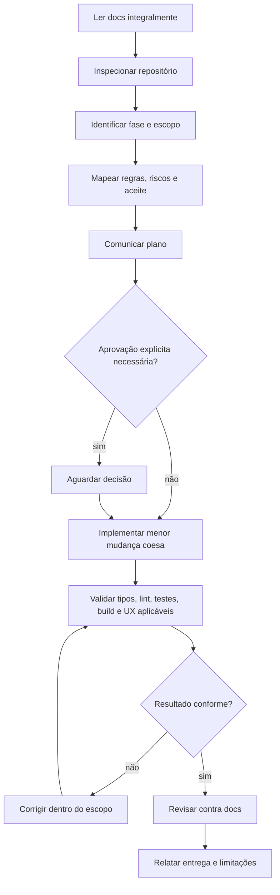
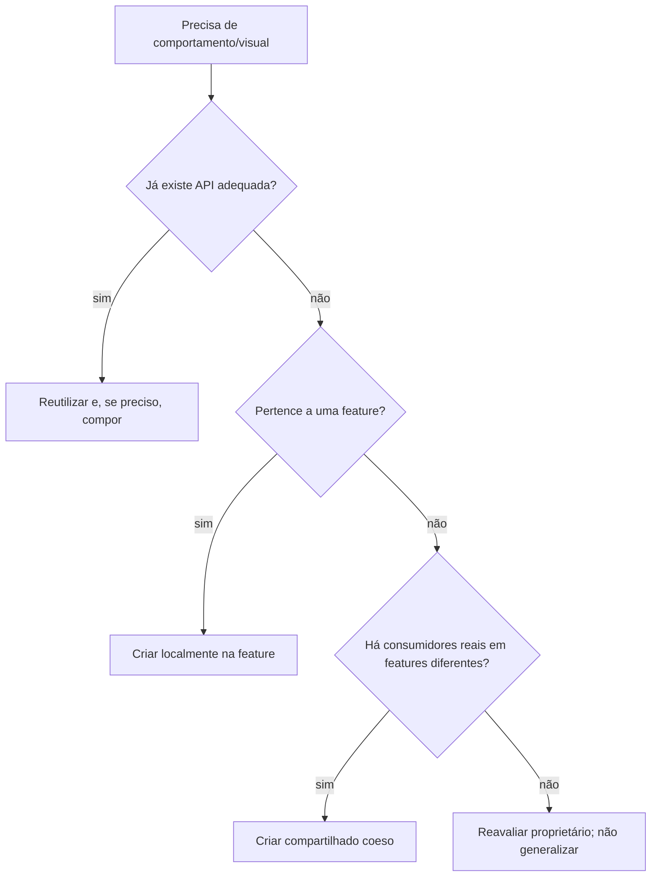
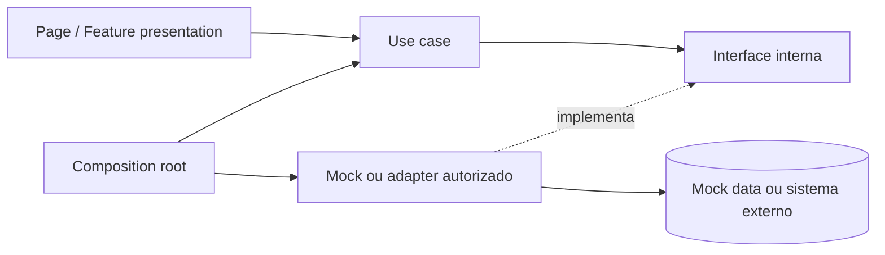
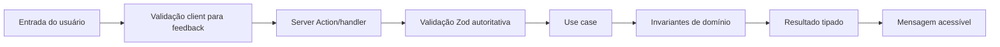
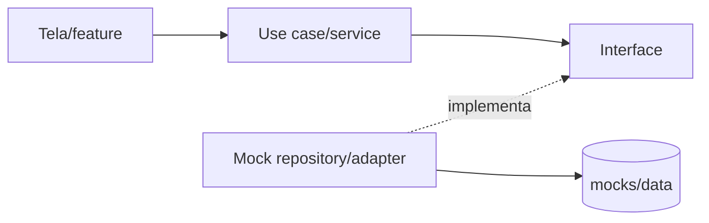

# AI Rules — Constituição do Veste Bem E-commerce

> **Status:** obrigatório para qualquer agente de IA  
> **Escopo:** análise, planejamento, implementação, validação e comunicação  
> **Aplica-se a:** Codex, Cursor, Claude Code, GPT, agentes autônomos e ferramentas equivalentes  
> **Documentos-base:** [`01-arquitetura.md`](./01-arquitetura.md), [`02-regras-negocio.md`](./02-regras-negocio.md) e [`03-estrutura-do-projeto.md`](./03-estrutura-do-projeto.md)

## Linguagem normativa

Neste documento:

- **DEVE** indica obrigação.
- **NÃO DEVE** indica proibição.
- **PREFIRA** indica a alternativa padrão; desvio exige motivo técnico verificável.
- **EVITE** indica risco conhecido; use somente se o contexto demonstrar benefício superior.

Uma IA NÃO DEVE interpretar exemplos como autorização para criar escopo, tecnologia ou integração não solicitados. Segurança, privacidade, instruções da plataforma e limites de autorização permanecem superiores a qualquer regra do repositório.

---

## 1. Objetivo

Este documento existe para fazer qualquer IA trabalhar como uma integrante sênior da equipe, preservando decisões ao longo de tarefas independentes. Ele converte arquitetura, negócio e estrutura em comportamento operacional: o que ler, como decidir, quando agir, quando parar, como validar e como prestar contas.

Antes de escrever ou modificar código, uma IA DEVE ler este documento e os demais arquivos de `docs/`. Durante a tarefa, DEVE usar as regras como critérios de decisão, não como checklist decorativo. Ao finalizar, DEVE verificar o resultado contra os documentos oficiais.

Este arquivo complementa os anteriores; NÃO DEVE reinterpretá-los. Se uma tarefa exigir mudança incompatível, a IA DEVE apontar o conflito e solicitar que a decisão normativa correspondente seja atualizada ou autorizada. Ela NÃO DEVE “resolver” a divergência silenciosamente no código.

## 2. Hierarquia dos documentos

### 2.1 Ordem de prioridade do projeto

Em conflito real e não resolvido por especialidade, prevalece:

1. `docs/01-arquitetura.md` — direção de dependência e decisões arquiteturais;
2. `docs/02-regras-negocio.md` — invariantes e comportamento comercial;
3. `docs/03-estrutura-do-projeto.md` — localização e convenções físicas;
4. `docs/04-ai-rules.md` — processo de trabalho dos agentes;
5. prompt da tarefa — objetivo local, sem poder para revogar silenciosamente regras oficiais.

Instruções obrigatórias da plataforma, segurança e autorização estão fora desta lista e sempre prevalecem.

### 2.2 Propriedade temática

| Questão | Fonte primária |
|---|---|
| Para onde uma dependência pode apontar? | `01-arquitetura.md` |
| O pedido pode ter menos de 6 peças? | `02-regras-negocio.md` |
| Onde fica um use case? | `03-estrutura-do-projeto.md` |
| Como uma IA deve planejar e reportar? | `04-ai-rules.md` |
| Qual mudança local foi solicitada agora? | prompt da tarefa |

A hierarquia só deve ser usada após consultar a fonte temática. Por exemplo, arquitetura não deve ser usada para inventar uma regra comercial, e uma convenção estrutural não pode reduzir o mínimo de seis peças.

### 2.3 Tratamento de conflito

Ao encontrar conflito, a IA DEVE:

1. citar os trechos/decisões incompatíveis;
2. identificar qual fonte possui prioridade e propriedade temática;
3. interromper somente a parte conflitante;
4. continuar trabalho independente que permaneça seguro e válido;
5. solicitar decisão quando a escolha alterar arquitetura, negócio, dados ou escopo;
6. NÃO editar documentos normativos sem solicitação ou autorização correspondente.

Uma instrução local para “fazer de qualquer jeito” NÃO autoriza violar regras. Se o usuário explicitamente pedir uma mudança normativa, a IA DEVE explicar impactos e atualizar primeiro ou junto os documentos afetados, conforme o escopo autorizado.

## 3. Fluxo obrigatório de trabalho

Toda tarefa que possa modificar o repositório DEVE seguir esta sequência:

1. Ler integralmente todos os arquivos relevantes em `docs/`; para código, isso inclui no mínimo `01` a `04`.
2. Inspecionar o estado real do repositório e preservar alterações existentes.
3. Identificar a fase atual: documentação, fundação, feature mock, estabilização ou integração futura autorizada.
4. Delimitar escopo, regras de negócio, arquivos prováveis, riscos e critérios de aceite.
5. Explicar um plano conciso antes de codificar.
6. Aguardar aprovação quando o usuário solicitar aprovação prévia ou quando faltar decisão material que não possa ser inferida com segurança.
7. Implementar somente o escopo autorizado e a menor mudança coesa.
8. Validar em proporção ao risco: tipos, lint, testes, build e inspeção visual/funcional aplicáveis.
9. Revisar diff/arquivos modificados contra a documentação.
10. Explicar resultado, decisões, validações, limitações e próximos passos relevantes.

### 3.1 Quando aguardar

A IA DEVE aguardar decisão quando:

- o usuário pedir plano/aprovação antes da implementação;
- existirem duas opções com impacto material diferente e nenhuma fonte decidir;
- for necessária integração, credencial, publicação ou comunicação externa não autorizada;
- a tarefa exigir ação destrutiva ou perda de trabalho;
- houver ambiguidade sobre regra comercial crítica;
- for preciso ampliar significativamente o escopo.

A IA NÃO DEVE parar por detalhes reversíveis e descobríveis. PREFIRA inspecionar o repositório, aplicar convenções existentes e declarar uma suposição de baixo risco.

### 3.2 Fases

| Fase | Trabalho permitido | Trabalho proibido sem nova autorização |
|---|---|---|
| Documentação | documentos solicitados e revisão de consistência | código, dependências e scaffolding |
| Fundação | configuração e estrutura explicitamente pedidas | features completas ou integrações |
| Feature mock | casos de uso, UI e adapters mock do escopo | SDKs e backends reais |
| Estabilização | testes, acessibilidade, performance e correções | expansão funcional não solicitada |
| Integração futura | somente fornecedor/capacidade autorizados | outras integrações previstas |

## 4. Como desenvolver

A IA DEVE compreender antes de editar. Isso significa localizar o proprietário do comportamento, rastrear dependências e confirmar regras relevantes. Ela NÃO DEVE gerar arquivos por padrão aprendido de outro projeto.

### 4.1 Princípios operacionais

- DEVE seguir Clean Architecture, SOLID, KISS, DRY e Separation of Concerns conforme `01-arquitetura.md`.
- PREFIRA Server Components, funções puras, composição e injeção explícita.
- DEVE manter regra de negócio em domínio/application, nunca em UI ou adapter.
- PREFIRA reutilizar API pública existente antes de criar alternativa paralela.
- EVITE abstração na primeira ocorrência; extraia quando responsabilidade e variação forem reais.
- DEVE usar TypeScript estrito; `any` exige justificativa excepcional e localizada.
- DEVE preservar acessibilidade, segurança, privacidade, SEO e performance relevantes.
- NÃO DEVE alterar arquivos não relacionados “aproveitando a tarefa”.
- NÃO DEVE sobrescrever mudanças do usuário ou assumir que worktree diferente está descartável.

### 4.2 Regra da menor mudança coesa

“Menor” não significa remendo. A mudança DEVE incluir tudo que torna o comportamento correto e verificável — tipos, regra, adapter, apresentação e testes necessários — mas NÃO DEVE incluir refatorações ou funcionalidades sem relação causal com a solicitação.

### 4.3 Decisão de reutilização

## 5. Como criar componentes

### 5.1 Quando criar

Crie um componente quando existir responsabilidade visual/comportamental nomeável, fronteira client necessária, unidade testável ou composição recorrente. NÃO crie componente apenas para reduzir algumas linhas de markup sem ganho semântico.

### 5.2 Quando reutilizar ou compartilhar

- DEVE procurar primeiro em `src/components` e na feature atual.
- Componente de uma única feature DEVE ficar em `features/<nome>/presentation/components`.
- Componente compartilhado DEVE possuir consumidores reais de features diferentes, semântica comum e mesma razão para mudar.
- Semelhança visual NÃO é prova suficiente; PREFIRA compor primitives.
- `shared` NÃO DEVE virar pasta de sobras.

### 5.3 Quando dividir

O limite aproximado de 150 linhas é um alerta, não uma meta. Divida quando houver múltiplas responsabilidades, estados independentes, partes com nomes claros, teste difícil, API excessiva ou fronteira server/client ampla. NÃO fragmente markup coeso em componentes anêmicos.

### 5.4 Regras obrigatórias

| DEVE | NÃO DEVE |
|---|---|
| ter uma responsabilidade principal | buscar dados por repository concreto |
| receber props mínimas e tipadas | receber muitas flags incompatíveis |
| usar composição/slots/children | usar herança visual |
| tratar loading, empty, error e success aplicáveis | esconder regra comercial em handler |
| preservar semântica, teclado e foco | usar `div` clicável sem semântica |
| manter `'use client'` no menor limite | transformar página/layout inteiro em client sem necessidade |

### 5.5 Exemplos de decisão

| Necessidade | Local/abordagem correta |
|---|---|
| botão genérico | `components/ui/button.tsx` |
| seletor de variação do produto | `features/product/presentation/components` |
| campo com label e erro acessível usado em vários formulários | `components/forms/form-field.tsx` |
| resumo do mínimo de seis peças exclusivo do carrinho | `features/cart/presentation/components` |
| card visual parecido em duas telas, mas com semânticas distintas | compor primitives; EVITE unificação prematura |

## 6. Como criar features

Uma nova feature DEVE representar capacidade de negócio coesa, não uma tela, endpoint ou componente. Antes de criá-la, a IA DEVE verificar se o comportamento pertence a `home`, `catalog`, `product`, `cart`, `checkout`, `orders`, `customer`, `favorites`, `search` ou `authentication`.

### 6.1 Processo

1. Definir limite, linguagem e proprietário.
2. Relacionar regras de `02-regras-negocio.md` e identificar lacunas.
3. Definir entidades/value objects e invariantes necessárias.
4. Definir portas pelo lado consumidor.
5. Criar casos de uso em `application/use-cases`.
6. Criar infrastructure apenas se houver I/O/adapters.
7. Criar presentation server-first e schemas de fronteira.
8. Expor somente API mínima por `index.ts`.
9. Criar rota fina em `app` se houver URL.
10. Testar regras e fluxo crítico.

Estrutura segue `domain/application/infrastructure/presentation`. Pastas vazias NÃO DEVEM ser criadas. A feature NÃO DEVE importar internos de outra feature.

### 6.2 Checklist da feature

- [ ] A capacidade não pertence a feature existente.
- [ ] Nome está em inglês e kebab-case.
- [ ] Regras de negócio estão identificadas por documento/ID.
- [ ] Domínio não conhece framework ou fornecedor.
- [ ] Use cases dependem de portas.
- [ ] Adapter mock preserva semântica futura.
- [ ] Presentation não acessa dados diretamente.
- [ ] API pública é mínima.
- [ ] Testes cobrem invariantes e exceções.

## 7. Como criar services

“Service” DEVE ter uma categoria explícita:

- use case em `feature/application/use-cases`;
- domain service em `feature/domain/services`;
- application service em `feature/application/services`;
- porta transversal em `src/services`.

NÃO crie `features/x/services` genérico na raiz. NÃO crie `BaseService` ou `BaseRepository<T>` para uniformizar operações sem semântica de domínio.

### 7.1 Contratos

Interfaces DEVERÃO pertencer ao consumidor, usar linguagem interna e ser pequenas. NÃO DEVEM retornar tipos do Supabase, InfinitePay, Melhor Envio, ERP ou CRM. Paginação, nulabilidade, erros e idempotência aplicável DEVEM estar explícitos.

### 7.2 Implementações

- Mock adapter fica na infrastructure da feature dona ou local de integração definido.
- Adapter real futuro implementará o mesmo contrato.
- Mapper traduz formato externo para DTO/entidade interna.
- Composition root em `lib/composition` escolhe implementação.
- Página, componente e hook NÃO DEVEM instanciar adapter.
- PREFIRA injeção por parâmetro/factory; EVITE container reflexivo.

## 8. Como criar hooks

Crie hook quando houver composição reutilizável de estado/efeitos React ou encapsulamento de API do navegador. Hook global em `src/hooks` exige consumidores de features diferentes; hook local fica em `feature/presentation/hooks`.

### 8.1 PREFIRA

- nomes que expressem comportamento (`use-cart-drawer`);
- retorno pequeno, estável e tipado;
- estado derivado calculado durante renderização;
- efeitos somente para sincronizar sistemas externos;
- fetch server-first quando possível.

### 8.2 EVITE/NÃO DEVE

- NÃO DEVE esconder regra `MIN-001`, cálculo de subtotal ou autorização.
- EVITE hook que apenas chama uma função e devolve o resultado.
- NÃO DEVE copiar props para state sem razão.
- NÃO DEVE usar effect para derivar valor calculável.
- NÃO DEVE tornar global um estado exclusivo de componente.
- NÃO DEVE acessar mock/repository concreto.

## 9. Como trabalhar com forms

Zod é obrigatório nas fronteiras não confiáveis. React Hook Form é o padrão para formulários client-side interativos com múltiplos campos, validação progressiva ou estado complexo. Formulário simples e server-first PODE usar recursos nativos/Server Actions sem React Hook Form se isso reduzir JavaScript e mantiver a mesma correção.

Se React Hook Form ainda não estiver instalado, a IA DEVE declarar a nova dependência e justificá-la no plano; NÃO DEVE instalá-la em tarefa que não autorize implementação/dependências.

### 9.1 Organização

| Artefato | Local |
|---|---|
| primitive de input | `components/ui` |
| composição label/erro/descrição | `components/forms` |
| formulário específico | `feature/presentation/components` |
| schema Zod específico | `feature/presentation/schemas` |
| regra comercial | `feature/domain` ou `application` |
| mensagem de validação | presentation, em linguagem acessível |

### 9.2 Fluxo de validação

### 9.3 Regras

- DEVE inferir tipos do schema quando isso evitar duplicação segura.
- DEVE revalidar no servidor; client validation nunca é autoridade.
- DEVE associar erro ao campo e fornecer resumo quando apropriado.
- NÃO DEVE exibir mensagem técnica, stack ou erro do fornecedor.
- NÃO DEVE colocar `quantidadeTotal >= 6` apenas no schema do formulário.
- PREFIRA validação no blur/submit conforme custo e experiência; EVITE validar operação cara a cada tecla.
- DEVE preservar dados digitados após erro recuperável.
- NÃO DEVE tornar consentimento de marketing condição para compra.

## 10. Como trabalhar com estados

Estado DEVE ter fonte de verdade única e escopo mínimo.

| Tipo | Local padrão | Exemplos |
|---|---|---|
| URL | `searchParams`/rota | busca, filtros, ordenação, paginação |
| servidor | data layer/use case/cache server | catálogo, preço, estoque, pedido |
| interface local | componente/hook local | menu aberto, aba, seleção efêmera |
| formulário | React Hook Form ou mecanismo do formulário | valores, touched, erros |
| derivado | cálculo durante render/use case | quantidade total, subtotal, faltantes |
| persistido no browser | adapter validado/versionado | carrinho visitante futuro/local |
| sessão | SessionProvider futuro/server | identidade autenticada |

### 10.1 Regras

- NÃO DEVE armazenar valor derivável como estado independente.
- NÃO DEVE duplicar dado do servidor em Context por padrão.
- PREFIRA URL para estado que deve sobreviver a refresh ou ser compartilhável.
- PREFIRA estado local ao global.
- Provider DEVE ter consumidor e responsabilidade transversal reais.
- Estado persistido DEVE ser tratado como entrada não confiável, versionado e validado.
- Carrinho NÃO DEVE congelar preço ou garantir estoque.

## 11. Como trabalhar com mocks

Mocks permitem desenvolvimento e validação da V1 sem representar sistemas reais. Eles DEVEM cumprir contratos, filtros, paginação, nulabilidade e erros relevantes. Mock irreal produz integração falsa e NÃO DEVE ser usado apenas para “fazer a tela funcionar”.

### 11.1 Fluxo obrigatório

- Página/componente NÃO DEVE importar `mocks/data`.
- Use case NÃO DEVE importar implementação mock.
- Composition root DEVE selecionar o mock.
- Mock data DEVE conter apenas dados fictícios/aprovados, sem PII ou credenciais.
- Produtos V1 DEVEM respeitar `REF.001`, `REF.002`, R$ 50,00 e demais regras de `02`.
- Cores, tamanhos, frete e pagamento NÃO DEVEM ser inventados sem definição aprovada.
- Estado “pagamento aprovado” NÃO DEVE simular operação real como fato.

Mocks são infraestrutura de desenvolvimento/V1. Test doubles exclusivos de teste ficam próximos dos testes quando não forem a fonte mock da aplicação.

## 12. Como trabalhar com integrações futuras

Supabase, InfinitePay, Melhor Envio, ERP e CRM estão previstas, mas NÃO estão autorizadas na V1. Preparar significa definir portas e manter regras independentes; NÃO significa instalar SDK, criar env, schema de banco, endpoint, webhook ou chamada de rede.

| Integração | Preparação permitida | Proibido sem fase autorizada |
|---|---|---|
| Supabase | repository interface e mapper previsto | client, migrations, tabelas ou credenciais |
| InfinitePay | `PaymentGateway` interno e estados de domínio | cobrança, webhook ou SDK |
| Melhor Envio | `ShippingGateway` e DTO interno | cotação real, etiqueta ou token |
| ERP | portas de catálogo/estoque/pedido | sincronização e decisão tácita de fonte de verdade |
| CRM | eventos internos/consentimento documentados | envio de PII ou instalação de client |

Quando autorizada, a integração DEVE:

1. confirmar fonte de verdade e contratos;
2. usar adapter anticorrupção;
3. isolar tipos do fornecedor;
4. validar respostas externas;
5. definir timeout, retry seguro e idempotência;
6. proteger segredos e PII;
7. incluir observabilidade sem dados sensíveis;
8. testar falhas e duplicidade;
9. preservar a API dos casos de uso sempre que possível.

## 13. Como nomear arquivos

Arquivos e pastas usam `kebab-case`.

| Tipo | Padrão | Exemplo |
|---|---|---|
| componente | substantivo visual | `product-card.tsx` |
| caso de uso | verbo + objeto | `list-products.ts` |
| schema | `*.schema.ts` | `address-form.schema.ts` |
| mapper | `*.mapper.ts` | `product.mapper.ts` |
| repository contrato | conceito + repository | `product-repository.ts` |
| adapter | fornecedor/fonte + contrato | `mock-product-repository.ts` |
| teste | `*.test.ts[x]` | `minimum-order.test.ts` |
| CSS Module | `*.module.css` | `product-gallery.module.css` |

NÃO use `helpers.ts`, `common.ts`, `misc.ts`, `services.ts` ou `types.ts` como depósito. PREFIRA nome que revele responsabilidade. Arquivos especiais do Next.js mantêm nomes exigidos pelo framework.

## 14. Como nomear componentes

Símbolos de componentes usam `PascalCase` e substantivos claros: `ProductCard`, `CartSummary`, `AddressForm`. Props usam `<ComponentName>Props` quando exportadas/úteis; props locais podem ser tipadas junto do componente.

- DEVE nomear pelo papel, não pela aparência (`PrimaryAction`, não `BlueButton`, quando semântica justificar).
- EVITE prefixos genéricos como `Base`, `Generic`, `Common`.
- Variantes DEVEM representar um conjunto coerente, não esconder componentes diferentes.
- Subcomponentes compostos PODEM compartilhar namespace conceitual quando a API permanecer clara.
- Event handlers internos usam `handleX`; callbacks de props usam `onX`.

## 15. Como nomear hooks

Arquivo usa `use-*.ts[x]`; símbolo usa `useX`. O nome DEVE indicar comportamento ou recurso: `useMediaQuery`, `useCartDrawer`, `useFormPersistence`.

NÃO use nomes vagos como `useData`, `useLogic` ou `useUtils`. Hook que consulta entidade DEVE deixar fonte/semântica clara, mas PREFIRA leitura server-first em vez de criar `useFetchX` automaticamente.

## 16. Como nomear services

| Categoria | Padrão | Exemplo |
|---|---|---|
| use case | verbo + objeto | `create-order.ts` |
| repository interface | entidade + `Repository` | `ProductRepository` |
| reader segregado | entidade + capacidade | `ProductReader` |
| gateway externo | capacidade + `Gateway` | `PaymentGateway` |
| domain service | conceito/decisão | `OrderEligibilityPolicy` |
| mock adapter | `Mock` + contrato | `MockProductRepository` |
| adapter futuro | fornecedor + contrato | `SupabaseProductRepository` |

NÃO use `Manager`, `Helper` ou `Service` sem dizer o que a unidade faz. O sufixo `Service` é aceitável para capacidade transversal clara, como `NotificationService`, e NÃO para agrupar funções aleatórias.

## 17. Como organizar imports

O alias único é `@/* -> src/*`. Ele permite `@/components`, `@/features`, `@/services`, `@/hooks` e `@/utils`; aliases paralelos NÃO DEVEM ser criados.

Ordem:

1. módulos de plataforma;
2. dependências externas;
3. aliases internos `@/`;
4. imports relativos;
5. estilos/efeitos laterais permitidos.

### 17.1 Regras

- DEVE usar `import type` para imports exclusivamente de tipo quando aplicável.
- Entre features, DEVE importar apenas a API pública pelo `index.ts`.
- Dentro do mesmo módulo, PREFIRA import direto e relativo curto.
- NÃO DEVE importar de `app` para reutilizar lógica.
- NÃO DEVE importar infrastructure/mock em presentation.
- NÃO DEVE fazer módulo client depender direta ou indiretamente de server-only.
- Barrels profundos/globais são proibidos; EVITE ciclos e tree-shaking imprevisível.
- Caminho `../../../../` sinaliza proprietário/local incorreto e DEVE ser revisto.

## 18. Como responder ao usuário

A IA DEVE comunicar como colaboradora técnica responsável.

### 18.1 Antes/durante

- Explique entendimento, escopo e plano de forma concisa antes de editar.
- Informe suposições que afetam o resultado.
- Aponte conflito com documentação antes de criar divergência.
- Durante trabalho longo, forneça atualizações verificáveis sem despejar logs.
- NÃO apresente intenção como resultado concluído.

### 18.2 Na entrega

- Comece pelo resultado.
- Liste arquivos modificados com links quando possível.
- Explique decisões e impactos relevantes, sem narrar cada comando.
- Informe validações executadas e resultados reais.
- Declare claramente testes não executados, limitações e decisões pendentes.
- NÃO afirme que build/teste passou sem executar.
- NÃO invente funcionalidade, requisito ou aprovação.
- NÃO esconda alteração de documento, dependência, configuração ou comportamento.

Se não houver mudança necessária, diga isso e apresente evidência. Se estiver bloqueada, explique condição concreta e qual decisão/autoridade falta.

## 19. O que nunca fazer

Uma IA trabalhando neste projeto:

1. NÃO DEVE ignorar ou ler parcialmente a documentação relevante.
2. NÃO DEVE colocar regra de negócio em página, componente, hook, schema ou adapter.
3. NÃO DEVE acessar mock, banco ou SDK diretamente da interface.
4. NÃO DEVE importar internos de outra feature.
5. NÃO DEVE criar componente gigante com múltiplas responsabilidades.
6. NÃO DEVE transformar layout/página inteira em Client Component sem necessidade.
7. NÃO DEVE duplicar estado derivado ou dado server em Context.
8. NÃO DEVE criar abstração genérica por antecipação.
9. NÃO DEVE criar pastas vazias para “completar arquitetura”.
10. NÃO DEVE usar `shared`, `utils`, `types` ou `services` como descarte.
11. NÃO DEVE criar `BaseRepository<T>`/CRUD genérico sem semântica.
12. NÃO DEVE usar `any` para silenciar erro de tipo.
13. NÃO DEVE engolir erro ou convertê-lo indevidamente em “não encontrado”.
14. NÃO DEVE aceitar preço, subtotal, total, disponibilidade ou status enviados pelo cliente como autoridade.
15. NÃO DEVE implementar pedido mínimo apenas na UI.
16. NÃO DEVE alterar `MIN-001`, preços ou composição livre sem mudança normativa autorizada.
17. NÃO DEVE inventar cores, tamanhos, descontos, frete ou pagamento.
18. NÃO DEVE afirmar pagamento, reserva ou expedição real em fluxo mockado.
19. NÃO DEVE instalar biblioteca sem necessidade, impacto e justificativa.
20. NÃO DEVE instalar SDK de integração futura na V1.
21. NÃO DEVE expor segredo ao client, log ou repositório.
22. NÃO DEVE usar dados pessoais reais em mocks/testes.
23. NÃO DEVE editar arquivo gerado como `next-env.d.ts`.
24. NÃO DEVE criar alias ou barrel redundante.
25. NÃO DEVE misturar refatoração extensa a correção pequena sem autorização.
26. NÃO DEVE sobrescrever mudanças do usuário ou usar comando destrutivo por conveniência.
27. NÃO DEVE alterar documento normativo sem informar.
28. NÃO DEVE gerar código, API, tela ou configuração não solicitada.
29. NÃO DEVE declarar validação bem-sucedida se não a executou.
30. NÃO DEVE encerrar tarefa com erro conhecido corrigível dentro do escopo.

## 20. Checklist antes de entregar código

### Escopo e conformidade

- [ ] Todos os documentos relevantes foram lidos integralmente.
- [ ] A fase e o escopo autorizado foram respeitados.
- [ ] O diff não contém arquivos/mudanças sem relação.
- [ ] Regras de negócio afetadas estão preservadas e rastreáveis.
- [ ] Nenhuma integração futura foi implementada sem autorização.

### Arquitetura e estrutura

- [ ] Arquivos estão no menor escopo proprietário.
- [ ] Dependências apontam para dentro: presentation → application/domain.
- [ ] Use cases dependem de portas, não adapters.
- [ ] Páginas/componentes não acessam dados diretamente.
- [ ] Imports entre features usam API pública.
- [ ] Não há pastas/abstrações especulativas.

### Qualidade funcional

- [ ] Loading, empty, error e success aplicáveis foram tratados.
- [ ] Entradas não confiáveis são validadas.
- [ ] Invariantes são revalidadas no lado autoritativo.
- [ ] Erros esperados são tipados e mensagens são seguras.
- [ ] Acessibilidade por teclado, foco e semântica foi verificada.
- [ ] Estados não foram duplicados desnecessariamente.

### Verificação

- [ ] Formatter/lint relevante passou.
- [ ] Typecheck passou.
- [ ] Testes afetados passaram.
- [ ] Build passou quando proporcional ao risco.
- [ ] Fluxo visual/funcional foi inspecionado quando houve UI.
- [ ] Resultado dos comandos foi realmente lido.
- [ ] Limitações/testes não executados serão informados.

## 21. Checklist antes de criar novas features

- [ ] A capacidade não cabe em feature existente.
- [ ] Nome, limite e vocabulário estão definidos.
- [ ] Regras existentes e novas foram documentadas.
- [ ] Entidades, value objects e invariantes necessários foram identificados.
- [ ] Portas foram desenhadas pelo consumidor.
- [ ] Use cases possuem entradas, saídas e falhas explícitas.
- [ ] Mock respeita contrato e regras oficiais.
- [ ] Presentation será server-first.
- [ ] Rota, se necessária, será fina.
- [ ] API pública exportará apenas o necessário.
- [ ] Dependências com outras features não violam encapsulamento.
- [ ] Testes de regras e exceções foram planejados.
- [ ] Segurança, privacidade, SEO, acessibilidade e performance foram avaliados.

## 22. Checklist antes de criar componentes

- [ ] Existe responsabilidade visual/comportamental nomeável.
- [ ] Componente equivalente não existe.
- [ ] O local é feature-specific ou compartilhado pelo critério correto.
- [ ] API de props é pequena, tipada e não permite combinações inválidas.
- [ ] Composição foi preferida a herança/flags excessivas.
- [ ] Regra comercial permanece fora do componente.
- [ ] Estado está no ancestral/escopo mínimo correto.
- [ ] `'use client'` é necessário e está no menor limite.
- [ ] Semântica HTML, teclado, foco, label e feedback foram considerados.
- [ ] Loading/empty/error não causarão layout shift evitável.
- [ ] Divisão ou manutenção como unidade coesa foi justificada.

## 23. Checklist antes de criar services

- [ ] A categoria é use case, domain service, application service ou porta transversal.
- [ ] O nome descreve capacidade/intenção.
- [ ] Não existe service/repository equivalente.
- [ ] A interface pertence ao consumidor e é segregada.
- [ ] Contrato não expõe tipo de fornecedor.
- [ ] Nulabilidade, paginação, falhas e idempotência estão explícitas.
- [ ] Mock e adapter futuro podem ser substituídos semanticamente.
- [ ] Mapper está na infrastructure.
- [ ] Composition root fará a montagem.
- [ ] UI não instanciará nem importará implementação.
- [ ] Não foi criada base genérica sem necessidade.
- [ ] Testes de contrato/falha foram previstos.

## 24. Critérios de qualidade

| Critério | Condição de aceite |
|---|---|
| Legibilidade | nomes revelam intenção; fluxo é local e compreensível sem comentários compensatórios |
| Correção | regras e exceções documentadas são satisfeitas; dados autoritativos são revalidados |
| Manutenção | mudança fica no domínio proprietário e não cria acoplamento oculto |
| Tipagem | TypeScript estrito, entradas `unknown` validadas e sem `any` injustificado |
| Responsabilidade única | cada unidade possui razão principal para mudar |
| Reutilização | abstração possui semântica comum e consumidores reais |
| Testabilidade | regra pura e portas permitem testes sem framework/fornecedor |
| Performance | server-first, bundle client mínimo, imagens/cache/fetch avaliados por evidência |
| Acessibilidade | semântica, teclado, foco, contraste e mensagens atendem o fluxo |
| Segurança | validação, autorização, segredos, sanitização e logs seguros nas fronteiras |
| Privacidade | dados pessoais mínimos, finalidade clara e ausência de PII em mocks/logs |
| Observabilidade | falhas diagnosticáveis sem expor dados sensíveis |
| Documentação | decisão relevante e alteração normativa estão refletidas na fonte correta |

### 24.1 Definition of Done

Uma tarefa só está concluída quando o comportamento solicitado existe, está no local correto, foi validado em proporção ao risco e foi comunicado com honestidade. Código compilando não basta se violar regra de negócio; teste passando não basta se testar o comportamento errado; UI bonita não basta se depender diretamente de mock.

PREFIRA uma solução simples que satisfaça integralmente os critérios a uma solução sofisticada com abstrações não solicitadas. EVITE otimização sem medição e generalização sem segundo caso real.

## 25. Objetivo final

Estas regras existem para manter o Veste Bem E-commerce coerente enquanto pessoas, IAs, ferramentas e integrações mudam. A meta não é produzir mais código; é preservar um sistema compreensível, seguro e evolutivo, no qual cada regra de negócio tenha um proprietário, cada dependência aponte na direção correta e cada entrega possa ser verificada.

Toda IA DEVE deixar o projeto em estado pelo menos tão compreensível quanto encontrou. Quando houver dúvida, DEVE consultar a documentação, inspecionar evidência e escolher a alternativa mais simples compatível com as regras. Quando a documentação não decidir algo material, DEVE tornar a lacuna visível em vez de transformá-la silenciosamente em código.

---

## Declaração de conformidade para agentes

Antes de iniciar implementação, o agente deverá conseguir afirmar:

> Li os documentos oficiais, identifiquei a fase e as regras afetadas, compreendi o limite da tarefa e planejei uma mudança compatível com a arquitetura. Não implementarei integrações, dependências, regras ou funcionalidades além do escopo autorizado. Validarei o resultado e relatarei com precisão o que foi alterado.

Se não puder fazer essa afirmação, a IA NÃO DEVE começar a codificar. Ela DEVE obter o contexto ou a decisão que falta.
