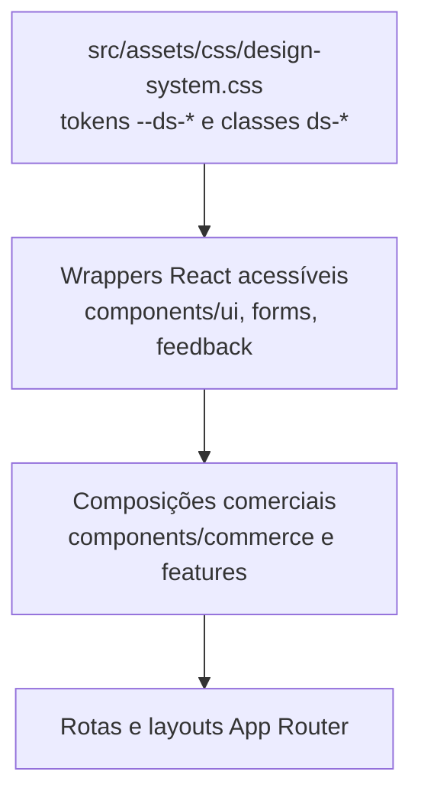
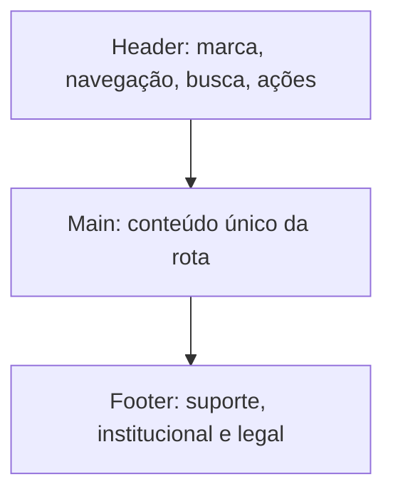
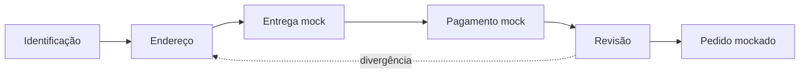
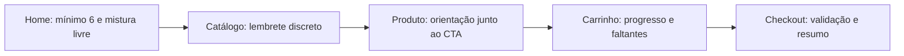

# Design System e UI — Veste Bem E-commerce

> **Status:** guia normativo de implementação da interface  
> **Escopo:** Design System próprio do storefront Veste Bem E-commerce  
> **Fonte visual canônica:** `src/assets/css/design-system.css`  
> **Documentos relacionados:** [`01-arquitetura.md`](./01-arquitetura.md), [`02-regras-negocio.md`](./02-regras-negocio.md), [`03-estrutura-do-projeto.md`](./03-estrutura-do-projeto.md) e [`04-ai-rules.md`](./04-ai-rules.md)

> **Decisão visual de 02/07/2026:** nesta fase, o e-commerce não depende do Design System do MVP/Admin. A identidade premium, minimalista e comercial do storefront passa a ser implementada e versionada localmente em `src/assets/css/design-system.css`. Os contratos `--ds-*` e `ds-*` continuam obrigatórios para impedir valores visuais dispersos.

## Premissas e linguagem normativa

As palavras **DEVE**, **NÃO DEVE**, **PREFIRA** e **EVITE** têm o significado normativo definido em `04-ai-rules.md`.

Este documento define como o e-commerce deverá consumir seus contratos oficiais, compor experiências comerciais e evoluir a fonte canônica sem espalhar decisões visuais. Paleta, tipografia, escala, breakpoints e largura de container DEVEM ser definidos em `src/assets/css/design-system.css`; componentes não podem criar valores paralelos.

Quando este guia usar nomes como “primária”, “espaçamento médio” ou “transição rápida”, eles representam funções semânticas resolvidas por tokens `--ds-*`, nunca valores locais.

---

## 1. Objetivo

Este documento orienta qualquer pessoa ou IA a produzir uma experiência de compra coerente com o ecossistema Veste Bem. Sua responsabilidade é ligar três camadas:

1. **fundação oficial:** tokens `--ds-*` e classes `ds-*` do Veste Bem Admin Design System;
2. **primitives reutilizáveis:** wrappers React acessíveis em `src/components/ui`, `forms` e `feedback`;
3. **composições comerciais:** componentes de produto, catálogo, carrinho e checkout nas features responsáveis.

O guia trata aparência, hierarquia, interação, responsividade, acessibilidade, desempenho e comunicação das regras atacarejo. Ele NÃO define preço, disponibilidade, pagamento ou frete; esses comportamentos pertencem a `02-regras-negocio.md`.

### 1.1 Resultado esperado

Uma tela só estará visualmente aprovada quando:

- usar os contratos oficiais sem redefinição local;
- manter foco no produto e na ação principal;
- comunicar estados e regras com clareza;
- funcionar por teclado, leitor de tela e diferentes larguras;
- preservar performance e estabilidade visual;
- reutilizar primitives sem criar componentes monolíticos.

## 2. Filosofia visual

A identidade do e-commerce deverá traduzir **moda feminina premium com luxo discreto**. Premium não significa excesso de ornamento; significa precisão tipográfica, fotografia cuidada, ritmo consistente, conteúdo confiável e interação sem ruído.

### 2.1 Princípios

| Princípio | Aplicação | Evitar |
|---|---|---|
| Minimalismo | poucas ações concorrentes e hierarquia clara | telas vazias sem informação útil |
| Sofisticação | alinhamento rigoroso, tipografia e imagem consistentes | brilho, gradientes ou efeitos sem token |
| Espaço em branco | separa grupos e melhora leitura | aumentar espaçamento arbitrariamente |
| Foco no produto | imagem, modelo, referência, variação e preço dominam | chrome visual competindo com a peça |
| Luxo discreto | movimento sutil e feedback preciso | animações teatrais e urgência artificial |
| Confiança | regras, mínimo, valores e estados transparentes | esconder restrições até o checkout |
| Elegância funcional | decisões simples e reversíveis | fluxo bonito, porém ambíguo ou inacessível |

O storefront possui gramática própria e coerente: tokens, raios, sombras, transições, ícones e comportamento dos primitives vêm da fonte canônica do e-commerce. A diferença entre telas deverá vir da composição e do conteúdo, não de paletas locais.

## 3. Implementação do Design System

### 3.1 Camadas de consumo

`src/assets/css/design-system.css` é a fonte canônica e deverá ser carregada pela entrada global. PREFIRA não introduzir folha legada; mantenha estilos específicos adjacentes aos componentes e compostos exclusivamente com tokens oficiais.

### 3.2 Reutilizar, estender ou criar

| Situação | Ação correta |
|---|---|
| contrato `ds-*` atende semântica e estados | reutilizar diretamente por wrapper fino |
| primitive existe, mas falta composição comercial | compor sem alterar o primitive |
| falta estado acessível/semântico no contrato oficial | propor extensão upstream e documentar |
| necessidade exclusiva de uma feature | criar composição local usando tokens/primitives |
| necessidade comum a várias features | promover para `components/commerce` após uso real |
| diferença apenas estética local | NÃO criar variante; revisar composição |

Wrappers React PODEM encapsular classes e comportamento acessível, mas NÃO DEVEM copiar CSS do Design System, mudar raios ou inventar cores. Variação visual NÃO DEVE conter regra de negócio; por exemplo, um `Button` não decide se o pedido mínimo foi atingido.

### 3.3 Contratos oficiais disponíveis

| Capacidade | Contrato oficial |
|---|---|
| Button | `ds-button`, `ds-button--primary`, `--secondary`, `--danger`, `ds-icon-button` |
| Form | `ds-field`, `ds-label`, `ds-input`, `ds-textarea`, `ds-native-select` |
| Select custom | `ds-select`, `__trigger`, `__menu`, `__option` |
| Dropdown | `ds-dropdown`, `__item` |
| Card | `ds-card`, `ds-mini-card`, `ds-card-title` |
| Badge | `ds-badge` e variantes semânticas oficiais |
| Table | `ds-table-shell`, `ds-table` |
| Headers | `ds-page-header`, `ds-section-header` |
| Search | `ds-search` |
| Avatar | `ds-avatar` |
| Switch | `ds-switch` com `aria-checked` |
| Tabs | `ds-tabs`, `ds-tab` |
| Tooltip | atributo `data-tooltip` |
| Modal | `ds-modal-backdrop`, `ds-modal`, `__header`, `__actions` |
| Drawer | `ds-drawer-backdrop`, `ds-drawer` |
| Toast | `ds-toast-region`, `ds-toast` e variantes |
| Loading/Skeleton/Empty | `ds-loading`, `ds-skeleton`, `ds-empty` |

Classes legadas compatíveis (`button`, `form-field`, `status-badge`, `data-table`, `module-header`, `modal`, `reports-tabs`, `settings-tabs`) existem para migração do Admin. Componentes novos do e-commerce DEVEM usar `ds-*`, não os aliases legados.

## 4. Tokens

Todos os valores visuais fundamentais DEVEM usar tokens `--ds-*`. Um componente NÃO DEVE receber cores, espaçamentos, raios, sombras ou transições locais.

| Grupo | Uso | Regra de consumo |
|---|---|---|
| cores | superfície, texto, ação, borda e feedback | usar token semântico oficial; nunca hexadecimal local |
| tipografia | família, tamanho, peso e entrelinha | aplicar escala oficial; não criar tamanho isolado |
| espaçamento | padding, gap, margens estruturais | usar escala oficial; não “ajustar” com número mágico |
| radius | cantos de controles/superfícies | cards 12px; inputs/selects/buttons/dropdowns 10px conforme fonte oficial |
| sombras | elevação de card, overlay e menu | usar níveis oficiais; não simular borda com sombra arbitrária |
| bordas | divisões, campos e estados | token de cor/espessura oficial |
| opacidade | disabled, backdrop e conteúdo secundário | somente token/estado oficial; não reduzir legibilidade |
| z-index | base, sticky, dropdown, overlay, toast | escala canônica; não usar números competitivos locais |
| animações | duração e easing | tokens de transição `--ds-*`; respeitar reduced motion |

### 4.1 Resolução de lacunas

Se um token necessário não estiver publicado:

1. verificar se outro token semântico já representa a função;
2. evitar alias local ou valor literal;
3. registrar a necessidade com contexto e estados;
4. adicionar o token à fonte oficial por processo aprovado;
5. só então consumi-lo no e-commerce.

Variáveis `--ecommerce-*` NÃO DEVEM formar uma segunda fundação. Exceções temporárias exigem ADR, prazo de remoção e fallback para token oficial.

## 5. Grid

O grid deverá adaptar conteúdo sem alterar a ordem semântica. Container, gutter e breakpoints DEVEM vir dos tokens/contratos oficiais quando publicados. Como esses valores não constam no material recebido, implementadores NÃO DEVEM fixar números neste documento ou criar uma escala paralela.

### 5.1 Comportamento normativo

| Faixa semântica | Comportamento |
|---|---|
| Mobile/compacta | uma coluna principal; ações críticas ao alcance; filtros em drawer |
| Tablet/intermediária | grid de produtos progressivo; resumo pode permanecer abaixo do conteúdo |
| Desktop/ampla | container central; grid e sidebar quando úteis; whitespace controlado |
| Desktop Wide | conteúdo mantém largura máxima oficial; espaço extra não estica texto/produto indefinidamente |

- O container DEVE ser centralizado e limitado pelo token oficial de largura máxima.
- Gutters DEVEM vir da escala `--ds-*` e crescer por faixa oficial.
- Grids DEVEM usar `minmax`/composição fluida quando isso evitar saltos frágeis.
- Texto longo NÃO DEVE ocupar largura que prejudique leitura.
- Alinhamentos DEVEM seguir uma linha-base compartilhada entre título, conteúdo e CTA.
- Carrossel NÃO DEVE substituir grid quando comparação entre produtos for importante.

### 5.2 Breakpoints

Os nomes Mobile, Tablet, Desktop e Desktop Wide descrevem comportamentos, não novos tokens. Antes de implementar media queries, a equipe DEVE extrair e documentar os breakpoints canônicos de `design-system.css`. Se eles não existirem, a lacuna deverá ser resolvida upstream. NÃO use breakpoints padrão de framework por suposição.

## 6. Tipografia

A tipografia deverá herdar família e escala oficiais. O e-commerce NÃO DEVE escolher nova fonte, peso ou tamanho sem atualização do Design System.

| Papel | Uso | Regras |
|---|---|---|
| Display | hero editorial, no máximo um foco por viewport | uso raro; não sacrificar quebra/legibilidade |
| Heading 1 | título único da página | descreve conteúdo, não slogan repetido |
| Heading 2 | seções principais | preservar ordem hierárquica |
| Heading 3 | grupos/cards complexos | não usar apenas para aumentar fonte |
| Subtitle | apoio imediato a heading | conciso, contraste secundário suficiente |
| Body | descrição, instrução e conteúdo | largura e entrelinha confortáveis |
| Caption | metadado e ajuda curta | não carregar informação essencial sozinha |
| Label | nome de campo/controle | sempre visível quando campo exige identificação |
| Button | ação objetiva | verbo curto; não usar caixa alta forçada sem contrato |

Referência, preço, mínimo e disponibilidade DEVEM permanecer legíveis e semanticamente distinguíveis. Estilo visual não substitui heading HTML. Não saltar níveis de heading para obter aparência.

## 7. Cores

Não existe autorização para uma paleta nova. Toda cor deverá vir de token `--ds-*` conforme sua função semântica.

| Função | Aplicação |
|---|---|
| primária | CTA principal e foco de marca controlado |
| secundária | ação alternativa, nunca concorrendo com CTA primário |
| neutras | fundo, superfície, texto, divisores e conteúdo secundário |
| sucesso | confirmação concluída e verificável |
| erro | falha, campo inválido ou ação destrutiva |
| aviso | risco/atenção recuperável, como mínimo ainda não atingido |
| informação | orientação neutra e contexto |

Cor NÃO DEVE ser o único canal: combine texto, ícone e semântica. “Pagamento aprovado”, “enviado” ou “entregue” só podem usar sucesso quando o estado for autoritativo; na V1 mockada, comunicação NÃO DEVE sugerir evento real. Contraste deve atender WCAG vigente para texto, controles, foco e estados.

## 8. Componentes base

### 8.1 Uso dos contratos existentes

| Componente | Diretriz |
|---|---|
| Button | uma ação primária por contexto; usar `danger` só para ação destrutiva |
| Input | label persistente, descrição/erro associado e autocomplete apropriado |
| Textarea | usar para texto realmente multilinha; indicar limites quando existirem |
| Select | nativo quando possível; custom somente com teclado/foco equivalentes |
| Switch | decisão imediata binária; `aria-checked`; não para confirmação crítica |
| Badge | estado curto e semântico; não substituir explicação necessária |
| Card | agrupar conteúdo relacionado; não envolver toda seção sem razão |
| Modal | decisão focada e bloqueante; restaurar foco ao fechar |
| Drawer | conteúdo contextual móvel/carrinho; foco contido e fechamento previsível |
| Tooltip | ajuda complementar; nunca informação essencial ou única em touch |
| Tabs | alternar painéis pares; setas/ARIA conforme padrão de tabs |
| Toast | confirmação transitória; erros críticos devem permanecer visíveis |
| Skeleton | espelhar geometria final, evitar CLS e não simular conteúdo infinito |
| Empty State | explicar situação e oferecer próximo passo pertinente |
| Loading | espera indeterminada curta; preferir skeleton para estrutura conhecida |

### 8.2 Contratos ainda não publicados

Checkbox, Radio e Accordion não aparecem na lista oficial recebida. Eles DEVEM usar elementos nativos acessíveis como base e tokens oficiais; uma classe `ds-*` nova só poderá ser declarada na fonte canônica. O e-commerce NÃO DEVE fingir que o contrato existe.

- **Checkbox:** seleção independente/múltipla; label clicável; estado indeterminado quando aplicável.
- **Radio:** uma escolha entre opções mutuamente exclusivas; grupo e legenda semânticos.
- **Accordion:** conteúdo suplementar; botão real com `aria-expanded` e relação ao painel.

### 8.3 Estados comuns

Todo controle aplicável deverá prever: default, hover, focus-visible, active, disabled, loading, invalid e read-only. Disabled não deverá ser usado para esconder motivo; explique como habilitar a ação.

## 9. Componentes do e-commerce

Estes são **composições**, não novos primitives do Design System. Devem ficar na feature proprietária até haver reutilização real em múltiplas features.

| Componente | Responsabilidade | Não deve fazer |
|---|---|---|
| ProductCard | resumir imagem, nome, referência, preço e estado | consultar repository ou conter regra de mínimo |
| ProductGallery | navegar imagens com alt/contexto e estabilidade | controlar variação comercial sozinho |
| ProductGrid | layout/list semantics de cards | filtrar/ordenar dados internamente |
| ProductPrice | formatar preço e contexto comercial | recalcular preço autoritativo |
| ColorSelector | apresentar cores disponíveis como seleção nomeada | inferir cores ou usar apenas amostra visual |
| SizeSelector | selecionar tamanho válido e informar indisponível | inventar tabela de tamanhos |
| QuantitySelector | editar inteiro positivo com limites claros | decidir elegibilidade total do pedido |
| CartSummary | exibir quantidade, subtotal, entrega e total determinável | confiar em total enviado pela UI |
| CartDrawer | acesso rápido e edição curta | substituir a página completa ou prender navegação |
| CheckoutSteps | indicar progresso e etapa atual | permitir saltos inválidos por aparência |
| HeroBanner | comunicar proposta e CTA principal | esconder conteúdo essencial dentro de imagem |
| FeatureCard | explicar benefício real | inventar promessa comercial |
| CategoryCard | navegar categoria existente | criar taxonomia sem catálogo |
| FAQAccordion | revelar respostas oficiais | conter política não aprovada |
| Newsletter | coletar consentimento separado e explícito | bloquear compra ou pré-marcar opt-in |
| Breadcrumb | informar hierarquia e navegação | reproduzir histórico pessoal do browser |
| ProductBadge | indicar estado/atributo verificável | criar urgência falsa ou regra de preço |

Cada componente deverá ter responsabilidade única, props pequenas, estados documentados e semântica apropriada. Aproximadamente 150 linhas é alerta de revisão, conforme arquitetura; não é meta automática.

## 10. Layout

### 10.1 Header e menu

O header deverá priorizar marca, navegação do catálogo, busca, favoritos e carrinho. Em mobile, controles devem continuar identificáveis e acessíveis; menu colapsado usa drawer com foco correto. Badge do carrinho apresenta quantidade total, não quantidade de linhas.

### 10.2 Busca

Busca deverá ser acessível por label/nome, suportar referência e modelo e levar a URL compartilhável. Sugestões futuras não deverão sequestrar teclado. Estado vazio e erro são distintos.

### 10.3 Hero e categorias

Hero deve ter conteúdo textual real, CTA claro e imagem otimizada. Categorias só aparecem se existirem no catálogo aprovado; com dois produtos iniciais, NÃO inventar uma taxonomia extensa para preencher layout.

### 10.4 Conteúdo e grids

Seções usam container e ritmo oficial. O grid favorece comparação de produtos, mantém proporções de imagem e evita alturas instáveis. Não alternar alinhamentos sem razão editorial.

### 10.5 Footer

Footer deverá conter navegação secundária, contato e informações legais aprovadas. Newsletter é opcional e separa consentimento. NÃO publicar política, rede social ou canal inexistente.

## 11. Home

Ordem recomendada, sujeita a conteúdo comercial aprovado:

1. **Hero:** proposta atacarejo e entrada principal para catálogo.
2. **Confiança/regra principal:** mínimo de seis peças e mistura livre, sem letras miúdas.
3. **Produtos em destaque:** os dois produtos reais, sem preencher com itens fictícios.
4. **Como comprar:** escolher modelos/cores/tamanhos, atingir seis, revisar pedido.
5. **Benefícios verificáveis:** entrega nacional e composição flexível.
6. **Conteúdo de marca:** alfaiataria e proposta Veste Bem, se houver material aprovado.
7. **FAQ:** dúvidas oficiais sobre mínimo, composição e fluxo mock/V1 quando aplicável.
8. **Newsletter:** somente se houver finalidade e consentimento definidos.

A Home NÃO DEVE parecer catálogo infinito com apenas dois produtos. PREFIRA narrativa curta, fotografia de qualidade e caminhos diretos. Toda seção precisa de objetivo; remova seção decorativa sem conteúdo real.

## 12. Catálogo

O catálogo deverá permitir entender e comparar os dois modelos com mínimo atrito.

- Exibir título, contagem de resultados e filtros ativos.
- Filtros de cor e tamanho devem vir das variações reais.
- Busca deve priorizar referência exata e nome/modelo.
- Ordenação deve ser estável; preço empatará na V1.
- Em mobile, filtros ficam em drawer com contagem e ações aplicar/limpar.
- Em desktop, filtros podem usar sidebar se o volume justificar; com catálogo mínimo, EVITE painel excessivo.
- Estado sem resultado preserva consulta/filtros, explica e oferece limpar.
- Paginação futura deverá preservar filtros e URL; não implementar antes de volume real.

ProductGrid não deverá receber dados inválidos nem executar filtragem comercial. Loading usa skeleton com a mesma geometria dos cards.

## 13. Produto

### 13.1 Hierarquia

1. breadcrumb;
2. galeria;
3. nome e referência;
4. preço unitário;
5. descrição essencial;
6. seleção de cor;
7. seleção de tamanho;
8. quantidade;
9. CTA adicionar ao carrinho;
10. informação visível sobre mínimo de seis peças;
11. detalhes/FAQ pertinentes;
12. relacionados somente quando existirem dados reais.

### 13.2 Interação

- Cor e tamanho deverão ser escolhidos antes de adicionar.
- Cor não pode ser representada apenas por círculo; deve ter nome acessível/visível.
- Tamanho indisponível permanece identificável, mas não selecionável.
- Galeria mantém aspect ratio, controles por teclado e miniaturas com nome acessível.
- CTA disabled deve ser acompanhado do motivo e próximo passo.
- Adição bem-sucedida oferece feedback e acesso ao carrinho sem navegação forçada.
- Produtos relacionados NÃO DEVEM ser inventados; com dois produtos, podem mostrar o outro quando pertinente.

## 14. Carrinho

Carrinho deve tornar o progresso atacarejo evidente e a edição segura.

### 14.1 Drawer

Serve para confirmação rápida, lista resumida, quantidade total, subtotal e CTA para página/carrinho. Deve fechar por Escape, backdrop e botão nomeado, restaurar foco e não esconder mensagens importantes. Para edição extensa, direciona à página.

### 14.2 Página

Cada linha exibe imagem, referência, nome, cor, tamanho, preço unitário, QuantitySelector, total da linha e remoção. Variações distintas são linhas distintas. Remoção é reversível quando viável ou pede confirmação proporcional ao impacto.

### 14.3 Progresso do mínimo

| Situação | Mensagem/ação |
|---|---|
| 0 peças | “Adicione 6 peças para montar seu pedido.” |
| 1–5 peças válidas | informar quantidade atual e quantas faltam |
| 6 ou mais | confirmar elegibilidade sem prometer pagamento/estoque |
| item inválido | excluir do progresso e orientar correção |

O indicador pode usar barra/progresso, texto e ícone, nunca somente cor. Checkout fica bloqueado abaixo de seis, mas a interface deve explicar `max(0, 6 - quantidadeTotal)`. NÃO usar pressão artificial ou contagem regressiva.

## 15. Checkout

O checkout deverá ser um fluxo focado, com resumo persistente quando a largura permitir e retorno seguro entre etapas.

### 15.1 Etapas

1. identificação;
2. endereço;
3. entrega mockada;
4. pagamento mockado/placeholder;
5. revisão e confirmação do pedido mockado.

CheckoutSteps indica etapa atual, concluída e futura; não transforma título visual em navegação inválida. Em mobile, use rótulo atual e progresso compacto, preservando o nome das etapas para leitores de tela.

### 15.2 Formulários

Labels persistentes, autocomplete adequado, erros junto ao campo, resumo de erros e preservação de dados são obrigatórios. Validação client antecipa; servidor/caso de uso é autoridade. Consentimento de marketing é separado.

### 15.3 Resumo e confirmação

Resumo mostra itens, variações, quantidade, subtotal, entrega e total quando determinável. Divergência de preço/indisponibilidade interrompe confirmação e exige nova revisão. A tela final da V1 deve dizer que o pedido é mockado e NÃO afirmar pagamento, frete ou reserva reais.

## 16. Minha Conta

Minha Conta é futura porque autenticação/persistência real não existe na V1. Rotas PODEM ser documentadas ou prototipadas apenas quando solicitadas, sempre identificando dados mockados.

| Área | UX esperada futura |
|---|---|
| Perfil | dados essenciais, edição clara e confirmação segura |
| Pedidos | lista com número, data, valor e status autoritativo |
| Detalhe do pedido | snapshots, endereço, valores e histórico de status |
| Endereços | lista, padrão, criar/editar/remover com confirmação |
| Favoritos | produtos atuais, indisponíveis identificados e escolha de variação antes do carrinho |

Layout usa navegação lateral no desktop e padrão compacto acessível no mobile. Autorização ocorre no servidor; esconder item de menu não protege dado.

## 17. Estados visuais

| Estado | Padrão | Regra |
|---|---|---|
| Loading conhecido | `ds-skeleton` | espelhar layout final e reservar dimensões |
| Loading indeterminado | `ds-loading` | informar nome acessível quando necessário |
| Erro de campo | campo invalid + mensagem associada | explicar correção, não culpar usuário |
| Erro de seção | alert persistente + tentar novamente | preservar contexto/dados |
| Erro de página | error boundary com recuperação | não expor stack/fornecedor |
| Sem resultados | `ds-empty` + limpar filtros/voltar | distinguir de catálogo vazio |
| Lista vazia | `ds-empty` + próxima ação | ex.: favoritos ainda vazios |
| Indisponível | badge/explicação sem CTA inválido | não tratar como 404 automaticamente |
| Offline futuro | informar estado e limites de ações | não prometer sincronização sem suporte |

Skeleton não deverá piscar em operações instantâneas nem persistir indefinidamente. Toast complementa, não substitui erro que exige ação.

## 18. Motion

Motion deverá orientar causalidade, hierarquia e continuidade. PREFIRA transições CSS oficiais `--ds-*` para hover, focus, expansão simples e feedback. Framer Motion só deverá ser instalado/usado quando uma interação complexa justificar a dependência e a tarefa autorizar isso.

### 18.1 Quando animar

- abertura/fechamento de drawer e modal;
- expansão de accordion;
- mudança de estado do carrinho/progresso;
- entrada discreta de feedback diretamente causado por ação;
- reorganização que se beneficiará de continuidade espacial.

### 18.2 Quando evitar

- conteúdo crítico/LCP;
- animação decorativa repetitiva;
- parallax pesado;
- movimento que atrasa ação ou leitura;
- qualquer transição sem token oficial;
- animação de urgência artificial.

Duração e easing DEVEM vir dos tokens de transição oficiais; este documento não inventa milissegundos. `prefers-reduced-motion` deverá remover movimento não essencial e reduzir transformações. Animações usam propriedades performáticas e não devem causar layout thrashing.

## 19. Responsividade

Responsividade é adaptação de prioridade, não redução proporcional.

### Mobile

- conteúdo em uma coluna;
- toque confortável conforme padrão oficial;
- menu/filtros/carrinho em drawers acessíveis;
- CTA importante visível sem cobrir conteúdo/teclado;
- tabelas convertidas em composição legível, não rolagem cega quando possível.

### Tablet

- grid progressivo e whitespace equilibrado;
- galeria/detalhes podem permanecer empilhados conforme espaço real;
- filtros não ganham sidebar apenas pelo nome da faixa.

### Desktop

- container limitado;
- produto pode usar duas colunas;
- filtros/sidebar e resumo sticky somente se não ocultarem rodapé/erros;
- hover complementa, nunca é requisito único.

### Desktop Wide

- respeitar largura máxima;
- ampliar respiro ou colunas úteis, não linhas de texto indefinidas;
- imagens não devem ser ampliadas além da qualidade disponível.

Testes deverão cobrir conteúdo real, zoom e tamanhos intermediários, não apenas quatro screenshots fixos.

## 20. Acessibilidade

O alvo mínimo é WCAG 2.2 nível AA ou versão normativa vigente adotada pelo projeto.

- HTML semântico antes de ARIA; ARIA não corrige elemento errado.
- Todo controle deve ter nome, função, estado e foco perceptível.
- Ordem de DOM deve corresponder à leitura e navegação.
- Modal/drawer contém foco, fecha com Escape quando seguro e restaura foco.
- Select, tabs, accordion e tooltip seguem padrões de teclado reconhecidos.
- Imagem de produto possui alt que descreve informação útil; decoração usa alt vazio.
- Cor/tamanho não dependem só de aparência visual.
- Erros são associados a campos e anunciados adequadamente.
- Atualizações de carrinho usam live region com parcimônia.
- Contraste de texto, borda, ícone e foco usa combinações oficiais aprovadas.
- Zoom de 200% e reflow não podem remover funcionalidade.
- Reduced motion deve ser respeitado.
- Lucide é a família oficial de ícones, com 18px e `stroke-width="2"`; ícone isolado precisa de nome acessível ou texto visual.

## 21. Performance visual

- Use `next/image` com dimensões/aspect ratio e `sizes` corretos.
- Imagem LCP real pode receber prioridade; miniaturas e abaixo da dobra usam lazy loading.
- Não lazy-load conteúdo textual essencial ou CTA principal.
- Servir formatos/tamanhos adequados e evitar upscale.
- Fontes usam `next/font`/fonte oficial, subconjuntos e pesos necessários; evitar flash/layout shift.
- Server Components são padrão; componentes interativos formam ilhas pequenas.
- Import dinâmico atende galeria/widget pesado não crítico, não corrige arquitetura ruim.
- Skeleton e containers reservam espaço para reduzir CLS.
- Header, banners e badges não devem mudar altura após hidratação.
- Carregar Framer Motion só onde houver justificativa e code splitting seguro.
- Medir LCP, CLS e INP em viewport/dispositivo representativos.

Performance é parte da percepção premium. Uma transição elegante não compensa imagem lenta ou página instável.

## 22. UX do atacarejo

O pedido mínimo (`MIN-001`) deve ser explicado cedo, repetido no contexto certo e nunca revelado apenas no checkout.

### 22.1 Jornada de comunicação

### 22.2 Diretrizes

- Dizer “mínimo de 6 peças no total”, não “6 itens” se isso puder significar linhas.
- Explicar que modelos, cores e tamanhos disponíveis podem ser misturados.
- Mostrar quantidade atual e faltante em tempo real a partir da regra, sem duplicar autoridade na UI.
- Ao atingir seis, celebrar discretamente e liberar checkout; não criar urgência falsa.
- Se item se tornar inválido, explicar por que deixou de contar.
- Não exigir seis por modelo, cor, tamanho ou variação.
- Não sugerir desconto por volume: o preço permanece R$ 50,00 por peça na V1.
- Usar exemplos reais: `3 Gola U + 3 Gola V = 6 peças`.
- Manter preço unitário e subtotal transparentes.
- Entrega nacional deve ser apresentada sem inventar prazo ou valor.

Confiança nasce da previsibilidade: o usuário deve saber quanto falta, por que uma ação está bloqueada e o que acontecerá ao continuar.

## 23. Boas práticas

1. DEVE consultar tokens/classes oficiais antes de criar estilo.
2. PREFIRA composição de primitives a variantes numerosas.
3. Mantenha uma ação primária por contexto.
4. Use conteúdo real/aprovado; não preencher layout com promessas fictícias.
5. Preserve heading hierarchy e landmarks.
6. Mantenha regra comercial fora de componentes visuais.
7. Trate todos os estados antes de considerar a tela pronta.
8. Exponha regra do mínimo antes do bloqueio.
9. Use URL para filtros/busca compartilháveis.
10. Preserve seleção/dados após falha recuperável.
11. Teste teclado, leitor de tela, zoom e reduced motion.
12. Valide responsividade com conteúdo extremo e larguras intermediárias.
13. Otimize imagem pelo contexto, não com uma configuração universal.
14. Use apenas ícones Lucide no contrato oficial.
15. Mantenha textos de botão objetivos e mensagens acionáveis.
16. Diferencie indisponível, vazio, sem resultado e erro.
17. Meça performance e estabilidade visual.
18. Documente extensão upstream antes de consumi-la.
19. Mantenha componentes de feature perto de seu domínio.
20. Revise interface contra este checklist e as regras `MIN-*`, `CART-*` e `PRD-*` afetadas.

## 24. O que nunca fazer

1. NÃO DEVE redefinir token `--ds-*` no e-commerce.
2. NÃO DEVE copiar ou alterar internamente componente oficial para criar fork.
3. NÃO DEVE inventar paleta, fonte, breakpoint, sombra, radius ou z-index.
4. NÃO DEVE usar cor literal, espaçamento mágico ou estilo inline para aparência.
5. NÃO DEVE usar classes legadas em componente novo.
6. NÃO DEVE criar variante visual que execute regra de negócio.
7. NÃO DEVE duplicar Button, Input, Card, Modal, Drawer ou estado já contratado.
8. NÃO DEVE declarar classe `ds-*` local como se fosse oficial.
9. NÃO DEVE criar componente comercial gigante.
10. NÃO DEVE importar mock/repository em UI.
11. NÃO DEVE esconder o pedido mínimo até o checkout.
12. NÃO DEVE contar linhas como peças.
13. NÃO DEVE inventar cores, tamanhos, categorias, descontos, estoque, frete ou pagamento.
14. NÃO DEVE usar urgência falsa, contagem regressiva ou escassez não verificada.
15. NÃO DEVE depender apenas de cor, hover, tooltip ou ícone.
16. NÃO DEVE remover outline sem foco equivalente oficial.
17. NÃO DEVE usar `div`/`span` clicável no lugar de controle semântico.
18. NÃO DEVE abrir modal/drawer sem gerenciar foco.
19. NÃO DEVE usar animação exagerada, não tokenizada ou incompatível com reduced motion.
20. NÃO DEVE esticar imagens, causar CLS ou priorizar todas as imagens.
21. NÃO DEVE instalar Framer Motion apenas para fade simples.
22. NÃO DEVE tornar página inteira client por causa de uma interação.
23. NÃO DEVE usar skeleton com geometria diferente do conteúdo.
24. NÃO DEVE afirmar pagamento, reserva ou entrega real na V1 mockada.
25. NÃO DEVE comprometer legibilidade para obter aparência “premium”.

## 25. Checklist de aprovação de tela

### Design System

- [ ] A fonte canônica foi consultada.
- [ ] Todos os valores visuais usam tokens `--ds-*`.
- [ ] Componentes novos usam contratos `ds-*`, não aliases legados.
- [ ] Cards usam raio oficial de 12px; controles/dropdowns, 10px.
- [ ] Ícones são Lucide 18px, stroke 2.
- [ ] Nenhuma classe `ds-*` foi inventada localmente.
- [ ] Extensões necessárias foram encaminhadas upstream.

### Hierarquia e conteúdo

- [ ] Há um objetivo e uma ação primária claros.
- [ ] Headings seguem ordem semântica.
- [ ] Produto, referência, preço e variações são compreensíveis.
- [ ] Conteúdo e promessas são aprovados/reais.
- [ ] Espaço em branco melhora agrupamento sem esconder informação.
- [ ] Não existe componente/seção puramente decorativo sem função.

### Negócio e atacarejo

- [ ] Mínimo de 6 peças totais está comunicado no ponto adequado.
- [ ] Mistura de modelos, cores e tamanhos está clara.
- [ ] Quantidade representa unidades, não linhas.
- [ ] Progresso informa quantidade atual e faltante.
- [ ] Produtos custam R$ 50,00 por peça na V1.
- [ ] UI não inventa desconto, estoque, frete ou pagamento.
- [ ] Estado mockado não é apresentado como operação real.

### Componentes e estados

- [ ] Componentes existentes foram reutilizados antes de criar novos.
- [ ] Componentes específicos permanecem na feature proprietária.
- [ ] Props são pequenas e regra de negócio está fora da UI.
- [ ] Default, hover, focus, disabled, loading e invalid aplicáveis existem.
- [ ] Loading, empty, sem resultados, indisponível e error são distintos.
- [ ] Feedback persistente não depende só de toast.

### Responsividade

- [ ] Layout funciona em Mobile, Tablet, Desktop e Desktop Wide oficiais.
- [ ] Breakpoints/gutters vêm da fonte canônica.
- [ ] Conteúdo mantém ordem semântica ao reorganizar.
- [ ] Toque, teclado virtual e sticky elements não obstruem ações.
- [ ] Texto não fica largo demais e imagens não são ampliadas indevidamente.
- [ ] Larguras intermediárias e conteúdo extremo foram testados.

### Acessibilidade

- [ ] Landmarks, headings e elementos semânticos estão corretos.
- [ ] Todos os controles possuem nome e foco visível.
- [ ] Fluxo completo funciona por teclado.
- [ ] Modal/drawer gerencia e restaura foco.
- [ ] Cor, tamanho, erro e status não dependem apenas de cor.
- [ ] Contraste atende WCAG AA.
- [ ] Erros de formulário são associados/anunciados.
- [ ] Zoom, reflow e reduced motion foram verificados.

### Performance visual

- [ ] Imagens possuem dimensões, `sizes`, alt e prioridade correta.
- [ ] Elemento LCP foi identificado e otimizado.
- [ ] Skeleton/reservas evitam CLS.
- [ ] Fontes oficiais carregam somente pesos/subconjuntos necessários.
- [ ] JavaScript client e animação foram minimizados.
- [ ] LCP, CLS e INP foram medidos proporcionalmente ao risco.

---

## Evolução da fonte canônica

Novas necessidades visuais deverão primeiro ser avaliadas semanticamente. Quando um token ou contrato realmente faltar, ele deverá ser adicionado a `src/assets/css/design-system.css`, documentado e reutilizado; valores locais continuam proibidos. Checkbox, Radio e Accordion permanecem baseados em HTML nativo acessível até que um contrato compartilhado seja necessário.
