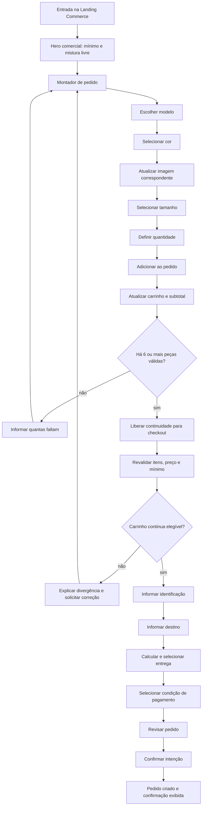
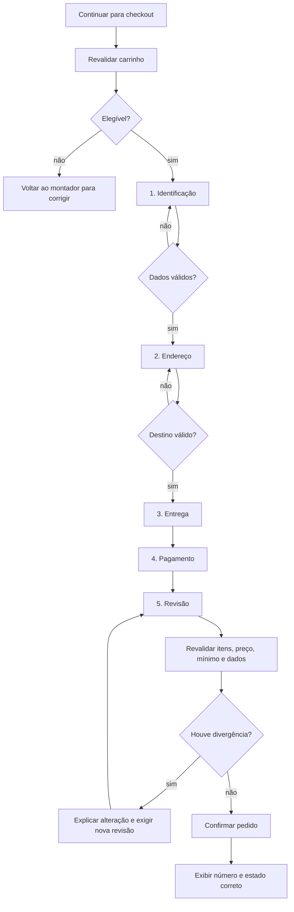

# User Flow — Landing Commerce e Montador de Pedido Atacarejo

> **Status:** especificação oficial da jornada e da experiência de compra  
> **Escopo:** página inicial, montagem do pedido, carrinho inteligente e progressão para checkout  
> **Fase:** documentação para a V1 com catálogo, disponibilidade, entrega, pagamento e pedido mockados  
> **Documentos relacionados:** [`01-arquitetura.md`](./01-arquitetura.md), [`02-regras-negocio.md`](./02-regras-negocio.md), [`03-estrutura-do-projeto.md`](./03-estrutura-do-projeto.md), [`04-ai-rules.md`](./04-ai-rules.md), [`05-design-system-ui.md`](./05-design-system-ui.md) e [`06-prompt-mestre.md`](./06-prompt-mestre.md)

## Premissas e linguagem normativa

As palavras **DEVE**, **NÃO DEVE**, **PREFIRA** e **PODE** têm o sentido normativo definido nos documentos oficiais do projeto.

Este documento define como as regras comerciais existentes serão apresentadas e percorridas pelo usuário. Ele **não altera** preço, pedido mínimo, disponibilidade, composição do carrinho, entrega, pagamento ou arquitetura. Em caso de conflito, prevalecem a fonte temática e a ordem de prioridade definidas em `06-prompt-mestre.md`.

---

## 1. Decisão estratégica

A experiência principal do Veste Bem E-commerce será uma **Landing Commerce com Montador de Pedido Atacarejo**.

O usuário deverá conseguir descobrir a proposta, comparar os modelos, escolher variações e montar o pedido diretamente na página inicial. A jornada principal não dependerá da sequência tradicional Home → Catálogo → Produto.

As rotas de catálogo, produto e carrinho previstas na arquitetura continuam válidas como URLs canônicas de apoio, acessibilidade, recuperação, compartilhamento, SEO e edição detalhada. Elas deixam de ser etapas obrigatórias da conversão principal.

### 1.1 O que muda

- A Home passa de vitrine introdutória a principal superfície de compra.
- Os dois modelos iniciais aparecem no próprio montador.
- Cor, tamanho, quantidade e adição ao pedido acontecem sem troca obrigatória de página.
- O progresso até seis peças permanece visível durante a montagem.
- O carrinho oferece feedback e edição no contexto, sem interromper a escolha.
- O checkout só se torna acionável quando o carrinho possui ao menos seis unidades válidas.

### 1.2 O que não muda

- O pedido mínimo é de **6 peças no total** (`COM-001`, `MIN-001`).
- Modelos, cores e tamanhos disponíveis podem ser misturados livremente (`COM-002`, `COM-006`, `COM-007`).
- Não existe mínimo por SKU, referência, modelo, cor, tamanho ou variação (`MIN-003`, `COM-008`).
- Na V1, `REF.001` e `REF.002` custam R$ 50,00 por peça (`PRD-001`).
- Cor e tamanho não alteram o preço na V1 (`PRD-002`).
- Produto, variação, preço, disponibilidade e mínimo são revalidados antes do checkout e da criação do pedido.
- Frete e pagamento da V1 são mockados e não podem ser comunicados como operações reais.

## 2. Objetivos da experiência

O fluxo deverá:

1. explicar a condição atacarejo antes de pedir qualquer escolha;
2. reduzir navegação e manter o usuário no contexto de montagem;
3. permitir composição livre com feedback imediato;
4. mostrar quanto já foi adicionado e quanto falta para liberar a continuidade;
5. tornar bloqueios compreensíveis e reversíveis;
6. separar montagem, entrega, dados e pagamento em momentos cognitivamente adequados;
7. funcionar com teclado, leitor de tela, toque, zoom e diferentes larguras;
8. preservar URLs recuperáveis para carrinho, checkout e confirmação;
9. manter a linguagem premium, direta e sem urgência artificial;
10. não prometer estoque, prazo, frete, cobrança ou confirmação que a fonte configurada não possa garantir.

### 2.1 Métrica principal de sucesso

A principal conversão da Landing Commerce é o avanço de uma sessão com intenção de compra para um **carrinho elegível com seis ou mais peças válidas**.

Conversões secundárias:

- início de interação com o montador;
- primeira variação válida adicionada;
- recomposição após item inválido;
- entrada no checkout;
- seleção de entrega;
- chegada à revisão;
- criação do pedido mockado na V1 ou pedido real em fase futura autorizada.

## 3. Princípios de UX

| Princípio | Aplicação obrigatória |
|---|---|
| Compra direta | O montador deverá estar na Home e ser alcançável pelo CTA do Hero. |
| Regra antecipada | “Mínimo de 6 peças no total” e mistura livre aparecem antes do primeiro CTA. |
| Uma decisão por vez | Modelo → cor → tamanho → quantidade → adicionar ao pedido. |
| Contexto preservado | Adicionar uma peça não força navegação nem perde seleções de outros modelos. |
| Progresso contínuo | Quantidade atual, faltantes e subtotal acompanham a montagem. |
| Liberdade explícita | A interface reforça que as seis peças podem ser combinadas. |
| Bloqueio explicável | Toda ação indisponível informa por que está bloqueada e como liberar. |
| Feedback proporcional | Sucesso é discreto; erro que exige ação permanece visível. |
| Autoridade fora da UI | A interface representa resultados do domínio; não decide mínimo, preço ou disponibilidade. |
| Mobile first | A tarefa principal deve ser confortável em uma coluna e sem depender de hover. |

## 4. Jornada principal



### 4.1 Caminho feliz resumido

```text
Entrada no site
→ entender mínimo de 6 e mistura livre
→ escolher modelo
→ escolher cor e ver a imagem correspondente
→ escolher tamanho
→ definir quantidade
→ adicionar ao pedido
→ acompanhar carrinho e progresso
→ repetir até atingir 6 peças válidas
→ continuar para checkout
→ informar identificação e destino
→ calcular e selecionar entrega
→ selecionar pagamento
→ revisar
→ confirmar
→ visualizar confirmação do pedido
```

## 5. Arquitetura da página principal

A Home deverá ter uma sequência curta, comercial e orientada à ação.

### 5.1 Ordem das seções

1. **Header enxuto**
   - marca;
   - link “Monte seu pedido” para a âncora do montador;
   - acesso ao carrinho com quantidade total de unidades;
   - navegação secundária apenas quando aprovada.
2. **Hero direto e comercial**
   - proposta de valor;
   - mínimo de seis peças;
   - liberdade para misturar modelos, cores e tamanhos disponíveis;
   - CTA para o montador;
   - imagem oficial otimizada, sem texto essencial embutido.
3. **Faixa de confiança/regra**
   - reforço curto de preço unitário, composição livre e entrega nacional;
   - sem inventar prazo, desconto ou frete grátis.
4. **Montador de Pedido Atacarejo**
   - modelos publicáveis;
   - seletores de cor, tamanho e quantidade;
   - imagem sincronizada com a cor;
   - CTA por seleção válida;
   - carrinho inteligente e progresso.
5. **Como funciona**
   - escolher;
   - combinar;
   - atingir seis peças;
   - revisar e concluir.
6. **Informações de confiança**
   - composição flexível;
   - atendimento a destinos válidos no Brasil;
   - somente benefícios e políticas aprovados.
7. **FAQ**
   - mínimo, mistura de variações, preço, entrega e funcionamento do pedido;
   - conteúdo oficial, sem criar políticas.
8. **Footer**
   - contato, institucional, navegação e informações legais aprovadas.

### 5.2 Hero

Conteúdo recomendado para aprovação:

- **Título:** “Monte seu pedido do seu jeito.”
- **Apoio:** “Escolha no mínimo 6 peças e misture modelos, cores e tamanhos disponíveis.”
- **CTA primário:** “Começar meu pedido”.
- **Destino do CTA:** âncora estável do montador, com foco/rolagem que respeite `prefers-reduced-motion`.

O Hero NÃO DEVE usar contagem regressiva, escassez sem fonte, desconto inexistente ou CTA genérico como “Saiba mais” quando a intenção principal é comprar.

## 6. Montador de Pedido

O montador é a principal unidade interativa da Landing Commerce. Ele deverá apresentar somente produtos publicáveis vindos da fonte configurada. Na V1, serão os dois produtos oficiais quando ativos:

- `REF.001` — Colete Gola U;
- `REF.002` — Colete Gola V.

### 6.1 Estrutura de cada modelo

Cada modelo deverá exibir:

1. imagem do produto ou da cor selecionada;
2. nome e referência;
3. preço unitário;
4. descrição essencial aprovada;
5. seleção de cor;
6. seleção de tamanho;
7. quantidade;
8. CTA “Adicionar ao pedido”;
9. estado de disponibilidade e mensagens locais.

A ordem semântica do DOM deverá continuar lógica mesmo quando o layout visual usar colunas.

### 6.2 Sequência de seleção

#### Estado inicial

- A imagem principal do produto PODE aparecer antes de uma cor ser escolhida, sem indicar seleção implícita.
- Cor e tamanho NÃO DEVEM ser pré-selecionados se isso puder adicionar uma variação sem intenção clara.
- A quantidade inicial PODE ser `1`, mas só será aceita após cor e tamanho formarem uma variação válida.
- O CTA de adição permanece indisponível até a seleção estar completa e válida.
- O motivo do bloqueio deve estar visível ou ser informado no contexto, e não apenas por atributo `disabled`.

#### Seleção de cor

- As opções vêm exclusivamente das variações do produto.
- Cada opção deverá possuir nome visível ou acessível; amostra visual não basta.
- Ao selecionar uma cor, a imagem principal muda para a imagem associada quando ela existir (`CAT-003`).
- A troca deverá reservar a mesma geometria para evitar CLS.
- Se não houver imagem específica para a cor, mantém-se uma imagem geral do produto e a interface NÃO DEVE fingir correspondência cromática.
- A mudança deve atualizar o texto alternativo/contexto quando a cor for informação visível relevante.

#### Seleção de tamanho

- Somente combinações cadastradas podem ser selecionadas (`VAR-004`).
- Tamanhos indisponíveis permanecem identificáveis quando útil, mas não selecionáveis.
- Se a troca de cor tornar o tamanho atual inválido, o tamanho deverá ser limpo e a mensagem deverá orientar uma nova escolha.
- A interface NÃO DEVE trocar automaticamente para outro tamanho.

#### Seleção de quantidade

- Aceita apenas número inteiro positivo (`CART-001`, `CART-003`).
- A edição deverá funcionar por teclado e toque, com nome acessível para incrementar e reduzir.
- Limites vindos da disponibilidade configurada devem ser respeitados; a UI não inventa estoque.
- Zero em uma linha existente exige ação explícita de remoção ou confirmação adequada.

#### Adição

- O CTA deverá usar “Adicionar ao pedido”.
- A ação valida produto ativo, variação disponível e quantidade inteira positiva.
- Se a mesma variação já existir, a quantidade é consolidada (`VAR-003`, `CART-002`).
- O foco permanece no contexto do montador.
- Uma live region anuncia de forma breve o que foi adicionado e o novo total de peças.
- O carrinho inteligente atualiza sem recarregar a página e sem navegação forçada.

### 6.3 Feedback após adicionar

Mensagem recomendada:

> “{quantidade} × {modelo}, {cor}, tamanho {tamanho} adicionado ao pedido. Agora você tem {quantidadeTotal} peças.”

O feedback visual poderá oferecer “Ver pedido”, mas não deverá deslocar automaticamente o usuário para o carrinho. Um toast pode confirmar a ação; progresso, erros e bloqueios devem permanecer visíveis no carrinho.

### 6.4 Troca entre modelos

- Seleções ainda não adicionadas podem permanecer localmente ao alternar modelos durante a mesma visita.
- Itens já adicionados pertencem ao carrinho e não dependem de o card continuar aberto.
- Abrir ou configurar um modelo não deve limpar a configuração do outro sem ação explícita.
- Com apenas dois modelos, o layout deve favorecer comparação direta; carrossel não é necessário para desktop.

## 7. Carrinho inteligente

O carrinho inteligente é o resumo vivo do pedido durante a montagem. Ele apresenta resultados do domínio e oferece edição segura; não é a autoridade das regras.

### 7.1 Informações permanentes

- quantidade total de peças válidas;
- progresso até o mínimo de seis;
- quantidade faltante calculada por `max(0, 6 - quantidadeTotal)`;
- linhas por variação;
- modelo, referência, cor, tamanho e quantidade;
- preço unitário e total da linha;
- subtotal;
- estado de elegibilidade;
- ação seguinte disponível.

Entrega e total final não devem ser apresentados como definidos antes da seleção de entrega. Descontos permanecem R$ 0,00 enquanto não houver regra aprovada.

### 7.2 Estados do progresso

| Estado | Regra | Mensagem recomendada | CTA principal |
|---|---|---|---|
| 0 peças | carrinho vazio | “Adicione 6 peças para montar seu pedido.” | “Escolher peças” |
| 1 a 5 válidas | abaixo do mínimo | “Você tem {atual} de 6 peças. Faltam {faltantes}.” | “Continuar escolhendo” |
| 6 válidas | mínimo atingido | “Pedido mínimo atingido. Você já pode continuar.” | “Continuar para checkout” |
| mais de 6 válidas | elegível | “Seu pedido tem {atual} peças e está liberado para continuar.” | “Continuar para checkout” |
| item inválido | não conta no mínimo | “Um item deixou de estar disponível e não conta para o mínimo. Revise seu pedido.” | “Revisar item” |
| revalidando | autoridade em andamento | “Atualizando disponibilidade e valores…” | ação em loading |

A barra de progresso é limitada visualmente a 100% ao chegar a seis, mas o texto continua mostrando a quantidade real acima do mínimo. Não existe máximo de seis nem obrigação de múltiplos de seis.

### 7.3 Edição

- Incrementar ou reduzir quantidade recalcula linha, total de peças, faltantes e subtotal.
- Remover afeta somente a linha selecionada.
- Variações iguais permanecem consolidadas.
- Variações diferentes permanecem em linhas distintas.
- Se a edição reduzir o total para menos de seis, o carrinho continua editável e o checkout volta a ficar bloqueado (`MIN-007`).
- A remoção deverá ser reversível quando viável ou pedir confirmação proporcional ao impacto.
- “Limpar pedido” é ação secundária/destrutiva intencional e não pode competir com a continuidade.

### 7.4 Comportamento ao atingir seis peças

Quando o total válido muda de menos de seis para seis ou mais, a interface deverá:

1. atualizar texto e indicador de progresso;
2. anunciar discretamente “Pedido mínimo atingido”;
3. habilitar “Continuar para checkout”;
4. manter a montagem disponível para novas adições;
5. não abrir checkout, formulário, drawer ou modal automaticamente;
6. não sugerir que seis seja um limite máximo;
7. não prometer reserva de estoque, frete ou pagamento.

## 8. Regra de liberação do checkout

O checkout será liberado visualmente quando `quantidadeTotal >= 6`, considerando somente linhas válidas. A autorização real depende de revalidação no caso de uso (`MIN-004`, `MIN-005`).

### 8.1 Abaixo de seis

- O CTA de checkout permanece indisponível.
- A interface informa quantidade atual e faltante.
- O usuário pode continuar escolhendo, editar, remover ou limpar.
- Frete, dados pessoais e pagamento NÃO DEVEM competir com a tarefa de atingir o mínimo.
- O sistema não deverá solicitar cadastro ou login para “salvar” o progresso na V1.

### 8.2 Com seis ou mais

- O CTA de checkout se torna acionável.
- Ao acioná-lo, o sistema revalida produto, variação, preço, disponibilidade e mínimo.
- Em sucesso, navega para a rota canônica `/checkout`.
- Em divergência, permanece ou retorna ao contexto de correção com seleção preservada.
- Se os itens válidos voltarem a menos de seis, a conclusão é bloqueada e os faltantes são recalculados.

### 8.3 Acesso direto à URL

Entrar diretamente em `/checkout` não ignora o gate:

- carrinho elegível: carregar a primeira etapa válida;
- carrinho abaixo do mínimo: redirecionar ou orientar retorno ao montador com mensagem persistente;
- carrinho vazio: orientar a iniciar o pedido;
- carrinho com divergência: exigir revisão antes de coletar novos dados.

## 9. Momento de frete, dados e pagamento

### 9.1 Princípio de revelação progressiva

A página principal concentra seleção e progresso. Informações de checkout aparecem apenas quando forem necessárias e acionáveis.

| Capacidade | Quando aparece | Pré-condição |
|---|---|---|
| lembrete de entrega nacional | Hero/faixa de confiança | conteúdo aprovado, sem valor ou prazo inventado |
| CTA para checkout | carrinho inteligente | seis ou mais peças válidas na UI |
| identificação | início do checkout | carrinho revalidado e elegível |
| endereço/destino | após identificação válida | dados mínimos preservados |
| cálculo e opções de entrega | após destino estruturalmente válido | endereço brasileiro aceito |
| pagamento | após seleção de entrega | valor determinável e carrinho ainda válido |
| revisão | após dados, entrega e pagamento válidos | todas as etapas anteriores concluídas |
| confirmação | após revalidação final | intenção explícita e operação idempotente |

### 9.2 Compatibilização da decisão “liberar frete ao atingir seis”

Atingir seis peças **libera o caminho para entrega**, mas não autoriza calcular ou selecionar frete sem destino válido. O usuário percebe que a próxima fase está disponível ao habilitar o checkout. A cotação e a seleção aparecem dentro do checkout, após identificação e endereço, conforme as regras atuais.

Uma futura estimativa apenas por CEP poderá ser adicionada se houver regra, contrato e integração autorizados. Ela não deverá substituir a cotação final baseada no endereço e na composição revalidados.

### 9.3 V1 mockada

- A entrega deverá ser rotulada como simulada quando apresentada.
- Valor e prazo só podem vir do mock aprovado; se não existirem, aparecem como pendentes/simulados, nunca inventados.
- O pagamento deverá ser uma simulação ou placeholder claramente não transacional.
- A confirmação deverá dizer que um pedido mockado foi criado e não que houve cobrança, reserva de estoque ou contratação de frete.

## 10. Fluxo de checkout

O checkout utiliza layout focado e rota recuperável. Ele deverá preservar dados ao voltar entre etapas e manter um resumo acessível do pedido.



### 10.1 Identificação

- Nome, e-mail e telefone são os dados de contato esperados na documentação atual.
- CPF/CNPJ não pode se tornar obrigatório sem decisão fiscal aprovada.
- Login real não é obrigatório na V1.
- Consentimento de marketing é separado, opcional e nunca pré-marcado.

CTA recomendado: “Continuar para endereço”.

### 10.2 Endereço

Coleta destinatário, CEP, logradouro, número ou indicação válida de sem número, bairro, cidade e UF; complemento é opcional. Todas as UFs e o Distrito Federal devem ser aceitos quando o endereço for válido.

CTA recomendado: “Continuar para entrega”.

### 10.3 Entrega

- Exibe somente opções retornadas pela fonte configurada.
- Cada opção diferencia método, valor, prazo e caráter mockado quando aplicável.
- Uma opção não deve ser pré-selecionada se isso esconder escolha ou custo relevante.
- Falha não gera valor ou prazo alternativo inventado.
- Se nenhuma opção atender o CEP, a mensagem deve falar da indisponibilidade da cotação/opção, não negar a cobertura nacional da marca como um todo.

CTA recomendado: “Continuar para pagamento”.

### 10.4 Pagamento

- Só aparece depois de entrega selecionada e total determinável.
- Meios e condições vêm de configuração aprovada.
- Na V1, a simulação deve ser evidente e não coletar dados reais de cartão.
- A UI nunca marca pagamento como aprovado sem confirmação autoritativa futura.

CTA recomendado: “Revisar pedido”.

### 10.5 Revisão

Exibe:

- itens e variações;
- quantidades e quantidade total;
- preço unitário e total por linha;
- subtotal;
- entrega;
- descontos, se futuramente documentados;
- total determinável;
- identificação e endereço;
- condição de pagamento;
- aviso de simulação da V1.

O CTA final deverá ser coerente com a operação real. Na V1, PREFIRA “Confirmar pedido simulado” a uma expressão que sugira cobrança.

### 10.6 Confirmação

A tela final deverá mostrar:

- número único do pedido no conjunto local;
- resumo essencial;
- estado verdadeiro da operação;
- explicação explícita sobre o caráter mockado da V1;
- próximo passo permitido, sem prometer envio, pagamento ou rastreamento real.

## 11. Fluxo mobile

Mobile prioriza montagem sequencial, contexto compacto e ações ao alcance sem cobrir conteúdo ou teclado.

### 11.1 Estrutura

- Hero em uma coluna, com CTA visível e conteúdo textual real.
- Modelos empilhados ou alternados por controle acessível, sem esconder comparação essencial.
- Imagem antes dos seletores do modelo.
- Cor, tamanho e quantidade em grupos com labels persistentes.
- Carrinho resumido em barra contextual/sticky apenas se não obstruir conteúdo, foco ou teclado.
- Toque no resumo abre `CartDrawer` acessível com linhas, subtotal e progresso.
- Edição extensa poderá direcionar à rota `/carrinho`.
- Checkout apresenta uma etapa por vez, com rótulo atual e progresso compacto.

### 11.2 Barra contextual do pedido

Quando houver itens, a barra poderá mostrar:

- “{quantidadeTotal} peças”;
- “Faltam {faltantes}” ou “Pedido liberado”;
- subtotal;
- ação “Ver pedido” ou “Continuar”, conforme elegibilidade.

A barra NÃO DEVE:

- ocultar o CTA de adicionar;
- competir com o teclado virtual;
- impedir acesso ao footer;
- duplicar anúncios em live regions;
- depender apenas de cor para comunicar elegibilidade.

### 11.3 Drawer

- Deve receber foco inicial adequado, conter foco, fechar com Escape e restaurar foco ao acionador.
- Backdrop e botão nomeado fecham o drawer.
- A ação principal reflete o estado: continuar escolhendo ou continuar para checkout.
- Erros persistentes não ficam apenas em toast.

## 12. Fluxo desktop e telas amplas

### 12.1 Estrutura

- Container e breakpoints vêm da fonte canônica do Design System.
- Hero pode usar duas colunas quando a imagem oficial tiver qualidade adequada.
- Montador e carrinho podem formar composição principal + sidebar.
- O carrinho pode permanecer sticky durante a seção do montador, sem ultrapassar seus limites, ocultar erros ou cobrir o footer.
- Os dois modelos devem permanecer comparáveis; o layout não deve criar densidade de catálogo infinito.
- Em Desktop Wide, o conteúdo preserva largura máxima; imagens e texto não são esticados indefinidamente.

### 12.2 Comportamento

- Alterações no montador atualizam a sidebar sem deslocar a página.
- O foco não é movido para a sidebar a cada atualização.
- Hover apenas complementa estados já disponíveis por foco e toque.
- O checkout pode manter resumo sticky ao lado do formulário quando houver espaço real.

## 13. Estados de interface

### 13.1 Landing e catálogo

| Estado | Comportamento |
|---|---|
| carregando estrutura conhecida | skeleton com a geometria final, sem CLS |
| catálogo vazio | explicar indisponibilidade geral e oferecer tentativa novamente/contato aprovado |
| falha ao carregar | alerta persistente e “Tentar novamente”; não exibir erro técnico |
| produto indisponível | manter informação quando apropriado, remover CTA de adição e explicar |
| imagem ausente | fallback aprovado sem invalidar os demais dados |
| somente um produto publicável | exibir o disponível sem inventar o segundo |

### 13.2 Seleção de variação

| Estado | Mensagem recomendada |
|---|---|
| cor ausente | “Escolha uma cor.” |
| tamanho ausente | “Escolha um tamanho.” |
| combinação indisponível | “Essa combinação não está disponível. Escolha outra cor ou tamanho.” |
| quantidade inválida | “Informe uma quantidade inteira maior que zero.” |
| adição em andamento | “Adicionando ao pedido…” |
| adição concluída | anunciar item e novo total de peças |
| falha recuperável | explicar e preservar cor, tamanho e quantidade |

### 13.3 Carrinho

| Estado | Comportamento |
|---|---|
| vazio | orientar escolha e manter acesso ao montador |
| abaixo do mínimo | mostrar atual, faltantes e checkout bloqueado |
| elegível | confirmar liberação e permitir continuar |
| item invalidado | marcar linha, excluir de mínimo/subtotal elegível e orientar remoção/substituição |
| preço alterado | mostrar valor anterior/atual quando apropriado e exigir revisão |
| persistência incompatível | recuperar somente partes válidas e comunicar alterações relevantes |
| falha ao atualizar | preservar estado anterior confiável e permitir nova tentativa |

### 13.4 Frete e pagamento

| Estado | Comportamento |
|---|---|
| ainda bloqueado | não competir com montagem; explicar a próxima etapa no contexto do CTA |
| calculando entrega | loading nomeado sem apagar endereço |
| opções disponíveis | lista selecionável com método, prazo e valor vindos da fonte |
| nenhuma opção | explicar e permitir corrigir endereço/tentar novamente |
| falha de cotação | não inventar preço ou prazo; permitir nova tentativa |
| pagamento V1 | identificar simulação e não coletar cartão real |
| envio duplicado | bloquear repetição enquanto processa e garantir idempotência no caso de uso |

## 14. Mensagens e CTAs

### 14.1 Regras de conteúdo

- Usar “peças” para unidades e “variações” para combinações; evitar “itens” quando puder significar linhas.
- Dizer sempre “mínimo de 6 peças no total”.
- Reforçar “misture modelos, cores e tamanhos disponíveis”.
- CTAs usam verbo e resultado esperado.
- Mensagens de erro explicam correção e não culpam o usuário.
- Estado bloqueado sempre informa como liberar.
- Não usar “últimas unidades”, “corra”, cronômetro ou pressão sem fonte autoritativa.
- Não usar “frete grátis”, desconto ou parcelamento sem regra aprovada.
- Não usar “pagamento aprovado”, “pedido pago”, “enviado” ou “entregue” sem evento autoritativo.

### 14.2 Vocabulário recomendado

| Contexto | Texto recomendado |
|---|---|
| CTA do Hero | “Começar meu pedido” |
| CTA de produto | “Adicionar ao pedido” |
| carrinho abaixo do mínimo | “Continuar escolhendo” |
| carrinho elegível | “Continuar para checkout” |
| retorno ao montador | “Voltar e ajustar pedido” |
| início de entrega | “Continuar para entrega” |
| início de pagamento | “Continuar para pagamento” |
| revisão | “Revisar pedido” |
| confirmação V1 | “Confirmar pedido simulado” |
| erro recuperável | “Tentar novamente” |
| item inválido | “Revisar item” |

Os textos são recomendações de UX e deverão passar por aprovação de conteúdo. Variáveis como modelo, cor, tamanho, quantidade, prazo e valor vêm dos dados válidos; não podem ser inventadas pelo template.

## 15. Acessibilidade

O fluxo completo deverá atender WCAG 2.2 AA ou a versão normativa vigente adotada pelo projeto.

- Um `h1` descreve a página; seções principais usam hierarquia de headings consistente.
- Montador e carrinho usam landmarks e nomes acessíveis.
- Grupos de cor e tamanho têm label/legend e estado selecionado programático.
- Cor não depende apenas da amostra visual.
- Tamanho indisponível é anunciado como indisponível.
- Imagens possuem alt útil; decoração usa alt vazio.
- Toda ação usa `button`, `a`, `input`, `select` ou outro elemento semântico apropriado.
- Foco visível usa contrato oficial e segue ordem do DOM.
- Atualizações de carrinho usam live region com parcimônia; mudanças repetidas não devem produzir ruído.
- Erros são associados ao controle e anunciados; formulários podem oferecer resumo de erros.
- Drawer/modal contém e restaura foco.
- O fluxo funciona a 200% de zoom e com reflow.
- Motion não essencial é removido ou reduzido com `prefers-reduced-motion`.
- Nenhuma informação essencial depende apenas de cor, ícone, tooltip, hover ou toast.

## 16. Performance e estabilidade visual

- Conteúdo comercial e produtos iniciais devem ser server-first.
- A interatividade do montador e do carrinho deve ficar em ilhas client pequenas.
- Imagens usam `next/image`, dimensões, `sizes`, aspect ratio e prioridade apenas para o LCP real.
- A troca de imagem por cor mantém dimensões e evita layout shift.
- Miniaturas e imagens abaixo da dobra usam lazy loading adequado.
- Skeletons espelham a geometria final.
- Header, progresso e barra de pedido não mudam de altura de modo inesperado após hidratação.
- O catálogo inteiro não deverá ser carregado no cliente quando o volume futuro exigir paginação/fonte filtrada.
- Animações usam tokens oficiais, propriedades performáticas e não atrasam a ação.
- LCP, CLS e INP devem ser medidos em viewports e dispositivos representativos na fase de implementação.

## 17. Navegação, histórico e recuperação

- O CTA do Hero usa âncora estável e não cria entrada de histórico excessiva.
- `/carrinho` permanece a rota de edição completa e recuperação do pedido.
- `/checkout` permanece a rota canônica da conclusão.
- `/produto/[slug]` permanece disponível como detalhe compartilhável quando implementado, sem ser obrigatório para adicionar.
- Atualizar a Home não deve corromper carrinho persistido; dados do browser são entrada não confiável, versionada e validada.
- Voltar do checkout preserva o pedido e, quando possível, retorna ao contexto do montador.
- Atualizar ou acessar diretamente uma etapa não pode contornar validações.
- Confirmação possui URL própria, mas deve proteger contra repetição ou acesso inconsistente.

## 18. Eventos de produto e conversão

Quando analytics for autorizado, os eventos deverão evitar PII e carregar apenas contexto necessário. Esta seção define intenção de medição, não autoriza SDK ou integração.

| Evento conceitual | Momento | Dados permitidos de referência |
|---|---|---|
| `landing_viewed` | Home carregada | versão da experiência |
| `builder_started` | primeira interação no montador | origem/âncora |
| `color_selected` | cor escolhida | referência e código da opção |
| `size_selected` | tamanho escolhido | referência e código da opção |
| `item_added` | variação adicionada | referência, variação, quantidade; sem PII |
| `minimum_progressed` | mudança relevante no total | quantidade válida e faltantes |
| `minimum_reached` | transição para elegível | quantidade total |
| `checkout_started` | revalidação aprovada | quantidade e subtotal autoritativos |
| `shipping_selected` | opção escolhida | identificador interno do método, sem endereço |
| `review_viewed` | resumo exibido | quantidade e total determinável |
| `order_created` | pedido criado | identificador técnico não sensível e estado correto |

Eventos não são fonte de verdade para carrinho, pedido ou pagamento. Falha de analytics nunca bloqueia compra.

## 19. Responsabilidades por domínio

| Comportamento | Proprietário |
|---|---|
| composição editorial da Landing | `home` |
| consulta de produtos publicáveis | `catalog` |
| variações, imagem por cor e disponibilidade apresentada | `product` |
| linhas, consolidação, quantidades, subtotal e progresso | `cart` |
| gate, identificação, endereço, entrega, pagamento e revisão | `checkout` |
| criação idempotente e snapshot | `orders` |
| seleção de adapter mock/real | `lib/composition` |
| primitives, tokens e estados visuais | Design System e componentes compartilhados aprovados |

A Landing Commerce compõe APIs públicas dessas features; ela NÃO autoriza fundir domínios em um componente monolítico nem colocar regras no `page.tsx`.

## 20. Exceções e recuperação

### 20.1 Produto ou variação fica indisponível

1. marcar a linha afetada;
2. retirar suas unidades do mínimo e dos valores elegíveis;
3. explicar a alteração;
4. preservar as demais linhas;
5. levar o usuário ao modelo correspondente para escolher outra combinação ou remover;
6. reavaliar o gate de checkout.

### 20.2 Preço muda

1. revalidar pela fonte configurada;
2. informar a mudança antes da confirmação;
3. atualizar o resumo somente com resultado autoritativo;
4. exigir nova revisão;
5. não iniciar pagamento com valor desatualizado.

### 20.3 Falha de entrega

1. preservar endereço e pedido;
2. informar que não foi possível obter opções;
3. oferecer nova tentativa ou correção do destino;
4. não inventar transportadora, valor ou prazo;
5. não avançar para pagamento sem entrega válida quando ela for obrigatória.

### 20.4 Falha na confirmação

1. evitar novo envio enquanto a tentativa está em andamento;
2. preservar dados e um identificador idempotente;
3. informar estado sem declarar sucesso incerto;
4. permitir nova tentativa segura quando o resultado for conhecido;
5. não criar dois pedidos para a mesma intenção lógica.

## 21. Critérios de aceite

### Landing e montador

- [ ] A Home explica o mínimo e a mistura livre antes da primeira escolha.
- [ ] O CTA do Hero leva ao montador.
- [ ] Os produtos vêm da fonte configurada e somente publicáveis aparecem.
- [ ] Cor altera a imagem quando há associação real.
- [ ] Cor e tamanho formam somente variações cadastradas.
- [ ] Quantidade aceita somente inteiro positivo.
- [ ] Adicionar não força troca de página.
- [ ] A mesma variação é consolidada.
- [ ] Seleções e erros recuperáveis são preservados.

### Carrinho e elegibilidade

- [ ] O badge e o progresso contam unidades válidas, não linhas.
- [ ] Estados de 0, 1–5, 6+ e item inválido são distintos.
- [ ] A interface mostra quantas peças faltam.
- [ ] Seis peças liberam checkout sem impedir novas adições.
- [ ] Reduzir abaixo de seis bloqueia novamente a conclusão.
- [ ] Subtotal usa preço × quantidade em centavos inteiros.
- [ ] Entrega não compõe o total antes de ser determinada.
- [ ] Itens inválidos não contam para mínimo ou valores elegíveis.

### Checkout

- [ ] Acesso direto não contorna revalidação.
- [ ] Identificação e endereço precedem a seleção final de entrega.
- [ ] Pagamento aparece somente após entrega e total determinável.
- [ ] Dados são preservados após erro recuperável.
- [ ] Divergência exige nova revisão.
- [ ] A confirmação é idempotente.
- [ ] V1 identifica frete, pagamento e pedido como mockados.
- [ ] Nenhuma mensagem afirma cobrança, reserva ou envio real.

### Responsividade e acessibilidade

- [ ] O fluxo completo funciona em Mobile, Tablet, Desktop e Desktop Wide oficiais.
- [ ] Breakpoints e espaçamentos vêm do Design System.
- [ ] Sticky elements não cobrem conteúdo, erros, teclado ou footer.
- [ ] Teclado percorre escolha, carrinho e checkout em ordem lógica.
- [ ] Foco é visível e restaurado após drawer/modal.
- [ ] Seleções, erros e progresso não dependem apenas de cor.
- [ ] Live regions não anunciam conteúdo excessivo.
- [ ] Zoom, reflow e reduced motion preservam a tarefa.

### Qualidade e arquitetura

- [ ] Regra de mínimo permanece no domínio/application.
- [ ] Landing usa APIs públicas das features.
- [ ] UI não importa mocks, repositories ou SDKs.
- [ ] Server Components permanecem padrão.
- [ ] Estado derivado não é duplicado.
- [ ] Persistência local é versionada e validada.
- [ ] Nenhuma integração futura foi antecipada.
- [ ] Imagens, skeletons e trocas de estado evitam CLS.

## 22. Cenários essenciais de validação

1. Adicionar 6 unidades da mesma variação libera checkout.
2. Adicionar 3 Gola U + 3 Gola V libera checkout.
3. Adicionar 1 unidade de 6 variações diferentes libera checkout.
4. Adicionar 5 unidades mantém checkout bloqueado e informa 1 faltante.
5. Adicionar 8 unidades permanece válido; a barra mostra quantidade real.
6. Adicionar novamente a mesma variação consolida a linha.
7. Trocar cor para uma combinação incompatível limpa o tamanho, sem substituição automática.
8. Remover uma unidade de um pedido com 6 volta a bloquear o checkout.
9. Invalidar uma linha reduz progresso e exige correção.
10. Alterar preço durante a revisão exige novo aceite.
11. Acessar `/checkout` com carrinho vazio retorna ao início apropriado.
12. Falhar cotação preserva endereço e não inventa frete.
13. Confirmar duas vezes produz no máximo um pedido para a mesma tentativa.
14. O fluxo completo funciona apenas por teclado.
15. O mobile mantém o CTA e o carrinho utilizáveis com teclado virtual aberto.

## 23. Fora do escopo desta decisão

Este documento não autoriza:

- alterar o mínimo de seis peças;
- criar desconto por volume, preço por faixa ou frete grátis;
- definir cores, tamanhos, imagens, estoque, frete ou meios de pagamento ainda não aprovados;
- instalar ou integrar Supabase, ERP, InfinitePay, Melhor Envio, CRM ou analytics;
- exigir autenticação real;
- criar nova paleta, fonte, breakpoint, token ou primitive do Design System;
- remover as rotas canônicas previstas na arquitetura;
- implementar código, componentes ou configuração nesta fase de documentação.

## 24. Decisões pendentes antes da implementação completa

Dependem de definição/aprovação específica:

1. cores, tamanhos, imagens e descrições oficiais por produto;
2. associação entre cor e imagem;
3. política de disponibilidade dos mocks;
4. conteúdo final do Hero, benefícios e FAQ;
5. comportamento visual oficial dos seletores ainda sem contrato publicado;
6. breakpoints, gutters e tokens ausentes na fonte canônica;
7. dados fiscais obrigatórios;
8. modalidades, valores e prazos de entrega na V1;
9. condições exibidas na simulação de pagamento;
10. formato do número do pedido;
11. estratégia aprovada de persistência do carrinho visitante;
12. instrumentação e plataforma de analytics, se houver.

Até essas decisões existirem, a implementação deverá usar somente dados mockados aprovados, comportamento conservador e comunicação explícita sobre simulação.

---

## Síntese normativa

A Veste Bem deverá vender pela própria Home: explicar a condição atacarejo, permitir a montagem completa do carrinho e acompanhar o usuário até seis peças sem exigir navegação por catálogo e detalhe de produto. O carrinho inteligente transforma o mínimo em progresso compreensível, não em surpresa ou pressão.

Ao atingir seis unidades válidas, a continuidade é liberada, mas as regras continuam autoritativas: o carrinho é revalidado, o destino precede a seleção de entrega, o pagamento só aparece com total determinável e a confirmação representa exatamente o que a infraestrutura realizou. Na V1, isso significa uma jornada mockada, claramente identificada e sem alegações de cobrança, reserva ou frete reais.
